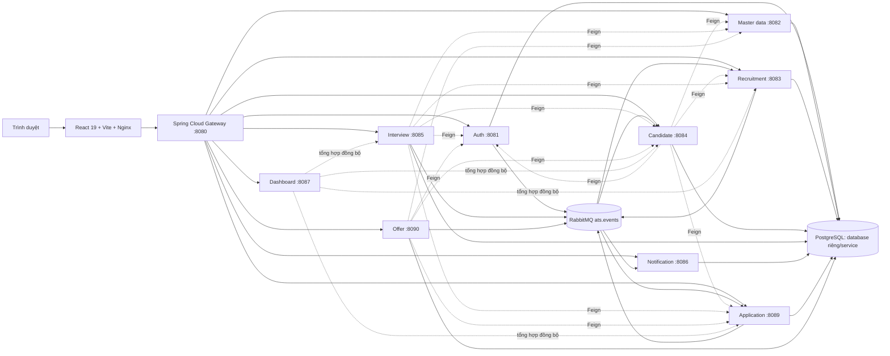

# Phân tích độc lập dự án ATS và bộ prompt giao việc cho Claude

Ngày phân tích: 2026-09-07

## 1. Phạm vi và nguyên tắc phân tích

Tài liệu này được suy luận độc lập từ mã nguồn có thể thực thi, cấu hình build/runtime, dependency, migration và test. Không sử dụng README, tài liệu trong `docs`, spec, file Word, hoặc các file phân tích/mô tả có sẵn trong repository làm nguồn kết luận.

Những nguồn đã kiểm tra:

- 530 file Java production, khoảng 19.437 dòng.
- 39 file Java test, khoảng 2.698 dòng.
- 146 file TypeScript/TSX frontend, khoảng 19.987 dòng.
- 22 migration SQL, khoảng 599 dòng.
- 10 `pom.xml`, `frontend/package.json`, `package-lock.json`, các `application.yml`, Dockerfile, `docker-compose.yml`, Nginx và script khởi động.

Những nguồn chủ động không đọc/không dùng:

- Mọi README, thư mục `docs`, spec và tài liệu mô tả.
- `Transcript Báo cáo tuần 1.docx`.
- `ARCHITECTURE_ANALYSIS.md` và `frontend/docs/ATS_BUSINESS_WORKFLOW_GAP_ANALYSIS.md`.
- Nội dung bản dump trong `backups/` và giá trị bí mật trong các file `.env`.

Mọi kết luận bên dưới cần được xem là kết quả reverse-engineering từ code. Chỗ nào là suy luận thay vì hành vi đã được test trực tiếp đều được ghi rõ.

## 2. Kết luận ngắn

Đây là một Applicant Tracking System cho một doanh nghiệp, triển khai theo kiểu microservices. Hệ thống bao phủ gần trọn vòng đời tuyển dụng:

1. Quản trị công ty, người dùng nội bộ và tài khoản ứng viên.
2. Yêu cầu tuyển dụng và quy trình phê duyệt.
3. Tin tuyển dụng công khai.
4. Hồ sơ ứng viên và CV.
5. Application đi qua pipeline tuyển dụng cấu hình động.
6. Lịch phỏng vấn, slot để ứng viên chọn, đánh giá và đề xuất lương.
7. Offer, phê duyệt và phản hồi của ứng viên.
8. Notification, email, WebSocket và audit log.
9. Dashboard tổng hợp và xuất PDF.

Thiết kế domain và phân quyền có nhiều điểm tốt, test backend hiện tại đều qua. Điểm yếu lớn nhất nằm ở độ tin cậy khi triển khai: topology Docker chưa nối đủ URL giữa các container; WebSocket và Google SSO không đi qua cổng public hiện có; Flyway chạy cùng Hibernate `ddl-auto:update` tạo schema không xác định trên database mới; event quan trọng chưa có retry/DLQ/idempotency/outbox. Vì vậy trạng thái “unit test xanh” chưa chứng minh hệ thống chạy end-to-end an toàn trong Docker.

Task nên giao Claude trước tiên là **sửa topology Docker và các browser entrypoint**, theo Prompt 1 ở cuối tài liệu.

## 3. Kiến trúc suy luận từ code



### 3.1. Thành phần và trách nhiệm

| Thành phần | Port | Dữ liệu sở hữu | Trách nhiệm suy luận từ controller/service/entity |
|---|---:|---|---|
| `api-gateway` | 8080 | Không | Route `/api/**`, xác thực JWT, loại bỏ identity header do client gửi và tạo lại `X-User-Id`, `X-User-Email`, `X-User-Role`, `X-Department-Id` từ claims đã xác minh. |
| `auth-service` | 8081 | `ats_auth` | Đăng ký ứng viên, OTP email, login, refresh-token rotation, logout, reset/change password, Google OAuth2, profile công ty, quản lý user/role/status. |
| `masterdata-service` | 8082 | `ats_masterdata` | Department và các catalog: job title/level, employment/contract type, location, skill, education/experience, source, rejection reason/status; pipeline và stage; email template; interview criteria. |
| `recruitment-service` | 8083 | `ats_recruitment` | Job requisition, approval/reject/request changes, job posting, review/publish/pause/close, public job API. |
| `candidate-service` | 8084 | `ats_candidate` | Candidate profile, self-service portal, skill/tag/custom field, CV upload, talent pool, yêu cầu xóa dữ liệu và cleanup theo retention. |
| `application-service` | 8089 | `ats_application` | Application, stage/history/comment, assign recruiter, bulk actions, candidate self-apply, stale reminder và xử lý kết quả offer. |
| `interview-service` | 8085 | `ats_interview` | Interview, interviewer, batch schedule, ICS, candidate confirmation, proposed slots, salary proposal, evaluation và score theo criteria. |
| `offer-service` | 8090 | `ats_offer` | Tạo/sửa/submit/approve/reject offer, candidate accept/decline, PDF offer, scope theo phòng ban/recruiter. |
| `notification-service` | 8086 | `ats_notification` | In-app notification, unread state, WebSocket STOMP, email template, delayed reminder, consumer business events và audit log. |
| `dashboard-service` | 8087 | Không thấy persistence trong code | Aggregator gọi đồng bộ các service khác để tạo summary/statistics và PDF. Database `ats_dashboard` được tạo/cấu hình trong Compose nhưng code không dùng JPA. |
| `frontend` | 5173 ngoài host | Local storage của trình duyệt | SPA React/Ant Design cho public careers, candidate portal và back-office theo role. |

### 3.2. Công nghệ chính

- Backend: Java 21 target, Spring Boot 3.3.4/3.3.6, Spring Web, Spring Security, Spring Data JPA, Validation, OpenFeign và Spring AMQP.
- Gateway: Spring Cloud Gateway/WebFlux, JJWT.
- Data: PostgreSQL 16; database riêng theo service trên cùng một PostgreSQL instance; Flyway.
- Messaging: RabbitMQ topic exchange `ats.events`; một số delay queue dùng TTL + dead-letter exchange.
- File: AWS SDK S3; code có nhánh MinIO và fallback lưu file local.
- Realtime: Spring WebSocket/STOMP + SockJS.
- Frontend: React 19, TypeScript 6, Vite 8, React Router 7, Redux Toolkit, Ant Design, React Hook Form, Zod, Axios, Recharts, XLSX.
- Deployment: multi-stage Dockerfiles, Docker Compose, Nginx SPA.

Không có root Maven aggregator, service discovery, centralized configuration, circuit breaker, tracing, CI pipeline hoặc frontend test framework trong phần code/config đã kiểm tra.

## 4. Luồng hoạt động chính

### 4.1. Xác thực và phân quyền

1. `auth-service` phát access token JWT 15 phút và opaque refresh token 7 ngày.
2. Refresh token thô chỉ trả về client; database lưu SHA-256 digest và token được rotate khi refresh.
3. Gateway xác minh chữ ký/expiration/role/subject rồi thay toàn bộ trusted identity header.
4. Mỗi downstream service tạo `CurrentUser` từ trusted header, sau đó controller/service áp dụng role và department scope.
5. Các role đang dùng: `COMPANY_ADMIN`, `RECRUITER`, `HIRING_MANAGER`, `CANDIDATE`.

Đây là mô hình hợp lý nếu chỉ gateway có thể nhận traffic bên ngoài và downstream network được cô lập hoàn toàn.

### 4.2. Tuyển dụng

1. Hiring Manager tạo requisition ở `DRAFT`, chỉ trong department của mình.
2. Requisition đi `DRAFT → PENDING_APPROVAL` và được Recruiter/Admin approve, reject hoặc request changes.
3. Requisition `APPROVED` mới là nguồn để tạo posting.
4. Posting có vòng đời `DRAFT/EDITING/APPROVED → OPEN ↔ PAUSED → CLOSED`.
5. Public API chỉ trả posting đang mở; candidate đăng nhập để apply.

### 4.3. Candidate và application pipeline

1. Đăng ký candidate xảy ra ở auth database, sau đó event `candidate.registered` provision profile trong candidate database.
2. Candidate profile giữ skill, tag, custom field, CV URL và pool status.
3. Application liên kết logic tới candidate, posting và pipeline ở các database khác; không thể có foreign key xuyên database.
4. Stage không hard-code trong application service mà đọc pipeline/stage từ master data.
5. Mỗi lần chuyển stage ghi history và phát event; comment có hỗ trợ `@mention`; job hằng ngày phát cảnh báo application bị kẹt.

### 4.4. Interview và offer

1. Interview có thể tạo đơn/batch, kiểm tra conflict, gán nhiều interviewer và xuất lịch ICS.
2. Candidate có thể xác nhận lịch hoặc chọn một proposed slot.
3. Interviewer submit evaluation theo criteria; module còn có salary proposal.
4. Offer chỉ tạo khi application ở stage type `OFFER`.
5. Offer đi `DRAFT → PENDING_APPROVAL → APPROVED`, sau đó candidate `ACCEPTED` hoặc `DECLINED`.
6. Accept/decline phát RabbitMQ event để application service đổi stage/reject vì candidate không có quyền gọi trực tiếp API quản trị pipeline.

### 4.5. Notification và audit

- Notification service nghe requisition, application, interview và offer events.
- In-app notification được lưu PostgreSQL, đẩy STOMP tới `/user/queue/notifications`, và có thể gửi email.
- Reminder phỏng vấn và kiểm tra evaluation dùng message TTL rồi dead-letter sang process queue.
- Audit event từ auth, recruitment, candidate, application và offer được gom vào `audit_log`.
- Không thấy audit publisher cho các thay đổi trong master data và interview; đây là khoảng trống nếu audit log được kỳ vọng bao phủ mọi thao tác quản trị.

## 5. Điểm mạnh

1. **Domain tương đối đầy đủ và tách trách nhiệm rõ.** Các service bám vào các bounded context dễ nhận biết thay vì gom toàn bộ logic vào một ứng dụng.
2. **Phân quyền không chỉ nằm ở frontend.** Backend có `AuthorizationPolicy`, `CurrentUser`, department scope và nhiều test chống truy cập chéo phòng ban.
3. **Gateway chống spoof identity header.** Header do client cung cấp bị xóa trước khi gateway gắn identity đã lấy từ JWT.
4. **Token nhạy cảm đã được xử lý tốt hơn mức prototype thông thường.** Refresh token opaque được hash, rotate và revoke; OTP được hash và có giới hạn failed attempts trong code/migration.
5. **Candidate-facing DTO được tách khỏi internal DTO ở offer.** Điều này giảm nguy cơ lộ requester/approver hoặc dữ liệu nội bộ.
6. **Pipeline cấu hình động.** Application stage dựa vào pipeline của master data, phù hợp nhiều quy trình tuyển dụng.
7. **Có lịch sử và event nghiệp vụ.** Application history, comments, reminders, notifications và audit tạo nền tảng tốt cho trace nghiệp vụ.
8. **Test backend hiện tại xanh.** Có test cho auth, schema contract, authorization theo phòng ban và một số workflow quan trọng.
9. **Frontend có type/schema rõ.** API wrapper, DTO type, Zod validation và role route được tách theo feature.

## 6. Điểm yếu và rủi ro, xếp theo ưu tiên

### P0-1. Docker Compose chưa nối đúng mạng nội bộ giữa các service

Trong `application.yml`, Feign URL mặc định là `http://localhost:<port>`. Bên trong container, `localhost` là chính container đang chạy, không phải service khác. Compose hiện thiếu các biến sau:

| Container | URL còn thiếu trong Compose |
|---|---|
| `recruitment-service` | auth, masterdata |
| `interview-service` | auth, masterdata, recruitment, candidate, application |
| `notification-service` | auth, masterdata, interview, candidate, application |
| `dashboard-service` | interview |
| `offer-service` | candidate |

`notification-service/.env` hiện chỉ khai báo key mail, không cung cấp các service URL nói trên. Hậu quả chắc chắn theo semantics của Docker networking: container khởi động được nhưng Feign call tại runtime sẽ gọi nhầm chính nó và thất bại.

Hai browser entrypoint cũng không khớp topology:

- Frontend WebSocket mặc định gọi `http://localhost:8086/ws`, trong khi Compose chỉ `expose` notification port cho network nội bộ và không publish port 8086 ra host.
- Google SSO bắt đầu tại `http://localhost:8081/oauth2/pre-login`, trong khi auth port 8081 cũng không được publish.
- Nginx hiện chỉ proxy `/api/`, chưa proxy WebSocket/OAuth path.

Đây là task cần làm trước vì nó ngăn các workflow chính chạy end-to-end trong deployment được repository cung cấp.

### P0-2. Flyway và Hibernate cùng sở hữu schema theo cách không xác định

Tám service database bật đồng thời:

```yaml
spring.jpa.hibernate.ddl-auto: update
spring.flyway.enabled: true
```

Flyway chạy trước Hibernate. Phần lớn migration `V1`/`V2` chỉ `ALTER` hoặc tạo index/FK nếu `to_regclass(...)` cho biết table đã tồn tại. Trên database mới do `docker/postgres-init/init-databases.sql` tạo, các table của recruitment/candidate/application/interview/offer/notification chưa tồn tại. Vì vậy:

1. Flyway đánh dấu migration thành công nhưng các khối `IF table exists` không làm gì.
2. Hibernate tạo table sau đó.
3. Lần chạy sau Flyway không chạy lại migration đã đánh dấu.
4. Index unique, FK và constraint mong muốn có thể vĩnh viễn không được tạo trên fresh install.

Schema vẫn có thể chạy ở mức cơ bản, nên unit test/context test không phát hiện. Đây là rủi ro integrity và race condition, đặc biệt với unique active application/candidate.

### P0-3. Event quan trọng có thể mất hoặc bị xử lý trùng

- Publisher gửi RabbitMQ trực tiếp trong luồng transaction database nhưng không có transactional outbox.
- Event không có `eventId`; consumer notification/audit không có inbox/deduplication.
- Business queues phần lớn không có retry policy và DLQ.
- `OfferOutcomeListener` bắt mọi exception, chỉ log rồi trả về; RabbitMQ sẽ ACK message. Nếu application transition tạm thời lỗi, offer đã `ACCEPTED/DECLINED` nhưng application có thể không đổi trạng thái và event bị mất vĩnh viễn.
- Chiều ngược lại, redelivery có thể tạo notification/audit trùng.

Đây là rủi ro consistency xuyên service, không phải lỗi unit test.

### P1-1. Cấu hình bảo mật còn phù hợp môi trường local hơn production

- JWT secret, PostgreSQL/RabbitMQ credentials và MinIO credentials có default cố định trong source/Compose.
- Access token và refresh token được lưu trong `localStorage`, nên một lỗi XSS có thể lấy cả hai token.
- Downstream tin tuyệt đối `X-User-*`; điều này chỉ an toàn khi không thể truy cập trực tiếp service. Script chạy local mở từng port, nên caller trên máy có thể tự tạo trusted header.
- WebSocket cho phép origin pattern `*` ở endpoint trong khi CORS HTTP chỉ liệt kê localhost.
- Không thấy issuer/audience rõ ràng trong JWT, rate limit cho login/OTP/reset, security headers tập trung, hay production profile fail-fast khi secret mặc định còn tồn tại.
- Không có `.dockerignore`; Docker build context có thể gửi `.env`, `target`, `node_modules`, `dist` và file local không cần thiết tới Docker daemon. `notification-service/.env` chứa mail credential và nằm trong build context dù Dockerfile không `COPY` nó vào final image.

### P1-2. File/CV storage không bền trong Compose

- Candidate service có AWS S3 client và nhánh MinIO, nhưng Compose không có MinIO và không set `AWS_S3_ENDPOINT`.
- Upload sẽ thử AWS bằng credential mặc định rồi bắt mọi lỗi và lưu vào thư mục `uploads` trong container.
- Thư mục này không có volume; container recreate có thể làm mất CV.
- URL fallback hard-code `http://localhost:8080/...`, không phù hợp domain/HTTPS khác.
- `ensureBucketExists()` nuốt mọi lỗi, nên “bucket đã tồn tại” và “permission/network sai” không phân biệt được.

### P1-3. Test chưa bao phủ topology và frontend

- 101 backend test đều qua, nhưng chủ yếu là unit/slice/context/schema-text contract; không thấy integration test chạy PostgreSQL/RabbitMQ/MinIO và các container cùng nhau.
- Frontend không có file test và package không có test script.
- `npm run lint` trả exit code 0 nhưng báo 39 warnings: chủ yếu synchronous state update trong effect và missing hook dependencies.
- `npm run build` thành công nhưng tạo một JS chunk khoảng 2.732 KB trước gzip, khoảng 827 KB gzip. `AppRoutes.tsx` import tĩnh toàn bộ page, nên admin, candidate và public code bị đưa vào initial bundle.

### P2-1. Coupling đồng bộ và duplication cao

- Dashboard và nhiều DTO enrichment gọi đồng bộ nhiều service; một service chậm/lỗi có thể làm toàn request lỗi hoặc thiếu dữ liệu.
- Một số code lấy toàn bộ user/catalog rồi tạo map cho mỗi request, làm tăng latency và tải chéo service.
- Không thấy timeout/resilience policy được cấu hình theo use case, circuit breaker hoặc cache rõ ràng.
- `TrustedHeaderAuthenticationFilter`, `CurrentUser`, `AuthorizationPolicy`, `FeignClientConfig`, `PageResponse` và exception handling được copy giữa nhiều service; dễ drift.
- Spring Boot đang trộn 3.3.4 và 3.3.6; Spring Cloud trộn 2023.0.3 và 2023.0.5; không có parent/BOM chung ở root.

### P2-2. Hạ tầng và repository hygiene chưa nhất quán

- Redis được chạy và set host cho nhiều container nhưng không service nào khai báo dependency Redis hoặc dùng Redis trong production code; OAuth exchange store vẫn in-memory.
- `ats_dashboard` database được tạo và Compose set datasource nhưng dashboard service không có JPA/PostgreSQL dependency.
- Không thấy CI config để chạy 10 Maven suites, lint và frontend build tự động.
- Một SQL database backup và một file Word đang được track trong Git; chưa đọc nội dung nên chưa kết luận có dữ liệu nhạy cảm, nhưng cần audit/sanitize và quy định lưu trữ.
- Audit coverage chưa bao phủ thay đổi master data và interview.

## 7. Kết quả kiểm tra thực tế

### Backend

Sau khi Maven được phép tải dependency còn thiếu, lệnh `mvn -q test` đã chạy thành công cho cả 10 module:

| Module | Test | Fail/Error/Skipped |
|---|---:|---:|
| api-gateway | 10 | 0/0/0 |
| auth-service | 41 | 0/0/0 |
| masterdata-service | 3 | 0/0/0 |
| recruitment-service | 15 | 0/0/0 |
| candidate-service | 10 | 0/0/0 |
| application-service | 13 | 0/0/0 |
| interview-service | 5 | 0/0/0 |
| offer-service | 11 | 0/0/0 |
| notification-service | 2 | 0/0/0 |
| dashboard-service | 1 | 0/0/0 |
| **Tổng** | **101** | **0/0/0** |

Lưu ý: log lỗi “downstream unavailable” trong application test là tình huống Mockito cố ý tạo để xác nhận listener nuốt exception; suite vẫn pass. Chính test này đồng thời xác nhận rủi ro mất message đã nêu ở P0-3.

### Frontend

- `npm run lint`: exit code 0, 0 error, 39 warning.
- `npm run build`: thành công.
- Output chính: JS khoảng 2.732,25 KB; gzip khoảng 826,78 KB; Vite cảnh báo chunk lớn hơn 500 KB.
- Không có frontend test file được phát hiện.

### Docker config

- `docker compose config --quiet`: thành công.
- Điều này chỉ chứng minh YAML hợp lệ, không chứng minh Feign URL, SSO, WebSocket, database migration hoặc event workflow chạy đúng end-to-end.

## 8. Thứ tự công việc đề xuất

Không thực hiện nhiều task cùng lúc. Sau mỗi task phải review diff, chạy test và được chủ dự án xác nhận trước khi chuyển task tiếp theo.

1. **P0 — Sửa Docker topology và browser entrypoint**: Prompt 1. Đây là task ưu tiên thực hiện đầu tiên.
2. **P0 — Làm schema migration deterministic**: Prompt 2.
3. **P0 — Làm offer outcome event reliable/idempotent**: Prompt 3.
4. **P1 — Làm CV/object storage bền vững**: Prompt 4.
5. **P1 — Harden trust boundary và secret handling**: Prompt 5.
6. **P1 — Thêm frontend test và giảm initial bundle**: Prompt 6.
7. **P2 — Chuẩn hóa build/dependency và CI**: Prompt 7.

## 9. Quy tắc chung khi copy prompt cho Claude

Mỗi prompt dưới đây đã có “confirmation gate”. Claude chỉ được khảo sát read-only, trình bày phương án và dừng lại. Chỉ sau khi người dùng trả lời xác nhận, Claude mới được sửa code.

Các nguyên tắc không được bỏ:

- Không đọc hoặc dựa vào README, `docs`, spec, file Word hay tài liệu phân tích có sẵn.
- Chỉ suy luận từ source, config, dependency, migration và test.
- Trước khi sửa: chạy `git status --short`, liệt kê file định sửa, quyết định kỹ thuật và trade-off; sau đó dừng chờ xác nhận.
- Không đọc/in giá trị secret từ `.env`; chỉ kiểm tra tên biến nếu cần.
- Không đụng vào thay đổi không liên quan, đặc biệt `.claude/`, `ARCHITECTURE_ANALYSIS.md` và `frontend/docs/ATS_BUSINESS_WORKFLOW_GAP_ANALYSIS.md`.
- Không xóa/reset database, volume, backup, file người dùng; không chạy `git reset --hard`; không commit nếu chưa được yêu cầu.
- Nếu phát sinh lựa chọn ngoài phạm vi đã duyệt, phải dừng và xin xác nhận lại.
- Sau triển khai phải báo file đã đổi, test đã chạy, kết quả, giới hạn còn lại và cung cấp `git diff` để review.

## 10. Các prompt copy/paste cho Claude

### Prompt 1 — Task ưu tiên: sửa Docker topology và browser entrypoint

```text
Bạn đang làm việc trong repository E:\ATS.

Quy tắc bắt buộc:
1. Không đọc hoặc dựa vào README, thư mục docs, spec, file Word hoặc bất kỳ tài liệu/phân tích có sẵn nào. Chỉ đọc source code, config, dependency, migration và test.
2. Trước khi sửa bất kỳ file nào, chạy git status --short; giữ nguyên mọi thay đổi không liên quan và file untracked hiện có.
3. Giai đoạn đầu CHỈ ĐƯỢC khảo sát read-only và lập kế hoạch. Hãy liệt kê bằng chứng, file dự kiến sửa, thiết kế route/proxy, test sẽ thêm/chạy và mọi trade-off. Sau đó DỪNG và chờ tôi xác nhận. Không được tự triển khai khi chưa có câu xác nhận của tôi.
4. Không đọc hoặc in giá trị secret trong .env. Không reset/xóa database, Docker volume hay backup. Không commit.

Task duy nhất: làm cho topology Docker Compose và các browser entrypoint của ATS hoạt động end-to-end mà không publish trực tiếp toàn bộ downstream REST service ra host.

Các vấn đề phải tự kiểm chứng từ code/config:
- Feign client trong recruitment-service, interview-service, notification-service, dashboard-service và offer-service đang thiếu một số SERVICES_*_URL trong docker-compose.yml, khiến default localhost được dùng bên trong container.
- Frontend WebSocket/SockJS đang trỏ cổng notification-service không được publish.
- Google OAuth2 pre-login và callback đang trỏ/redirect qua auth-service port không được publish.
- Nginx hiện chủ yếu proxy /api/.
- Không có .dockerignore nên build context có thể chứa .env, target, node_modules, dist và file local.

Sau khi tôi duyệt kế hoạch, hãy triển khai với acceptance criteria sau:
A. Mọi Feign dependency dùng đúng DNS service-name và port trên Docker network; không còn runtime call tới localhost để giao tiếp container-to-container.
B. REST public/protected vẫn đi qua gateway; downstream identity header không thể bị client giả mạo.
C. Notification SockJS/STOMP dùng một browser-reachable URL qua public entrypoint hiện có; STOMP CONNECT vẫn bắt buộc JWT và reconnect hoạt động. Không mở toàn bộ notification REST port ra host chỉ để WebSocket chạy.
D. Google OAuth2 start, authorization callback và redirect về SPA hoạt động qua public entrypoint; proxy phải giữ đúng header/cookie/protocol cần cho OAuth session. Không mở toàn bộ auth REST port ra host chỉ để SSO chạy.
E. Thêm .dockerignore phù hợp cho từng build context có liên quan; secret .env không được gửi vào build context và node_modules/target/dist không làm phình context.
F. Không thay đổi business workflow, schema database hoặc role policy ngoài phần cần thiết cho routing.
G. Thêm/sửa test tập trung cho gateway/public route/header stripping và cấu hình WebSocket/OAuth nếu có thể kiểm thử tự động.
H. Chạy tối thiểu: docker compose config --quiet, mvn -q test cho api-gateway/auth-service/notification-service và npm run lint + npm run build. Nếu cần chạy full compose hoặc thao tác có ảnh hưởng môi trường, phải hỏi tôi trước.

Khi hoàn tất, trả về:
- Tóm tắt thiết kế đã chọn và vì sao.
- Danh sách file đổi.
- Kết quả từng lệnh test.
- Rủi ro/giới hạn còn lại.
- git status --short và diff để tôi chuyển cho reviewer.
```

Prompt tiếp tục sau khi bạn đã duyệt kế hoạch của Claude:

```text
Tôi xác nhận triển khai đúng kế hoạch vừa trình bày. Chỉ được sửa các file/phạm vi đã được duyệt. Nếu trong lúc làm xuất hiện quyết định mới hoặc cần mở rộng phạm vi, dừng lại và hỏi tôi trước. Sau khi sửa, chạy đầy đủ acceptance checks và gửi diff cùng kết quả test; không commit.
```

### Prompt 2 — Làm schema migration deterministic

```text
Bạn đang làm việc trong E:\ATS. Không đọc README/docs/spec/file Word/tài liệu phân tích. Chỉ dùng entity, repository, application.yml, migration SQL, docker init và test làm bằng chứng. Giữ nguyên thay đổi không liên quan; không đọc secret; không commit; tuyệt đối không xóa/reset database hoặc volume.

Giai đoạn đầu chỉ khảo sát read-only. Hãy chứng minh hoặc bác bỏ tình huống Flyway chạy trước Hibernate ddl-auto=update khiến migration có điều kiện to_regclass(...) trở thành no-op trên fresh database rồi vẫn bị đánh dấu complete. Lập inventory cho từng DB-backed service: table/entity, constraint/index/FK, migration hiện có, fresh-install path và existing-database upgrade path. Đề xuất chính xác file sẽ sửa và cách rollback/backup. DỪNG chờ tôi xác nhận trước khi sửa.

Sau khi được xác nhận, task là chuyển schema ownership về Flyway một cách deterministic cho auth, masterdata, recruitment, candidate, application, interview, notification và offer:
- Fresh database phải được tạo đầy đủ bằng migration, không phụ thuộc Hibernate tạo table sau Flyway.
- Runtime bình thường dùng ddl-auto=validate hoặc none phù hợp, không dùng update để âm thầm thay schema.
- Không làm mất dữ liệu của database đang tồn tại; migration phải forward-only, idempotent ở chỗ cần thiết và có chiến lược baseline rõ.
- Tạo đủ unique constraint/index/FK nội database; không cố tạo FK xuyên database.
- Thêm integration/contract test thực sự khởi tạo PostgreSQL sạch và kiểm tra schema, không chỉ grep nội dung SQL.
- Chạy test cho từng service liên quan và docker compose config --quiet.

Nếu toàn bộ 8 service quá lớn cho một thay đổi an toàn, hãy đề xuất chia thành các PR/task độc lập và chỉ triển khai phần đầu tiên sau khi tôi chọn. Mọi quyết định về baseline version, sửa migration đã tồn tại hay thêm migration mới đều phải được tôi xác nhận trước.
```

### Prompt 3 — Làm workflow offer outcome reliable và idempotent

```text
Bạn đang làm việc trong E:\ATS. Không đọc README/docs/spec/tài liệu phân tích; chỉ phân tích code/config/migration/test. Giữ nguyên thay đổi không liên quan, không commit.

Giai đoạn đầu chỉ read-only. Trace chính xác luồng offer-service accept/decline -> RabbitMQ ats.events -> application-service OfferOutcomeListener -> application transition, kể cả transaction boundary, ACK/requeue, retry và duplicate delivery. Xác nhận từ code việc listener hiện bắt Exception rồi return có thể ACK và mất event. Đề xuất một thiết kế nhỏ nhất nhưng production-safe, liệt kê schema/config/code/test sẽ đổi, rồi DỪNG chờ tôi xác nhận.

Sau khi được xác nhận, triển khai task duy nhất: bảo đảm offer accepted/declined cuối cùng được phản ánh đúng sang application, chịu được lỗi tạm thời và redelivery mà không chuyển stage/reject hai lần.

Acceptance criteria:
- Event có định danh ổn định và đủ dữ liệu để deduplicate.
- Consumer không ACK thành công khi side effect thất bại tạm thời; có bounded retry và DLQ/parking queue, không requeue vô hạn.
- Application side effect idempotent; duplicate delivery không tạo history/notification/audit trùng hoặc chuyển thêm stage.
- Xử lý rõ permanent business error so với transient infrastructure error.
- Nếu chọn outbox cho producer, việc ghi offer state và outbox phải cùng local transaction; publisher retry an toàn.
- Có test cho success, duplicate, transient failure rồi retry, permanent failure/DLQ và message deserialize sai.
- Không dùng forged SYSTEM trusted header và không làm yếu authorization hiện tại.
- Chạy mvn -q test cho offer-service, application-service và notification-service; báo rõ phần nào chưa được integration-test với RabbitMQ thật.

Không mở rộng sang toàn bộ event bus nếu chưa hỏi tôi. Cuối cùng gửi diff, migration mới, test output và operational notes; không commit.
```

### Prompt 4 — Làm CV/object storage bền vững

```text
Bạn đang làm việc trong E:\ATS. Không đọc README/docs/spec/tài liệu phân tích. Chỉ dùng candidate-service source/config/test, frontend upload code và Docker config. Không đọc/in secret, không xóa file/volume, không commit.

Đầu tiên chỉ khảo sát read-only: trace upload/download CV, validation, URL được lưu, fallback local, cleanup/data-retention và Docker lifecycle. Đề xuất phương án MinIO/S3, migration dữ liệu nếu cần, public URL strategy và danh sách file đổi. DỪNG chờ tôi xác nhận.

Sau khi xác nhận, triển khai object storage bền vững cho môi trường Docker:
- Thêm MinIO và persistent volume hoặc cấu hình S3-compatible tương đương đã được tôi duyệt.
- Candidate service dùng endpoint nội bộ để upload nhưng trả download URL không hard-code localhost; ưu tiên download có authorization qua API hoặc presigned URL ngắn hạn.
- Không âm thầm fallback sang filesystem ephemeral khi storage cấu hình sai trong production; fail rõ ràng hoặc chỉ cho phép fallback bằng explicit local profile.
- Validate MIME, extension, size và filename; response download có Content-Type/Content-Disposition an toàn.
- Bucket provisioning phân biệt already-exists với network/permission error.
- Data retention/xóa candidate phải xử lý object tương ứng hoặc ghi rõ cơ chế orphan cleanup.
- Thêm test và chạy candidate-service test, frontend build, docker compose config.

Mọi lựa chọn public bucket vs private bucket, presigned URL vs authenticated proxy và cách migrate CV cũ đều phải được tôi xác nhận trước khi sửa.
```

### Prompt 5 — Harden trust boundary và secret handling

```text
Bạn đang làm việc trong E:\ATS. Không dùng README/docs/spec/tài liệu phân tích. Chỉ kiểm tra security/config code, Compose, Nginx và test. Không đọc hoặc in secret value trong .env. Không commit.

Giai đoạn đầu chỉ read-only. Lập threat model ngắn cho browser -> Nginx/gateway -> downstream, JWT, trusted X-User-* headers, WebSocket STOMP và local-development direct ports. Liệt kê lỗ hổng có thể chứng minh, false positive, phương án và file sẽ đổi. DỪNG chờ tôi xác nhận.

Sau khi xác nhận, triển khai một hardening set đã duyệt với các mục tiêu:
- Production profile fail-fast nếu JWT secret/DB/Rabbit/mail/storage credential vẫn dùng default hoặc thiếu.
- Auth, gateway và notification dùng cùng secret thông qua secret injection, không bake secret vào image/source.
- Downstream chỉ tin identity context đến từ gateway/internal caller đã xác thực; direct client không thể tự gắn COMPANY_ADMIN header.
- Giới hạn origin WebSocket/CORS theo cấu hình, không wildcard ở production.
- Xem xét issuer/audience/token purpose và clock skew; không làm refresh token thành JWT bearer.
- Thêm rate limiting/lockout hợp lý cho login, OTP, resend và reset nếu phạm vi được duyệt.
- Đề xuất an toàn hơn cho refresh token so với localStorage; không tự đổi sang cookie nếu chưa trình bày đầy đủ CSRF/CORS/rotation impact và được tôi xác nhận.
- Thêm regression test cho spoofed headers, direct downstream access, invalid claims, origin và secret validation.

Không thay đổi API contract hoặc cơ chế lưu token frontend trước khi được tôi phê duyệt cụ thể. Cuối cùng chạy test liên quan và gửi diff; không commit.
```

### Prompt 6 — Frontend test, hook correctness và code splitting

```text
Bạn đang làm việc trong E:\ATS. Không đọc README/docs/spec/tài liệu phân tích. Chỉ dùng frontend source/config/package files và backend API contracts trong code. Giữ nguyên thay đổi không liên quan, không commit.

Đầu tiên chỉ khảo sát read-only. Chạy npm run lint và npm run build, nhóm 39 warning theo nguyên nhân, đo initial bundle và xác định route imports làm bundle lớn. Đề xuất framework test tương thích với Vite/React hiện tại, các route sẽ lazy-load, error/loading boundary và tối đa 5 workflow frontend ưu tiên để test. DỪNG chờ tôi xác nhận trước khi sửa hoặc cài dependency.

Sau khi được xác nhận:
- Chuyển page-level route sang React.lazy/dynamic import theo public/auth/internal/admin/candidate feature; có Suspense fallback và error handling phù hợp.
- Không lazy-load component nhỏ gây request waterfall không cần thiết.
- Sửa missing dependency và effect pattern có khả năng stale closure/race; không tắt rule hàng loạt và không thay đổi hành vi chỉ để hết warning.
- Thêm Vitest + React Testing Library hoặc stack đã được duyệt.
- Test tối thiểu auth refresh queue, role route, candidate self-apply, application stage UI và notification reconnect/cleanup bằng mock API hợp lý.
- Mục tiêu lint 0 error và giảm mạnh warning có ý nghĩa; build thành công; báo before/after chunk size.

Không thay đổi UI/UX lớn, API contract hoặc auth storage ngoài phạm vi được duyệt. Cuối cùng gửi diff và toàn bộ test/lint/build output; không commit.
```

### Prompt 7 — Chuẩn hóa build/dependency và thêm CI

```text
Bạn đang làm việc trong E:\ATS. Không đọc README/docs/spec/tài liệu phân tích. Chỉ dùng pom.xml, package files, Dockerfiles, source/test và cấu hình repository. Không commit.

Giai đoạn đầu chỉ read-only. So sánh 10 pom.xml, Spring Boot/Cloud version, plugin, Java target, dependency duplication và lệnh test/build. Đề xuất parent/BOM hoặc root multi-module build, CI matrix, dependency cache và security scanning ở mức vừa đủ. Liệt kê file sẽ đổi và các rủi ro nâng version. DỪNG chờ tôi xác nhận.

Sau khi xác nhận:
- Tạo root Maven aggregator/parent hoặc giải pháp đã duyệt để khóa một bộ Spring Boot/Cloud tương thích và Java 21.
- Không upgrade major/minor tùy tiện; mọi version bump phải được phê duyệt.
- Giữ khả năng build từng service độc lập trong Docker.
- Thêm CI chạy backend test, frontend lint/test/build và docker compose config validation.
- Cache Maven/npm đúng cách; không cache secret/build output không cần thiết.
- Có dependency/concurrency cancellation và artifact/test report hữu ích.
- Loại bỏ hoặc giải thích Redis/dashboard database cấu hình thừa sau khi được xác nhận, không tự xóa hạ tầng đang có thể được dùng ngoài code.

Chạy full verification và gửi diff, thời gian build tương đối, test result; không commit.
```

## 11. Checklist review sau khi Claude hoàn tất một task

Khi Claude làm xong, cung cấp cho reviewer:

1. Prompt/task đã dùng và câu xác nhận phạm vi.
2. `git status --short` trước và sau.
3. `git diff --stat` và full diff của các file được đổi.
4. Output test/build/lint/compose validation.
5. Migration mới và cách xử lý database đang có, nếu task chạm schema.
6. Các quyết định Claude đã hỏi và câu trả lời đã được xác nhận.
7. Những giới hạn hoặc test chưa chạy.

Reviewer cần kiểm tra tối thiểu:

- Không đọc/sửa tài liệu bị loại trừ và không chạm thay đổi người dùng.
- Không có secret/default credential mới trong diff.
- Authorization được kiểm tra ở server, không chỉ ẩn UI.
- Docker hostname không dùng `localhost` cho container-to-container call.
- Event retry không gây vòng lặp vô hạn hoặc duplicate side effect.
- Migration không sửa lịch sử đã chạy một cách nguy hiểm và không phá dữ liệu.
- Test thực sự cover regression, không chỉ đổi assertion để suite xanh.
- Các lệnh xác minh đều exit 0; warning còn lại được giải thích.

Sau khi bạn copy Prompt 1 cho Claude và Claude trả về kế hoạch hoặc code/diff, hãy gửi nguyên kết quả đó cùng `git diff` để thực hiện vòng review độc lập tiếp theo.
