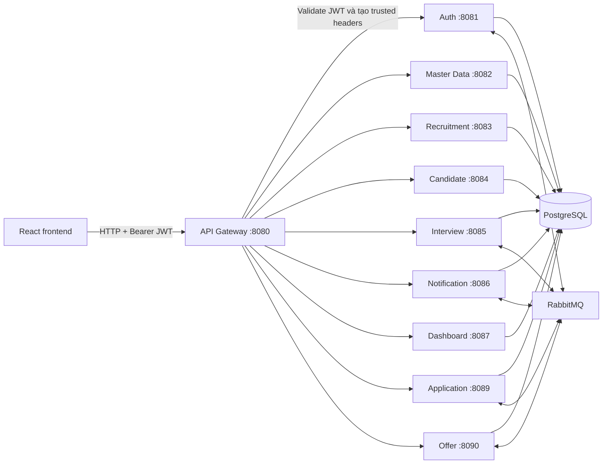

# ATS - Applicant Tracking System

Hệ thống quản lý tuyển dụng dành cho **một doanh nghiệp duy nhất**, xây dựng theo
kiến trúc microservices với Spring Boot 3 và React 19/TypeScript.

> Phạm vi chính thức: single-company, không có tenant và không có
> `PLATFORM_ADMIN`. Backend phân quyền theo role, phòng ban, người được giao và
> quyền sở hữu hồ sơ ứng viên.

## 1. Phạm Vi Hệ Thống

- Một hồ sơ doanh nghiệp dùng chung cho toàn hệ thống.
- Bốn role: `COMPANY_ADMIN`, `RECRUITER`, `HIRING_MANAGER`, `CANDIDATE`.
- Nhân viên nội bộ không tự đăng ký; `COMPANY_ADMIN` tạo tài khoản và gán phòng ban.
- Ứng viên tự đăng ký, xác thực email, đăng nhập, cập nhật hồ sơ/CV, ứng tuyển và
  theo dõi application, interview, offer của chính mình.
- `COMPANY_ADMIN` có phạm vi toàn doanh nghiệp.
- `RECRUITER` và `HIRING_MANAGER` bị giới hạn theo phòng ban và assignment được
  backend kiểm tra.
- Không có permission table hay permission động; policy hiện tại là RBAC kết hợp
  department, assignment và candidate self-ownership trong source code.

## 2. Role Và Trách Nhiệm

| Role | Phạm vi | Trách nhiệm chính |
| --- | --- | --- |
| `COMPANY_ADMIN` | Toàn doanh nghiệp | User, company profile, master data, audit và toàn bộ nghiệp vụ tuyển dụng |
| `RECRUITER` | Phòng ban hoặc resource được giao | Duyệt requisition, quản lý posting, candidate, application, interview và offer |
| `HIRING_MANAGER` | Phòng ban của tài khoản | Tạo/theo dõi requisition, tham gia phỏng vấn và nghiệp vụ thuộc phòng ban |
| `CANDIDATE` | Dữ liệu của chính tài khoản | Hồ sơ/CV, application, interview và offer cá nhân |

`departmentId` bắt buộc về mặt nghiệp vụ với `RECRUITER` và `HIRING_MANAGER`.
`COMPANY_ADMIN` và `CANDIDATE` không mang department scope.

## 3. Authentication Và Authorization

Tất cả người dùng đăng nhập bằng `email + password` tại `POST /api/auth/login`.
Mật khẩu được hash bằng BCrypt. Tài khoản chỉ đăng nhập được khi có status
`ACTIVE`; các status còn lại là `PENDING_VERIFICATION`, `LOCKED`, `INACTIVE`.

Auth service cấp:

- Access token JWT, mặc định 15 phút.
- Refresh token opaque, mặc định 7 ngày, chỉ lưu SHA-256 digest trong database.
- JWT claims: `sub` (user ID), `email`, `role`, `departmentId` nếu có, `iat`, `exp`.
- Không có `tenantId` hoặc company claim.

Gateway validate JWT, xóa identity header do client gửi và tạo lại:
`X-User-Id`, `X-User-Email`, `X-User-Role`, `X-Department-Id`. Domain services tạo
`SecurityContext` từ các header nội bộ và tiếp tục enforce policy ở controller,
service và repository/specification. Frontend route/menu chỉ hỗ trợ UX, không thay
thế authorization ở backend.

## 4. Kiến Trúc Hiện Tại



Mô tả đầy đủ hơn: [ATS_CURRENT_ARCHITECTURE.md](ATS_CURRENT_ARCHITECTURE.md).

## 5. Microservices

| Thành phần | Port local | Database | Chức năng |
| --- | ---: | --- | --- |
| API Gateway | 8080 | - | Routing, CORS, JWT validation, identity propagation |
| Auth Service | 8081 | `ats_auth` | Login, registration, token lifecycle, account/company profile |
| Master Data Service | 8082 | `ats_masterdata` | Department và danh mục tuyển dụng |
| Recruitment Service | 8083 | `ats_recruitment` | Requisition và job posting |
| Candidate Service | 8084 | `ats_candidate` | Candidate profile, CV, talent pool |
| Interview Service | 8085 | `ats_interview` | Lịch, slot, evaluation, salary proposal |
| Notification Service | 8086 | `ats_notification` | Notification và audit log |
| Dashboard Service | 8087 | `ats_dashboard` | Dashboard tổng hợp |
| Application Service | 8089 | `ats_application` | Application pipeline, comment, history |
| Offer Service | 8090 | `ats_offer` | Offer lifecycle và candidate response |
| Frontend | 5173 | - | Internal workspace và candidate portal |

## 6. Công Nghệ

- Java 21, Spring Boot 3, Spring Security, Spring Data JPA, Flyway.
- Spring Cloud Gateway và JJWT.
- PostgreSQL 16, RabbitMQ, Redis.
- React 19, TypeScript, Vite, Redux Toolkit, Ant Design.
- Docker Compose cho môi trường local/demo.

## 7. Khởi Chạy

Yêu cầu: JDK 21, Node.js 18+, npm, Maven wrapper và Docker Desktop.

### Cách 1: Docker Compose

> `docker compose config` đã được kiểm tra, nhưng fresh-stack E2E chưa có. Hiện
> migration V2 của application/interview/offer vẫn giả định bảng nghiệp vụ đã tồn
> tại; database hoàn toàn mới có thể dừng trước bước Hibernate tạo schema. Đây là
> runtime gap cần xử lý trước khi dùng Docker Compose làm kịch bản chấm chính thức.

```bash
docker compose up -d --build
```

- Frontend: `http://localhost:5173`
- API Gateway: `http://localhost:8080`
- Swagger UI: `http://localhost:8080/swagger-ui/index.html`
- RabbitMQ Management: `http://localhost:15672`

Các domain service chỉ `expose` trong Docker network; client phải đi qua gateway.
Database init chỉ chạy khi volume PostgreSQL được tạo lần đầu.

### Cách 2: Chạy service trên máy

Khởi động hạ tầng:

```powershell
.\start-infrastructure.bat
```

Sau đó chạy backend và frontend:

```powershell
.\start-backend.bat
cd frontend
npm install
npm run dev
```

Hoặc dùng `.\start-all.ps1` để mở các process phát triển cùng lúc.

## 8. Tài Khoản Và Kịch Bản Demo

Tài khoản nội bộ cho database mới được mô tả tại
[TEST_ACCOUNTS.md](TEST_ACCOUNTS.md). Candidate không dùng tài khoản seed trong
kịch bản chính thức; hãy demo đúng nghiệp vụ qua `/register` và `/verify-email`.

Luồng demo đề xuất:

1. `COMPANY_ADMIN` cấu hình phòng ban và tạo tài khoản nội bộ.
2. `HIRING_MANAGER` tạo và submit requisition trong phòng ban.
3. `RECRUITER` duyệt requisition và publish job posting.
4. Candidate xem `/careers`, tự đăng ký, xác thực email và cập nhật CV.
5. Candidate ứng tuyển; recruiter xử lý pipeline, interview và offer.
6. Candidate theo dõi và phản hồi offer trong portal của chính mình.

## 9. API Documentation

- Swagger aggregator: `http://localhost:8080/swagger-ui/index.html`.
- OpenAPI JSON: `/api/<service>/v3/api-docs` qua gateway.
- API surface và quy tắc gọi: [ATS_API_REFERENCE.md](ATS_API_REFERENCE.md).
- Repo không có Postman collection; OpenAPI là nguồn API documentation hiện tại.

Frontend và API client chỉ gửi `Authorization: Bearer <accessToken>`. Không gửi
trực tiếp các header `X-User-*` hoặc `X-Department-Id`.

## 10. Kiểm Thử

Mỗi backend module có Maven wrapper và test độc lập:

```powershell
cd auth-service
.\mvnw.cmd clean test
```

Frontend:

```powershell
cd frontend
npm run build
npm run lint
```

Chiến lược và ma trận hiện tại: [ATS_PHASE_11_TEST_STRATEGY.md](ATS_PHASE_11_TEST_STRATEGY.md).

## 11. Giới Hạn Đã Biết

- Không hỗ trợ nhiều doanh nghiệp, tenant switching hay `PLATFORM_ADMIN`.
- Không có permission động/permission management UI.
- Service-to-service cryptographic identity chưa được triển khai; Docker network là
  trust boundary vận hành hiện tại.
- Chưa có browser E2E, Docker E2E hoặc Testcontainers migration suite.
- Access/refresh token frontend đang lưu trong `localStorage`; production nên đánh
  giá lại cookie `HttpOnly` và CSRF strategy.
- Các migration xóa cột tenant có guard để từ chối dữ liệu legacy nhiều tenant; cần
  backup và reconcile trước khi chạy trên database cũ.
- Account internal legacy thiếu `departmentId` chưa được backfill. List
  specification đã fail-closed với trường hợp này (user không thấy gì thay vì thấy
  toàn bộ), nhưng dữ liệu vẫn cần backfill để họ làm việc được.
- Đồng bộ stage sau khi candidate accept/decline offer chạy bất đồng bộ qua
  RabbitMQ. Nếu broker chết, offer vẫn được ghi nhận nhưng application chưa chuyển
  stage; chưa có outbox/retry nên cần đối soát thủ công.
- Automation còn lại dùng role `SYSTEM` (auto-advance sau đánh giá phỏng vấn tích
  cực, notification tra cứu interview) vẫn bị downstream từ chối; đây là
  best-effort và được nuốt lỗi, không chặn nghiệp vụ chính.
- Google OAuth2 chưa được route đầy đủ qua gateway/Docker; email/password là flow
  authentication chính thức cho demo hiện tại.
- Admin status update chưa chặn việc activate candidate chưa verify email.

## 12. Tài Liệu

- [Kế hoạch refactor single-company](ATS_SINGLE_COMPANY_REFACTOR_PLAN.md)
- [Kiến trúc hiện tại](ATS_CURRENT_ARCHITECTURE.md)
- [API reference](ATS_API_REFERENCE.md)
- [Báo cáo Phase 12](ATS_PHASE_12_CLEANUP_DOCUMENTATION.md)
- `ATS_AUTHORIZATION_CURRENT_STATE.md` là snapshot lịch sử trước refactor, không
  phải mô tả runtime hiện tại.
