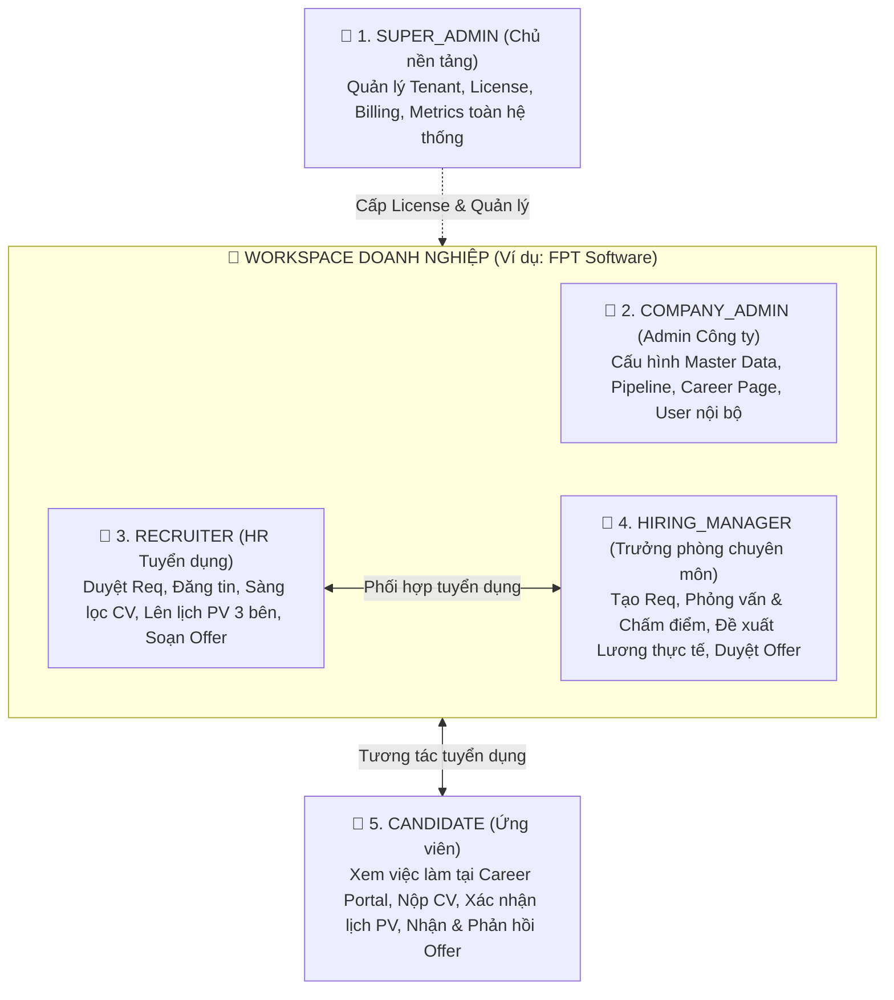
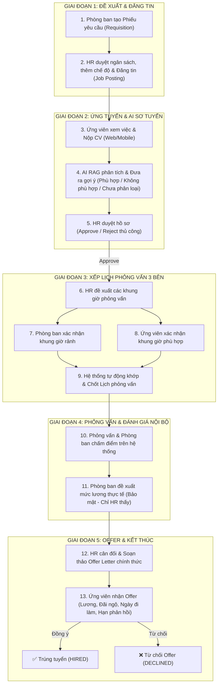
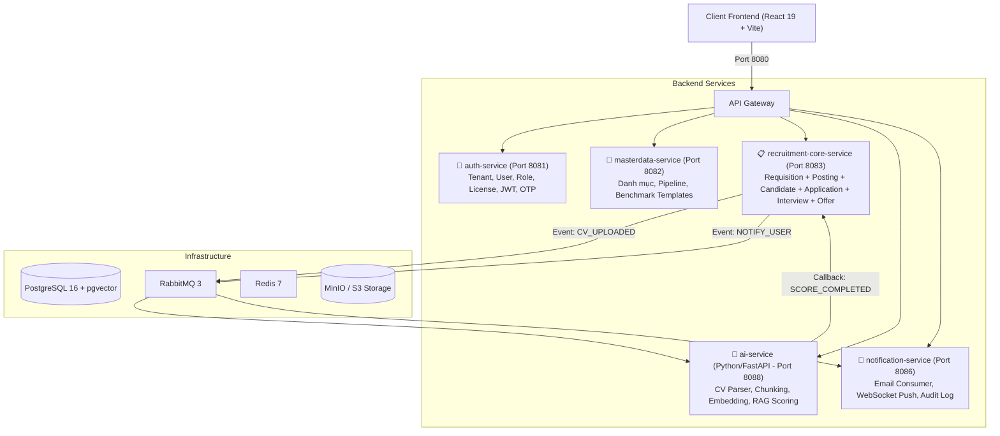
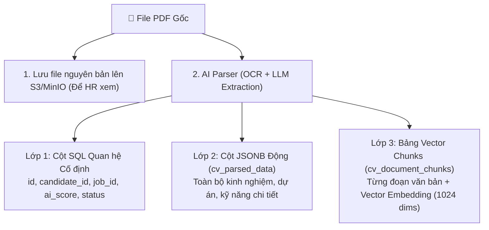
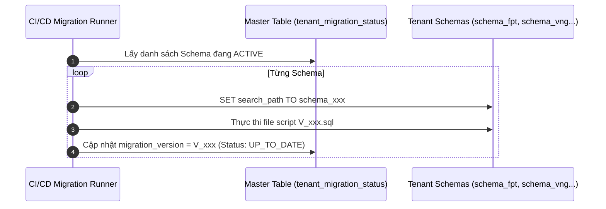
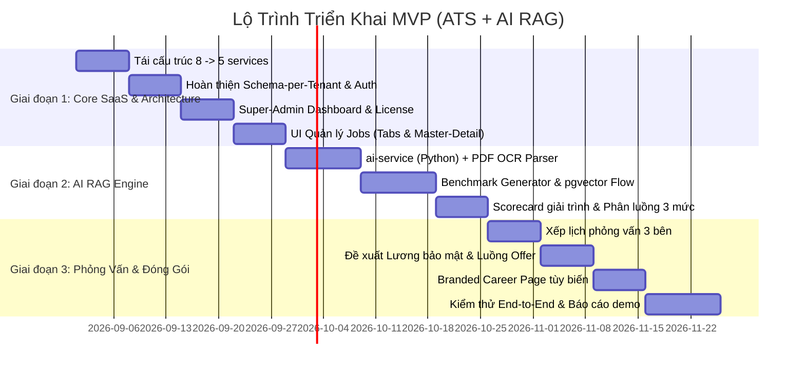

# 📑 TÀI LIỆU TỔNG HỢP TOÀN BỘ PHÂN TÍCH, PHẢN BIỆN & ĐẶC TẢ DỰ ÁN ATS B2B SaaS
## Hệ Thống Quản Lý Tuyển Dụng Đa Doanh Nghiệp Tích Hợp AI RAG (Explainable Benchmark)

---

# MỤC LỤC

1. [Tổng Quan Dự Án & Định Vị Sản Phẩm](#1-tổng-quan-dự-án--định-vị-sản-phẩm)
2. [Hệ Thống Phân Quyền (RBAC) & Cơ Chế Đăng Nhập](#2-hệ-thống-phân-quyền-rbac--cơ-chế-đăng-nhập)
3. [Quy Trình Nghiệp Vụ Từ A Đến Z (Chuẩn Nhận Xét Của Thầy Giáo)](#3-quy-trình-nghiệp-vụ-từ-a-đến-z-chuẩn-nhận-xét-của-thầy-giáo)
4. [Tái Cấu Trúc Kiến Trúc Microservices (Gom 8 → 5 Services)](#4-tái-cấu-trúc-kiến-trúc-microservices-gom-8--5-services)
5. [Thiết Kế Cơ Sở Dữ Liệu Multi-Tenant: PostgreSQL vs MongoDB & Schema-per-Tenant](#5-thiết-kế-cơ-sở-dữ-liệu-multi-tenant-postgresql-vs-mongodb--schema-per-tenant)
6. [Xử Lý Dữ Liệu CV Phi Cấu Trúc Bằng PostgreSQL (JSONB + Vector)](*6-xử-lý-dữ-liệu-cv-phi-cấu-trúc-bằng-postgresql-jsonb--vector*)
7. [AI RAG Engine & Bộ Tiêu Chí Benchmark Chuẩn (Explainable AI)](#7-ai-rag-engine--bộ-tiêu-chí-benchmark-chuẩn-explainable-ai)
8. [Kênh Tuyển Dụng & Career Page Tùy Biến Giao Diện](#8-kênh-tuyển-dụng--career-page-tùy-biến-giao-diện)
9. [Super-Admin Dashboard & Mô Hình Kinh Doanh SaaS Subscription](#9-super-admin-dashboard--mô-hình-kinh-doanh-saas-subscription)
10. [Chiến Lược Migration Cho Schema-per-Tenant](#10-chiến-lược-migration-cho-schema-per-tenant)
11. [Tổng Hợp 25 Câu Hỏi Phản Biện & Quyết Định Đã Chốt](#11-tổng-hợp-25-câu-hỏi-phản-biện--quyết-định-đã-chốt)
12. [Lộ Trình Triển Khai MVP (Minimum Viable Product)](#12-lộ-trình-triển-khai-mvp-minimum-viable-product)

---

# 1. TỔNG QUAN DỰ ÁN & ĐỊNH VỊ SẢN PHẨM

## 1.1 Khái niệm & Mục tiêu
* **Tên dự án:** ATS (Applicant Tracking System) - B2B SaaS Multi-tenant.
* **Mục tiêu cốt lõi:** Cung cấp nền tảng quản lý toàn diện vòng đời tuyển dụng từ khâu phát sinh nhu cầu nhân sự của phòng ban đến khi ứng viên nhận việc (Onboarding/Hired).
* **Điểm nhấn công nghệ (WOW Factor):** Tích hợp **AI RAG (Retrieval-Augmented Generation)** chuyên biệt cho tuyển dụng, tự động bóc tách CV, đối chiếu với **Bộ tiêu chí Benchmark chuẩn** của từng vị trí/doanh nghiệp, đưa ra **điểm số có giải trình dẫn chứng (Explainable AI)** và phân luồng hỗ trợ HR ra quyết định (Human-in-the-Loop).

## 1.2 Bảng so sánh định vị sản phẩm

| Tiêu chí | Mô hình Single-Tenant (Phần mềm đóng gói) | Mô hình Job Portal (TopCV, VietnamWorks) | Mô hình B2B SaaS ATS (Dự án này) ✅ |
| :--- | :--- | :--- | :--- |
| **Khách hàng** | 1 Công ty duy nhất cài On-Premise | Ứng viên tìm việc & Nhà tuyển dụng mua tin | **Nhiều doanh nghiệp đăng ký thuê bao (SaaS)** |
| **Quy trình nội bộ** | Có nhưng chỉ cho 1 công ty | Rất sơ sài (chủ yếu là thu thập CV) | **Đầy đủ, khép kín (Req ➔ PV ➔ Lương ➔ Offer)** |
| **Data Isolation** | 1 DB riêng biệt | Gộp chung toàn bộ ứng viên | **Schema-per-Tenant (Cách ly dữ liệu độc lập)** |
| **Career Page** | Cố định theo công ty đó | Nằm chung trên trang chủ chợ việc làm | **Branded Career Page riêng (`/c/:tenantCode`)** |

---

# 2. HỆ THỐNG PHÂN QUYỀN (RBAC) & CƠ CHẾ ĐĂNG NHẬP

## 2.1 Ma trận 5 Vai trò (Roles)



## 2.2 Quy tắc Auth & Tạo Tenant Code
1. **Đăng nhập đơn giản:** Bỏ yêu cầu nhập mã công ty ở màn hình Login. Người dùng chỉ cần nhập `Email` + `Password`.
2. **Quy tắc Email:** 1 Email của nhân viên nội bộ thuộc về 1 Tenant (theo domain của Tenant đó).
3. **Sinh mã công ty (Tenant Code):** Tự động sinh theo công thức: `<chuỗi_người_dùng_nhập>-<hash_ngẫu_nhiên_4_ký_tự>`.
   * Ví dụ: Doanh nghiệp nhập `fpt-software` ➔ Tenant Code: `fpt-software-8a2b`.
   * Tenant Code dùng làm Slug URL Career Page: `domain.com/c/fpt-software-8a2b`.

---

# 3. QUY TRÌNH NGHIỆP VỤ TỪ A ĐẾN Z (CHUẨN NHẬN XÉT CỦA THẦY GIÁO)

Quy trình giải quyết trọn vẹn bài toán **"Phần mềm khép kín không cần công cụ bên thứ ba"**, bao gồm 5 giai đoạn:



### Chi tiết các quy tắc nghiệp vụ quan trọng:
* **Giai đoạn 2 (AI Sơ tuyển):** AI **không được tự ý Reject hay Approve**. AI chỉ phân thành 3 nhóm: 
  * 🟢 `PHÙ HỢP (MATCH)` ($\ge 80\%$)
  * 🟡 `CHƯA PHÂN LOẠI (REVIEW)` ($50 - 79\%$ hoặc thiếu thông tin)
  * 🔴 `KHÔNG PHÙ HỢP (NOT MATCH)` ($< 50\%$)
  * HR luôn là người click nút duyệt cuối cùng.
* **Giai đoạn 3 (Xếp lịch 3 bên):** Không để HR gọi điện thoại thủ công. HR tạo danh sách khung giờ (Slots) ➔ Phòng ban tick chọn ➔ Ứng viên tick chọn ➔ Hệ thống tự tìm giao thoa và tạo lịch.
* **Giai đoạn 4 (Bảo mật Lương đề xuất):** Mức lương thực tế do Phòng ban đề xuất sau phỏng vấn **CHỈ HR VÀ PHÒNG BAN NHÌN THẤY**, Ứng viên tuyệt đối không thấy ở giai đoạn này.
* **Giai đoạn 5 (Offer Deadline):** Có thời hạn phản hồi. Hệ thống gửi email nhắc nhở tự động trước khi chuyển trạng thái sang Expired nếu ứng viên không trả lời.

---

# 4. TÁI CẤU TRÚC KIẾN TRÚC MICROSERVICES (GOM 8 → 5 SERVICES)

## 4.1 Đánh giá kiến trúc cũ (8 Services)
* **Nhược điểm:** Tách rời `candidate-service`, `application-service`, `interview-service`, `offer-service` làm phát sinh hàng loạt lệnh gọi HTTP Feign Client chéo nhau, gây tăng độ trễ (latency), khó kiểm soát transaction phân tán và tăng gấp đôi độ phức tạp debug.

## 4.2 Kiến trúc tối ưu (5 Services)



---

# 5. THIẾT KẾ CƠ SỞ DỮ LIỆU MULTI-TENANT: POSTGRESQL VS MONGODB & SCHEMA-PER-TENANT

## 5.1 So sánh PostgreSQL vs MongoDB trong ATS

| Tiêu chí | PostgreSQL 16+ ✅ | MongoDB ❌ |
| :--- | :--- | :--- |
| **Quan hệ & Ràng buộc (RDBMS)** | Cực mạnh (Foreign Keys, Cascade, Transaction ACID). Phù hợp tuyệt đối với luồng trạng thái phức tạp của ATS. | Rất yếu, dễ gây dữ liệu "mồ côi" khi xóa/sửa Job, User, Application. |
| **Tích hợp Vector AI RAG** | Có sẵn extension **`pgvector`**. Cho phép JOIN bảng Vector và bảng SQL trong 1 câu query. | Phải dùng MongoDB Atlas Cloud trả phí, bản Local Docker hạn chế. |
| **Multi-tenancy** | Hỗ trợ **Schema-per-Tenant** tự nhiên qua `SET search_path`. | Phải tạo hàng nghìn Collection riêng, khó quản lý index. |
| **Lưu trữ JSON linh hoạt** | Kiểu dữ liệu **`JSONB` + GIN Index** xử lý CV phi cấu trúc mượt như NoSQL. | JSON tự nhiên nhưng không có lợi thế hơn `JSONB` của Postgres. |

➔ **Kết luận:** **PostgreSQL là lựa chọn chuẩn chỉ và vượt trội 100%.**

## 5.2 Mô hình Schema-per-Tenant
* Tất cả doanh nghiệp dùng chung **1 Database Instance vật lý** và **1 Connection Pool (HikariCP 20-30 connections)**.
* Mỗi doanh nghiệp được cấp 1 **PostgreSQL Schema (Namespace logic)** riêng: `schema_fpt`, `schema_vng`, `schema_techcorp`.
* Dữ liệu và Vector embeddings của công ty nào nằm trọn trong Schema công ty đó ➔ **Bảo mật tuyệt đối, Zero Data Leakage.**

---

# 6. XỬ LÝ DỮ LIỆU CV PHI CẤU TRÚC BẰNG POSTGRESQL (JSONB + VECTOR)

Mỗi CV có layout và cách trình bày khác nhau (1 cột, 2 cột, bảng biểu, icon...). Hệ thống xử lý theo **Mô hình Dữ liệu 3 Lớp**:



### Cấu trúc bảng SQL:
```sql
-- Dòng dữ liệu gắn liền với candidate_id và job_posting_id
CREATE TABLE applications (
    id BIGSERIAL PRIMARY KEY,
    job_posting_id BIGINT NOT NULL,
    candidate_id BIGINT NOT NULL,
    cv_url VARCHAR(500) NOT NULL,
    cv_parsed_data JSONB,                       -- Chứa toàn bộ nội dung động
    ai_match_score NUMERIC(5,2),                -- Điểm AI (0 - 100)
    ai_classification VARCHAR(50),              -- MATCH, REVIEW, NOT_MATCH
    current_stage VARCHAR(50) DEFAULT 'SCREENING',
    status VARCHAR(50) DEFAULT 'ACTIVE',
    created_at TIMESTAMP DEFAULT CURRENT_TIMESTAMP
);

-- Bảng lưu Vector phục vụ RAG
CREATE EXTENSION IF NOT EXISTS vector;

CREATE TABLE cv_document_chunks (
    id BIGSERIAL PRIMARY KEY,
    application_id BIGINT NOT NULL REFERENCES applications(id),
    chunk_type VARCHAR(50),                     -- SKILL, WORK_EXP, EDUCATION
    content TEXT NOT NULL,
    embedding vector(1024),                     -- Multilingual E5 Large
    created_at TIMESTAMP DEFAULT CURRENT_TIMESTAMP
);
```

---

# 7. AI RAG ENGINE & BỘ TIÊU CHÍ BENCHMARK CHUẨN (EXPLAINABLE AI)

## 7.1 Tại sao KHÔNG cần "Train lại AI" cho từng công ty?
* **Hiểu lầm:** Nghĩ rằng mỗi công ty có tiêu chuẩn khác nhau thì phải Train (Fine-tune) model riêng.
* **Thực tế:** Không Fine-tune LLM. Sử dụng **In-Context Learning qua RAG**: Nhồi bộ tiêu chí Benchmark của công ty đó + Context CV vào Prompt lúc runtime.

## 7.2 Nguồn Benchmark chuẩn
1. **Khung chuẩn quốc tế:** O*NET (Mỹ), ESCO (Châu Âu), SFIA (Khung kỹ năng CNTT).
2. **Khung thị trường VN:** Báo cáo kỹ năng & lương của ITviec, TopCV.
3. **AI Smart Benchmark Generator:** Khi HR dán JD vào ➔ AI tự bóc tách thành bộ 4-5 tiêu chí Rubric kèm trọng số % ➔ HR kéo chỉnh thanh trượt trên UI trong 30 giây.

## 7.3 Mẫu Báo cáo AI Giải trình (Side-by-Side Scorecard)

Mỗi tiêu chí bắt buộc phải có đủ **4 thành phần chứng cứ**:

| Tiêu chí Benchmark (Trọng số) | Tiêu chuẩn yêu cầu | Dẫn chứng trích từ CV (Evidence) | Phân tích của AI (Gap Analysis) | Điểm |
| :--- | :--- | :--- | :--- | :---: |
| **1. Java & Microservices (40%)** | $\ge 3$ năm Java 17+, Spring Boot 3, Message Queue, PostgreSQL | 📌 *Trích đoạn CV (Cty ABC 2021-2024):*<br>"- Thiết kế 6 microservices với Spring Boot 3, RabbitMQ, PostgreSQL." | 🟢 **Đạt xuất sắc:** 3.5 năm kinh nghiệm thực chiến đúng Tech stack yêu cầu. | **38 / 40** |
| **2. Hệ thống tải cao (30%)** | Đã làm hệ thống High-traffic (> 1.000 RPS) | 📌 *Trích đoạn CV (Dự án E-com Gateway):*<br>"- Xây dựng Gateway chịu tải 3.000 RPS đợt Flash Sale." | 🟢 **Đạt:** Đã có kinh nghiệm thực tế vượt mức chuẩn 1.000 RPS. | **28 / 30** |
| **3. Tiếng Anh (15%)** | Đọc hiểu tài liệu & giao tiếp (TOEIC 650+) | 📌 *Trích đoạn CV:* "- TOEIC 780 (5/2023)." | 🟢 **Đạt:** Chứng chỉ còn hạn. | **14 / 15** |
| **4. Lead & CI/CD (15%)** | Code Review, hướng dẫn Junior, setup CI/CD | 📌 *Trích đoạn CV:* "- Có dùng Docker cơ bản."<br>*(Không tìm thấy K8s hay kinh nghiệm Lead)* | 🟡 **Chưa đạt:** Chỉ có Docker cơ bản, thiếu kinh nghiệm CI/CD và quản lý nhóm. | **7.5 / 15** |

* **Tổng điểm:** **87.5 / 100** ➔ **Phân loại: PHÙ HỢP (MATCH)**.
* **🎯 AI gợi ý câu hỏi phỏng vấn đào sâu:**
  1. *"Bạn đã từng gặp sự cố bottleneck nào lớn nhất khi hệ thống đạt 3.000 RPS và xử lý ra sao?"*
  2. *"Quy trình CI/CD và deploy Production của team bạn ở dự án trước diễn ra như thế nào?"*

---

# 8. KÊNH TUYỂN DỤNG & CAREER PAGE TÙY BIẾN GIAO DIỆN

## 8.1 Kênh tuyển dụng chính
* **Mô hình:** **Branded Career Page (`/c/:tenantCode`)**.
* Doanh nghiệp tự copy link Career Page của mình để đăng lên Facebook, LinkedIn, Website công ty hoặc TopCV. Ứng viên click link ➔ Về trang của doanh nghiệp ➔ Nộp CV ➔ Dữ liệu chảy thẳng vào Schema của Tenant đó.

## 8.2 Tùy biến giao diện (Theme Config)
Doanh nghiệp tự cấu hình giao diện tại trang Cài đặt:
* Upload Logo & Ảnh bìa Banner
* Chọn Màu chủ đạo (Primary Color), Màu nền qua Color Picker
* Slogan, Giới thiệu công ty (About Us), Phúc lợi chung qua Rich Text Editor
* Frontend áp dụng màu sắc động qua CSS Variables:
  ```css
  .career-banner { background-color: var(--primary-color); }
  .btn-apply { background-color: var(--primary-color); }
  .career-page { background-color: var(--bg-color); color: var(--text-color); }
  ```

---

# 9. SUPER-ADMIN DASHBOARD & MÔ HÌNH KINH DOANH SAAS SUBSCRIPTION

## 9.1 SaaS Subscription vs Bán License
* **Bản chất:** Nền tảng của bạn là **SaaS Subscription (Thuê bao dịch vụ Cloud)**, không phải bán License đóng gói cho khách tự cài.
* **Từ "License" trong hệ thống:** Được định nghĩa là **"Quyền truy cập có thời hạn kèm giới hạn tính năng" (Gói dịch vụ + Expiry Date)**.

## 9.2 Chức năng của Super-Admin Dashboard
1. **Quản lý Tenants:** Xem danh sách, tạo mới, tạm khóa (Suspend), mở khóa, xóa Tenant.
2. **Quản lý Gói dịch vụ (Plans):**
   * **FREE:** Tối đa 3 Jobs mở, 50 CV/tháng, 3 Users.
   * **STANDARD:** Tối đa 20 Jobs mở, 500 CV/tháng, AI Scoring, Custom Career Page.
   * **ENTERPRISE:** Không giới hạn.
3. **Platform Metrics:** Tổng số Tenant, Tăng trưởng Tenant mới, Tổng số Jobs, Tải xử lý AI CVs.
4. **Audit Log toàn nền tảng:** Nhật ký các hành động nhạy cảm.
5. **🔒 Quy tắc bảo mật:** Super-Admin **tuyệt đối không được xem dữ liệu CV, lương, kết quả phỏng vấn nội bộ** của doanh nghiệp.

---

# 10. CHIẾN LƯỢC MIGRATION CHO SCHEMA-PER-TENANT

Khi phát triển tính năng mới cần thay đổi cấu trúc bảng (thêm cột, tạo bảng mới), hệ thống phải tự động cập nhật cấu trúc cho tất cả các Schema đang hoạt động:



---

# 11. TỔNG HỢP 25 CÂU HỎI PHẢN BIỆN & QUYẾT ĐỊNH ĐÃ CHỐT

| # | Câu hỏi phản biện | Quyết định thiết kế đã chốt |
| :---: | :--- | :--- |
| **1** | Single-tenant hay Multi-tenant? | ✅ **Multi-tenant B2B SaaS** (Bắt buộc để đúng đề tài). |
| **2** | Có cần Super-Admin Dashboard? | ✅ **Có** (Quản lý Tenant, License, Subscription, Metrics). |
| **3** | Phần mềm khép kín không dùng tool ngoài? | ✅ Đưa toàn bộ quy trình Xếp lịch 3 bên, Chấm điểm, Offer vào hệ thống. |
| **4** | Candidate trên Mobile? | ✅ Tối ưu Responsive Web cho Candidate xem trạng thái, xác nhận PV, Offer. |
| **5** | Ai tạo Benchmark? | ✅ **AI tự sinh từ JD** + HR kéo chỉnh % trên UI trong 30 giây. |
| **6** | Điểm AI có giải trình không? | ✅ **Bắt buộc:** Bảng đối chiếu Side-by-Side kèm trích dẫn nguyên văn từ CV. |
| **7** | CV tiếng Việt xử lý thế nào? | ✅ Dùng Embedding đa ngôn ngữ `multilingual-e5-large` + OCR tiếng Việt. |
| **8** | Trích xuất CV phi cấu trúc? | ✅ Parse ra JSON chuẩn, lưu cột SQL định danh + cột `JSONB` + `pgvector`. |
| **9** | Logic phân luồng 3 mức AI? | ✅ $\ge 80\%$ Match, $50-79\%$ Review, $< 50\%$ Not Match. Không auto-reject. |
| **10** | Không có slot PV giao thoa? | ✅ Hệ thống báo và đề xuất HR tạo thêm khung giờ mới. |
| **11** | Candidate không xác nhận lịch PV? | ✅ Gửi email nhắc tự động sau 24h/48h. |
| **12** | Panel Interview nhiều người? | ✅ Mỗi người phỏng vấn có khung giờ rảnh riêng để hệ thống khớp. |
| **13** | Dữ liệu Lương đề xuất lưu ở đâu? | ✅ Bảng `salary_proposals` có Field-level Security, chỉ HR và Phòng ban thấy. |
| **14** | HR không đồng ý mức lương đề xuất? | ✅ HR có quyền điều chỉnh mức lương chốt và ghi chú lý do. |
| **15** | Offer hết hạn phản hồi? | ✅ Gửi email nhắc nhở, sau hạn tự động chuyển trạng thái `EXPIRED`. |
| **16** | Đánh giá lại 8 Microservices? | ✅ **Gom lại thành 5 Services** (recruitment-core gom 5 module). |
| **17** | Giảm phụ thuộc gọi chéo? | ✅ Gom domain vào `recruitment-core-service`, dùng SQL JOIN thay vì Feign. |
| **18** | Kế hoạch Migrate Schema-per-tenant? | ✅ Dùng bảng `tenant_migration_status` và script Migration Runner tự động. |
| **19** | 1 Email thuộc mấy Tenant? | ✅ **1 Email chỉ thuộc 1 Tenant** (theo domain nội bộ công ty). |
| **20** | Layout UI tin tuyển dụng? | ✅ Master-Detail / Drawer thu gọn mở rộng + Tabs trạng thái trực quan. |
| **21** | Field tuyển dụng theo văn hóa VN? | ✅ Dải lương rõ ràng, Thưởng tháng 13, Bảo hiểm, Địa điểm làm việc, Phụ cấp. |
| **22** | Candidate thấy gì ở My Applications? | ✅ Thấy chính xác mình đang ở vòng nào (Sơ tuyển ➔ Phỏng vấn ➔ Offer). |
| **23** | Kênh tuyển dụng? | ✅ **Branded Career Page (`/c/:tenantCode`)**. |
| **24** | Career Page tùy biến giao diện? | ✅ **Theme Config** (Logo, Banner, Color Picker, Slogan, Rich Text). |
| **25** | Điểm nhấn công nghệ (WOW Factor)? | ✅ **AI RAG Benchmark Scoring có giải trình dẫn chứng + Xếp lịch 3 bên.** |

---

# 12. LỘ TRÌNH TRIỂN KHAI MVP (MINIMUM VIABLE PRODUCT)



---
*Tài liệu được tạo tự động để lưu trữ toàn bộ quyết định kỹ thuật và nghiệp vụ của dự án ATS.*
