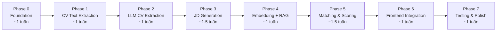

# Kế Hoạch Triển Khai AI Service — Chia Nhỏ Từng Phase

Chia bản master plan thành **7 Phase** độc lập, mỗi Phase có thể **build → test → verify** trước khi chuyển sang Phase tiếp theo.

---

## Tổng Quan Các Phase



---

## Phase 0: Foundation (Nền tảng) — ~1 tuần

> **Mục tiêu:** Dựng xong skeleton `ai-service`, DB, message queue — chưa có AI logic.

### Các bước thực hiện

| # | Task | Chi tiết |
|:---:|:---|:---|
| 0.1 | **Khởi tạo project `ai-service`** | FastAPI project, cấu trúc thư mục: `app/api/`, `app/core/`, `app/services/`, `app/models/`, `app/schemas/`, `app/workers/` |
| 0.2 | **Dockerfile + Docker Compose** | Thêm `ai-service` vào `docker-compose.yml`, port `8088`. Thêm PostgreSQL image thay bằng `pgvector/pgvector:pg16` |
| 0.3 | **Database migrations** | Tạo bảng `ai_jobs`, `cv_document_chunks`, `ai_feedback`. ALTER bảng `application` thêm cột AI. ALTER bảng `job_posting` thêm `benchmark_criteria` |
| 0.4 | **RabbitMQ queue setup** | Tạo queue `cv.uploaded`, `ai.scoring.completed`. Config consumer skeleton |
| 0.5 | **Health check API** | `GET /api/v1/ai/health` trả `{"status": "ok"}` |
| 0.6 | **Config management** | `.env` file cho API keys (OpenAI, Gemini), DB URL, RabbitMQ URL, MinIO URL |

### Kiểm thử Phase 0

```
✅ Test 0.1: `docker compose up ai-service` → container start không lỗi
✅ Test 0.2: `curl http://localhost:8088/api/v1/ai/health` → 200 OK
✅ Test 0.3: Connect PostgreSQL → verify bảng `ai_jobs`, `cv_document_chunks`, `ai_feedback` tồn tại
✅ Test 0.4: Verify pgvector extension enabled: `SELECT * FROM pg_extension WHERE extname = 'vector'`
✅ Test 0.5: RabbitMQ Management UI → thấy queue `cv.uploaded` tồn tại
✅ Test 0.6: Verify cột mới trên bảng `application` (cv_parsed_data, ai_match_score, ai_classification, ai_scorecard)
```

---

## Phase 1: CV Text Extraction (Trích xuất text) — ~1 tuần

> **Mục tiêu:** Nhận file PDF/DOCX từ MinIO → trích xuất raw text. Chưa dùng LLM.

### Các bước thực hiện

| # | Task | Chi tiết |
|:---:|:---|:---|
| 1.1 | **Input Validation module** | Kiểm tra file tồn tại trên MinIO, verify MIME (PDF/DOCX/PNG/JPG), size ≤ 10MB, file không corrupt |
| 1.2 | **PDF Text Extraction** | Dùng PyMuPDF `page.get_text("blocks")`. Quality check: text_density < 100 chars/page → flag `needs_ocr` |
| 1.3 | **DOCX Text Extraction** | Dùng `python-docx` |
| 1.4 | **OCR Fallback** | PaddleOCR PP-OCRv4 cho CV scan/ảnh. Confidence check: > 0.7 OK, < 0.5 flag HR review |
| 1.5 | **Text Normalization** | Unicode NFC, fix dấu tiếng Việt lỗi OCR, xóa formatting thừa. KHÔNG xóa nội dung |
| 1.6 | **Prompt Injection Scan** | Regex detect "ignore instructions", "system prompt", invisible chars (zero-width). Flag nhưng KHÔNG reject |
| 1.7 | **Test API endpoint** | `POST /api/v1/ai/extract-text` nhận file URL → trả raw text (dùng để test thủ công) |

### Kiểm thử Phase 1

```
✅ Test 1.1: Upload file > 10MB → trả lỗi INVALID_FILE_SIZE
✅ Test 1.2: Upload file .exe → trả lỗi INVALID_FILE_TYPE  
✅ Test 1.3: Upload PDF text-based → trả raw text đầy đủ, đọc được tiếng Việt
✅ Test 1.4: Upload DOCX → trả raw text đầy đủ
✅ Test 1.5: Upload PDF scan (ảnh) → OCR trả text, confidence score hợp lý
✅ Test 1.6: Upload PDF chứa hidden text "ignore previous instructions" → flag injection_detected = true
✅ Test 1.7: Upload file corrupt → trả lỗi FILE_CORRUPT
✅ Test 1.8: Text Normalization — dấu tiếng Việt bị lỗi "Nguyen" → "Nguyễn" (nếu có thể)
```

> [!TIP]
> **Cách test nhanh:** Chuẩn bị 5-6 file CV mẫu (PDF text, PDF scan, DOCX, file lỗi) để test thủ công qua API.

---

## Phase 2: LLM CV Extraction (Bóc tách CV → JSON) — ~1 tuần

> **Mục tiêu:** Raw text → gọi LLM → trả JSON có cấu trúc (ExtractedCV schema).

### Các bước thực hiện

| # | Task | Chi tiết |
|:---:|:---|:---|
| 2.1 | **Pydantic schemas** | Tạo `ExtractedCV`, `CandidateInfo`, `WorkExperience`, `Education`, `Certification`, `Project` |
| 2.2 | **LLM Client abstraction** | Abstract class cho GPT-4o-mini + Gemini fallback. Retry logic (2x, backoff 2s/4s) |
| 2.3 | **Extraction Prompt** | System prompt + CV text wrapped `### BEGIN CV ### / ### END CV ###`. JSON schema enforcement |
| 2.4 | **Extraction Engine** | Gọi LLM → validate Pydantic → tính Confidence score → lưu `cv_parsed_data` vào DB |
| 2.5 | **Confidence Scoring** | Per-field check (critical: name, skills, experience weight cao). Overall weighted average |
| 2.6 | **Test API endpoint** | `POST /api/v1/ai/extract-cv` nhận file URL → trả ExtractedCV JSON |

### Kiểm thử Phase 2

```
✅ Test 2.1: CV tiếng Anh chuẩn → JSON có đủ name, email, phone, skills, experience
✅ Test 2.2: CV tiếng Việt → JSON đọc đúng tên Việt, trường ĐH, kỹ năng
✅ Test 2.3: CV thiếu email → JSON có email = null (KHÔNG bịa)
✅ Test 2.4: CV rất ngắn → confidence = LOW, flag review
✅ Test 2.5: GPT-4o-mini timeout → tự động fallback sang Gemini
✅ Test 2.6: LLM trả JSON lỗi → retry → fallback → nếu vẫn lỗi → FAILED_EXTRACTION
✅ Test 2.7: Verify JSON luôn pass Pydantic validation (schema enforcement)
✅ Test 2.8: Verify KHÔNG extraction gender, photo, religion (bias fields)
```

> [!IMPORTANT]
> **Key milestone:** Sau Phase 2, bạn đã có thể demo: Upload CV → xem JSON bóc tách. Đây là deliverable đầu tiên có thể show GVHD.

---

## Phase 3: JD Generation (Sinh JD + Benchmark) — ~1.5 tuần

> **Mục tiêu:** Recruiter nhập input → AI sinh JD + bộ tiêu chí benchmark.

### Các bước thực hiện

| # | Task | Chi tiết |
|:---:|:---|:---|
| 3.1 | **JD Generation Prompt** | System prompt Việt hóa, output JSON schema (overview, responsibilities, requirements, benefits) |
| 3.2 | **Benchmark Criteria Generation** | Sinh 4-5 tiêu chí, tổng weight = 100%. Mỗi criterion có: name, weight, standardRequirement, category, isMustHave |
| 3.3 | **Validation Rules** | `sum(weights) == 100`, cosine similarity responsibilities < 0.85 (detect duplicate), ≥ 3 responsibilities |
| 3.4 | **Sync API** | `POST /api/v1/ai/jd/generate` (sync, < 10s response) |
| 3.5 | **Benchmark API** | `POST /api/v1/ai/benchmark/generate` (sinh benchmark từ JD có sẵn) |
| 3.6 | **Integration: recruitment-service** | `recruitment-service` gọi `ai-service` qua REST. Lưu `benchmark_criteria` JSONB vào `job_posting` |
| 3.7 | **Frontend: JD Generator UI** | Form nhập (title, level, skills, experience, notes) → hiển thị JD + benchmark → weight slider điều chỉnh → Lưu |

### Kiểm thử Phase 3

```
✅ Test 3.1: POST /jd/generate với input "Senior Java Engineer" → trả JD tiếng Việt hợp lý
✅ Test 3.2: Benchmark có 4-5 criteria, sum(weights) = 100
✅ Test 3.3: Mỗi criterion có standardRequirement không rỗng
✅ Test 3.4: Response time < 10 giây
✅ Test 3.5: Gửi input thiếu (chỉ có title) → vẫn sinh được JD cơ bản
✅ Test 3.6: POST /benchmark/generate với JD có sẵn → sinh benchmark criteria
✅ Test 3.7: Frontend: nhập form → xem JD → kéo weight slider → tổng luôn = 100 → Lưu thành công
✅ Test 3.8: Lưu DB → verify job_posting.benchmark_criteria JSONB có dữ liệu
```

---

## Phase 4: Embedding + Vector Storage (RAG cơ sở) — ~1 tuần

> **Mục tiêu:** Chunk CV → tạo embedding → lưu pgvector → sẵn sàng cho semantic search.

### Các bước thực hiện

| # | Task | Chi tiết |
|:---:|:---|:---|
| 4.1 | **Semantic Chunking** | Chia ExtractedCV thành chunks theo loại: `WORK_EXPERIENCE` (1/job), `PROJECT` (1/project), `EDUCATION` (1/degree), `SKILL_SUMMARY`, `CERTIFICATION` |
| 4.2 | **Embedding Model Setup** | Deploy `multilingual-e5-large-instruct` (ONNX runtime, CPU). Prefix mỗi chunk với `passage: ` |
| 4.3 | **pgvector Storage** | Lưu chunks + embedding vector(1024) vào `cv_document_chunks`. HNSW index |
| 4.4 | **Skill Normalization** | Exact match → Alias match ("JS"→"JavaScript") → Embedding similarity (cosine > 0.85) → Unmatched giữ free-text |
| 4.5 | **Retrieval API** | Internal function: query criterion text → top-3 relevant chunks (cosine similarity) |

### Kiểm thử Phase 4

```
✅ Test 4.1: CV có 3 job → tạo 3 WORK_EXPERIENCE chunks + SKILL_SUMMARY + EDUCATION chunks
✅ Test 4.2: Embedding model trả vector 1024 dims cho text tiếng Việt
✅ Test 4.3: Insert chunk + embedding → query by cosine similarity → trả kết quả đúng
✅ Test 4.4: Skill "React.js" → normalize thành "React" (alias match)
✅ Test 4.5: Skill "NextJS" → cosine > 0.85 với "Next.js" → match
✅ Test 4.6: Query "kinh nghiệm Java Spring Boot" → trả chunk WORK_EXPERIENCE liên quan nhất
✅ Test 4.7: Verify HNSW index hoạt động: query time < 100ms
```

---

## Phase 5: Matching & Scoring (Chấm điểm + Xếp hạng) — ~1.5 tuần

> **Mục tiêu:** Pipeline end-to-end: CV upload → extraction → embedding → scoring → scorecard. Đây là Phase phức tạp nhất.

### Các bước thực hiện

| # | Task | Chi tiết |
|:---:|:---|:---|
| 5.1 | **Hard Filtering (Rule Engine)** | Check must-have criteria: kinh nghiệm tối thiểu, kỹ năng bắt buộc, học vấn. KHÔNG dùng AI. Flag nhưng KHÔNG tự loại |
| 5.2 | **RAG Scoring per Criterion** | Với mỗi criterion: vector retrieve top-3 chunks → LLM evaluate → score + evidence + gapAnalysis |
| 5.3 | **Scoring Prompt** | Blind scoring (KHÔNG có tên, gender, tuổi). Prompt: "Trích dẫn đúng từ CV. Không bịa evidence." |
| 5.4 | **Score Aggregation** | `totalScore = Σ criterion_scores`. Classification: ≥80 MATCH 🟢, 50-79 REVIEW 🟡, <50 NOT_MATCH 🔴 |
| 5.5 | **Guardrail Validation** | Schema validation, score bounds 0-100, evidence substring match, contradiction check, bias check |
| 5.6 | **Full Async Pipeline** | `cv.uploaded` event → Worker chạy Stage 1-14 → lưu DB → publish `ai.scoring.completed` |
| 5.7 | **Score API** | `GET /api/v1/ai/applications/{id}/score` → trả Scorecard JSON |
| 5.8 | **Rescore API** | `POST /api/v1/ai/applications/{id}/rescore` → trigger chấm lại |
| 5.9 | **Feedback API** | `POST /api/v1/ai/feedback` → lưu recruiter feedback |

### Kiểm thử Phase 5

```
✅ Test 5.1: CV thiếu kỹ năng must-have "Java" → hard filter flag "Chưa đạt: Java" nhưng KHÔNG loại
✅ Test 5.2: CV có 3 năm Java, JD yêu cầu 2 năm → criterion "Kinh nghiệm Java" score cao
✅ Test 5.3: Mỗi criterion evaluation có evidence là trích dẫn thực từ CV (substring match verified)
✅ Test 5.4: totalScore = sum(criterion_scores), 0 ≤ score ≤ 100
✅ Test 5.5: Classification đúng: score 85 → MATCH, score 65 → REVIEW, score 30 → NOT_MATCH
✅ Test 5.6: Evidence nói "Không tìm thấy" nhưng score = PASS → guardrail flag contradiction
✅ Test 5.7: Full pipeline test: upload CV → chờ ~30-60s → GET /score → trả scorecard hoàn chỉnh
✅ Test 5.8: Duplicate cv.uploaded event → idempotent, không process lại
✅ Test 5.9: POST /rescore → trigger pipeline mới → score mới
✅ Test 5.10: POST /feedback → lưu DB thành công
✅ Test 5.11: Scoring prompt KHÔNG chứa tên ứng viên, gender, tuổi (blind scoring)
```

> [!WARNING]
> **Phase 5 là phase khó nhất.** Nên chia thêm: trước hết test scoring với 1 criterion → rồi mới mở rộng 4-5 criteria.

---

## Phase 6: Frontend Integration — ~1 tuần

> **Mục tiêu:** Hiển thị kết quả AI trên giao diện recruiter.

### Các bước thực hiện

| # | Task | Chi tiết |
|:---:|:---|:---|
| 6.1 | **AI Classification Badge** | Hiện badge MATCH 🟢 / REVIEW 🟡 / NOT_MATCH 🔴 trên Application List |
| 6.2 | **Scorecard Component** | Hiển thị: totalScore, summary, từng criterion (name, weight, score, status, evidence, gapAnalysis) |
| 6.3 | **AI Status Indicator** | Hiện trạng thái xử lý: QUEUED → PROCESSING → COMPLETED / FAILED |
| 6.4 | **Filter by Classification** | Filter application list theo MATCH / REVIEW / NOT_MATCH |
| 6.5 | **Sort by AI Score** | Sắp xếp application list theo ai_match_score DESC |
| 6.6 | **Feedback Buttons** | Nút "Đồng ý" / "Chỉnh score" / "Báo lỗi" trên Scorecard |
| 6.7 | **CV Parsed Data View** | Tab hiển thị thông tin đã bóc tách (skills, experience, education) |
| 6.8 | **Integration: application-service** | `application-service` consume event `ai.scoring.completed` → update `ai_match_score`, `ai_classification`, `ai_scorecard` |

### Kiểm thử Phase 6

```
✅ Test 6.1: Application list hiện badge màu đúng theo classification
✅ Test 6.2: Click vào application → xem Scorecard đầy đủ (score, evidence, gap analysis)
✅ Test 6.3: CV đang xử lý → hiện "Đang phân tích..." (PROCESSING)
✅ Test 6.4: Filter "MATCH" → chỉ hiện ứng viên MATCH
✅ Test 6.5: Sort by AI Score → đúng thứ tự giảm dần
✅ Test 6.6: Click "Đồng ý" → feedback lưu DB
✅ Test 6.7: Tab "Thông tin bóc tách" → hiện skills, experience, education từ cv_parsed_data
✅ Test 6.8: End-to-end: Upload CV → chờ → badge xuất hiện → click xem scorecard
```

---

## Phase 7: Testing & Polish — ~1 tuần

> **Mục tiêu:** Golden dataset testing, edge cases, performance, documentation.

### Các bước thực hiện

| # | Task | Chi tiết |
|:---:|:---|:---|
| 7.1 | **Tạo Golden Dataset** | 34 CV-JD pairs (xem Section 18 master plan): CV tech chuẩn, creative layout, scan, tiếng Việt, tiếng Anh, song ngữ, ngắn, thiếu field, prompt injection |
| 7.2 | **Extraction Accuracy Test** | Chạy 34 CV qua extraction → so sánh với expected JSON → đo exact match critical fields ≥ 95% |
| 7.3 | **Scoring Accuracy Test** | Chạy 34 CV-JD pairs qua scoring → so sánh classification với expected → agreement ≥ 75% |
| 7.4 | **Edge Case Tests** | CV corrupt, CV 0 bytes, CV 50 trang, concurrent 10 CV cùng lúc, LLM timeout simulation |
| 7.5 | **Prompt Injection Test** | 2 CV chứa injection → verify scan detect + scoring không bị thao túng |
| 7.6 | **Performance Test** | p95 latency ≤ 60s, cost per CV ≤ $0.10 |
| 7.7 | **Cost Tracking** | Verify `ai_jobs` ghi đúng token count + estimated_cost_usd |
| 7.8 | **Documentation** | API docs (FastAPI auto-generate), architecture diagram, deployment guide |

### Kiểm thử Phase 7

```
✅ Test 7.1: Extraction critical fields (name, email, phone) ≥ 95% exact match trên golden dataset
✅ Test 7.2: Extraction skills/experience F1 ≥ 85%
✅ Test 7.3: Scoring classification agreement ≥ 75% vs expected
✅ Test 7.4: Invalid JSON rate = 0% (schema enforcement)
✅ Test 7.5: p95 latency ≤ 60 giây
✅ Test 7.6: Prompt injection 100% detected trên known patterns
✅ Test 7.7: Cost per CV ≤ $0.10
✅ Test 7.8: Tất cả failure scenarios (Section 25) đều có error handling hợp lý
```

---

## Bảng Tóm Tắt

| Phase | Tên | Thời gian | Deliverable chính | Có thể demo? |
|:---:|:---|:---:|:---|:---:|
| 0 | Foundation | ~1 tuần | Docker + DB + Queue | ❌ Chưa |
| 1 | CV Text Extraction | ~1 tuần | Upload CV → Raw text | ✅ Cơ bản |
| 2 | LLM CV Extraction | ~1 tuần | Upload CV → JSON bóc tách | ✅ **Demo GVHD** |
| 3 | JD Generation | ~1.5 tuần | Form → JD + Benchmark | ✅ **Demo GVHD** |
| 4 | Embedding + RAG | ~1 tuần | Vector search hoạt động | ❌ Internal |
| 5 | Matching & Scoring | ~1.5 tuần | Full pipeline → Scorecard | ✅ **Demo chính** |
| 6 | Frontend Integration | ~1 tuần | UI hoàn chỉnh | ✅ **Demo cuối** |
| 7 | Testing & Polish | ~1 tuần | Golden dataset + docs | ✅ **Báo cáo** |

---

## Thứ Tự Ưu Tiên Nếu Thiếu Thời Gian

> [!CAUTION]
> Nếu không đủ 8 tuần, ưu tiên theo thứ tự sau:

1. **Phase 0 + 2 + 3** (Foundation + CV Extraction + JD Generation) → đã có 2 features demo được
2. **Phase 5 (simplified)** → scoring đơn giản hóa (pass full JSON vào LLM thay vì RAG vector search, skip Phase 4)
3. **Phase 6** → Frontend hiển thị
4. **Phase 4** → thêm RAG nếu còn thời gian
5. **Phase 7** → testing + polish

## Open Questions Trước Khi Bắt Đầu

> [!IMPORTANT]
> Cần xác nhận trước khi code:

1. **Bạn muốn bắt đầu từ Phase nào?** (Khuyến nghị Phase 0)
2. **API key OpenAI / Google Gemini đã có chưa?** (Cần cho Phase 2+)
3. **PyMuPDF license AGPL-3.0** — dùng `pdfplumber` (MIT) thay thế hay chấp nhận AGPL?
4. **PaddleOCR có cần cho MVP không?** (Có thể defer nếu CV chủ yếu là PDF text-based)
5. **Embedding model** — deploy local hay dùng API? (Local cần ~2GB RAM)
