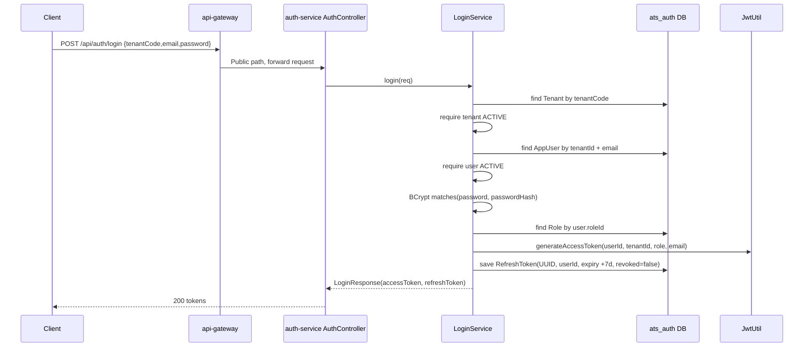
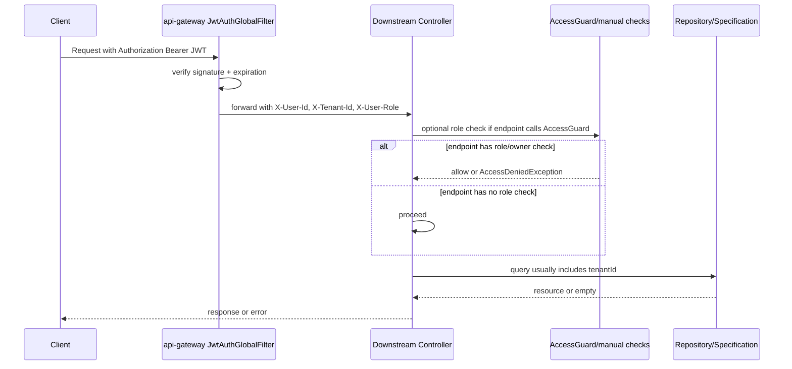
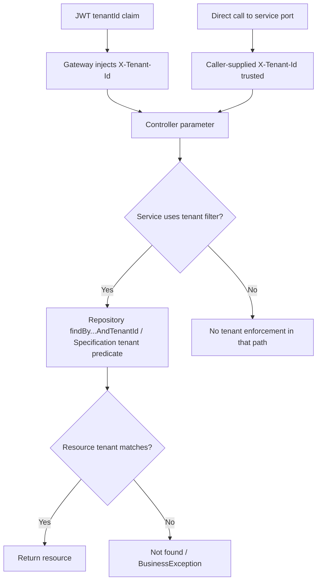
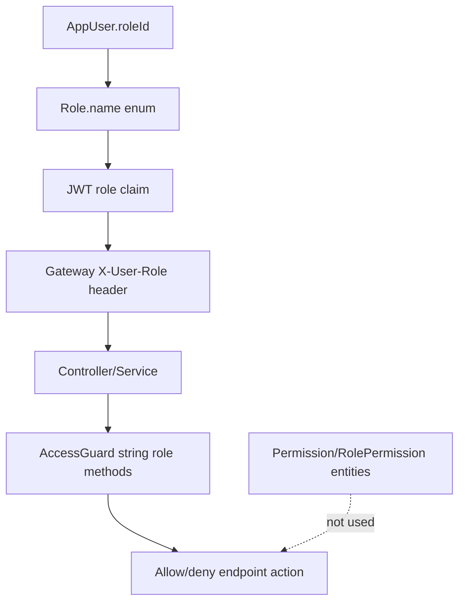

# ATS Authentication & Authorization Analysis

> [!WARNING]
> **TÀI LIỆU LỊCH SỬ - OUTDATED.** Đây là snapshot trước khi refactor
> single-company (Phase 0-12), được giữ lại để truy vết quyết định. Không dùng file
> này để mô tả runtime hiện tại. Xem `README.md`, `ATS_CURRENT_ARCHITECTURE.md` và
> các báo cáo phase để biết trạng thái sau refactor.

## 1. Executive Summary

Hệ thống ATS hiện tại là kiến trúc microservices Spring Boot đứng sau `api-gateway`, frontend React/Vite. Authentication tập trung ở `auth-service`; gateway validate JWT và inject các header nội bộ `X-User-Id`, `X-Tenant-Id`, `X-User-Role`. Các service nghiệp vụ không tự validate JWT, không tạo `SecurityContext`, và cấu hình Spring Security của hầu hết service là `anyRequest().permitAll()`.

Authorization hiện tại là `PARTIALLY IMPLEMENTED`: có RBAC dạng string role ở controller/service thông qua các class `AccessGuard`, có tenant scoping ở nhiều repository/specification theo `tenantId`, có ownership/assignee check ở một số resource như requisition, interview, offer. Không có permission-based authorization thực sự dù có entity `Permission` và `RolePermission`.

Multi-tenancy cũng là `PARTIALLY IMPLEMENTED`: database/entity có `tenant_id` rộng rãi và nhiều query lọc theo tenant, nhưng không có global tenant filter, không có FK đầy đủ trong SQL init, không có `departmentId` trong user, và service nội bộ tin header nếu bị gọi trực tiếp. Department authorization thực sự chưa hoàn chỉnh: `Department` tồn tại như master data; `JobRequisition` có `departmentId`, nhưng user không thuộc department nào trong auth model, nên không thể enforce người dùng theo phòng ban thật sự.

Các rủi ro nghiêm trọng nhất:

- `HIGH`: direct service access bypass được gateway vì service `SecurityConfig` permit all và tin header.
- `HIGH`: candidate/application list/detail thiếu role/self scope ở một số endpoint, làm candidate đã đăng nhập có thể xem dữ liệu trong cùng tenant nếu gọi API trực tiếp.
- `HIGH`: `InterviewSlotService.confirmSlot` cho candidate/department xác nhận slot không kiểm tra slot có thuộc candidate/interviewer/phòng ban của họ không.
- `HIGH`: `SalaryProposalService.submit/getByApplicationId` thiếu role/ownership check.
- `MEDIUM`: permission model tồn tại nhưng không seed/không load/không enforce.
- `MEDIUM`: logout frontend chỉ xóa local state, không gọi `/api/auth/logout`, nên refresh token không bị revoke nếu user logout từ UI hiện tại.

Test coverage hiện tại không chứng minh được security behavior: mỗi service chỉ có một test `contextLoads()` trong `src/test/java`, không có unit/integration test cho login, JWT validation, RBAC, tenant isolation, department isolation, IDOR/BOLA, refresh/logout revocation.

Implementation Status:
PARTIALLY IMPLEMENTED

Evidence:
- `api-gateway/src/main/java/iuh/fit/se/gateway/filter/JwtAuthGlobalFilter.java` - `filter`, `isPublicPath`
- `auth-service/src/main/java/iuh/fit/se/auth/service/LoginService.java` - `login`, `refreshToken`, `logout`, `issueTokens`
- `auth-service/src/main/java/iuh/fit/se/auth/security/JwtUtil.java` - `generateAccessToken`, `parseToken`
- `*/src/main/java/**/config/SecurityConfig.java` - `filterChain`
- `*/src/main/java/**/common/AccessGuard.java`
- `api-gateway/src/test/java/iuh/fit/se/gateway/ApiGatewayApplicationTests.java` - `contextLoads`
- `auth-service/src/test/java/iuh/fit/se/auth/AuthServiceApplicationTests.java` - `contextLoads`
- `candidate-service/src/test/java/iuh/fit/se/CandidateServiceApplicationTests.java` - `contextLoads`
- `application-service`, `interview-service`, `masterdata-service`, `notification-service`, `recruitment-service` test files - `contextLoads`

## 2. Authentication

### 2.1 User

User model là `AppUser`.

Fields thực tế:

| Field | Meaning | Evidence |
|---|---|---|
| `id` | user id, primary key | `AppUser` |
| `tenantId` | tenant/company scope | `AppUser.tenantId`, SQL `app_user.tenant_id` |
| `email` | username/login email, unique trong SQL global | `AppUser.email`, `init-databases.sql` |
| `passwordHash` | BCrypt hash | `AppUser.passwordHash`, `PasswordEncoderConfig.passwordEncoder` |
| `fullName` | display name | `AppUser.fullName` |
| `roleId` | một role duy nhất | `AppUser.roleId` |
| `status` | `PENDING_VERIFICATION`, `ACTIVE`, `INACTIVE` | `UserStatus` |
| `createdAt` | timestamp | `AppUser.createdAt` |

Không có `departmentId` trong `AppUser`. Không có many-to-many user-role. Candidate dùng chung `AppUser` để login nếu là account role `CANDIDATE`, nhưng candidate profile nghiệp vụ là entity riêng `candidate-service/Candidate` với field `userId` nullable. `PLATFORM_ADMIN` có enum/role seed nhưng `AppUser.tenantId` nullable=false, nên theo model hiện tại platform admin vẫn phải có `tenantId`; không có flow tạo platform admin hợp lệ ngoại tenant trong code.

Implementation Status:
PARTIALLY IMPLEMENTED

Evidence:
- `auth-service/src/main/java/iuh/fit/se/auth/entity/AppUser.java` - class `AppUser`
- `auth-service/src/main/java/iuh/fit/se/auth/enums/RoleName.java` - enum roles
- `auth-service/src/main/java/iuh/fit/se/auth/enums/UserStatus.java` - enum statuses
- `candidate-service/src/main/java/iuh/fit/se/candidate/candidate/Candidate.java` - `userId`
- `docker/postgres-init/init-databases.sql` - `app_user`, `role` seed

### 2.2 Login

Flow thực tế:

```text
Client
-> POST /api/auth/login
-> AuthController.login
-> LoginService.login
-> Tenant lookup by tenantCode
-> Reject if tenant not ACTIVE
-> User lookup by tenantId + email
-> Reject if user status not ACTIVE
-> BCrypt passwordEncoder.matches
-> Role lookup by user.roleId
-> JwtUtil.generateAccessToken(userId, tenantId, role, email)
-> Create refresh token UUID in DB
-> Return LoginResponse(accessToken, refreshToken)
```

Endpoint:

- `POST /api/auth/login`
- Request: `LoginRequest(tenantCode, email, password)`
- Response: `LoginResponse(accessToken, refreshToken)`

Authentication provider/service: custom `LoginService`; không dùng Spring `AuthenticationManager` cho email/password login. Password hashing: `BCryptPasswordEncoder`.

Thông điệp lỗi login sai tenant/email/password được gom thành cùng message trong `LoginService.login`, giúp giảm account enumeration ở login. Nhưng forgot password trả lỗi phân biệt tenant/user tồn tại.

Implementation Status:
IMPLEMENTED

Evidence:
- `auth-service/src/main/java/iuh/fit/se/auth/controller/AuthController.java` - `login`
- `auth-service/src/main/java/iuh/fit/se/auth/service/LoginService.java` - `login`, `issueTokens`
- `auth-service/src/main/java/iuh/fit/se/auth/dto/request/LoginRequest.java`
- `auth-service/src/main/java/iuh/fit/se/auth/dto/response/LoginResponse.java`
- `auth-service/src/main/java/iuh/fit/se/auth/config/PasswordEncoderConfig.java`

### 2.3 JWT

JWT generate ở `auth-service/security/JwtUtil.generateAccessToken`. JWT validate ở `api-gateway/filter/JwtAuthGlobalFilter.filter`.

Access token claims:

| Claim | Source | Present |
|---|---|---|
| `sub` | `userId` | YES |
| `tenantId` | tenant id | YES |
| `email` | user email | YES |
| `role` | role name | YES |
| `iat` | issue time | YES |
| `exp` | expiration | YES |
| `permissions` | none | NO |
| `departmentId` | none | NO |
| `username` | none; email claim exists | NO as username |

Signing: HMAC key from `app.jwt.secret` via `Keys.hmacShaKeyFor`. Default secret exists in config and should not be used in production. Access token expiration: `900000 ms` = 15 minutes. Refresh token expiration config: `604800000 ms`, but implementation hardcodes `.plusDays(7)` in `LoginService.issueTokens`.

Gateway behavior:

- Public paths bypass token validation.
- Other paths require `Authorization: Bearer <jwt>`.
- Gateway parses JWT and writes headers:
  - `X-User-Id = claims.subject`
  - `X-Tenant-Id = claims.tenantId`
  - `X-User-Role = claims.role`

SecurityContext:

- CHƯA IMPLEMENT trong service nghiệp vụ.
- Không có JWT filter trong downstream services.
- Controllers read current user from request headers, not `SecurityContextHolder`.

`X-Tenant-Id` spoofing:

- Qua gateway: client-sent `X-Tenant-Id` is effectively overwritten/added by `ServerHttpRequest.mutate().header(...)` from JWT claims. Current downstream behavior receives the JWT tenant value.
- Direct call to service port: service trusts request header because `SecurityConfig` permits all. User Tenant A can call service directly with `X-Tenant-Id: Tenant B` if network exposes service ports.

Implementation Status:
PARTIALLY IMPLEMENTED

Evidence:
- `auth-service/src/main/java/iuh/fit/se/auth/security/JwtUtil.java` - `generateAccessToken`, `parseToken`, `isValid`
- `api-gateway/src/main/java/iuh/fit/se/gateway/filter/JwtAuthGlobalFilter.java` - `filter`
- `auth-service/src/main/resources/application.yml` - `app.jwt.*`
- `api-gateway/src/main/resources/application.yml` - `app.jwt.secret`
- `application-service/src/main/java/iuh/fit/se/application/config/SecurityConfig.java` - `anyRequest().permitAll`

### 2.4 Logout

Backend logout endpoint exists:

- `POST /api/auth/logout`
- Request: `RefreshTokenRequest(refreshToken)`
- Behavior: find refresh token, set `revoked=true`, publish audit event if user exists.

Access tokens are not revoked. They remain valid until `exp`.

Frontend logout currently only dispatches Redux `logout()` and navigates to `/login`; it does not call `logoutRequest(refreshToken)` from `authApi.ts`. Therefore UI logout does not revoke refresh token.

Implementation Status:
PARTIALLY IMPLEMENTED

Evidence:
- `auth-service/src/main/java/iuh/fit/se/auth/controller/AuthController.java` - `logout`
- `auth-service/src/main/java/iuh/fit/se/auth/service/LoginService.java` - `logout`
- `auth-service/src/main/java/iuh/fit/se/auth/entity/RefreshToken.java`
- `frontend/src/features/auth/authApi.ts` - `logoutRequest`
- `frontend/src/layouts/AppLayout.tsx` - `handleLogout`

### 2.5 Registration

Company registration exists:

- `POST /api/auth/register-company`
- Request: `RegisterCompanyRequest(tenantCode, companyName, adminEmail, adminPassword, adminFullName)`
- Creates `Tenant(status=PENDING)`, `Company`, first `AppUser` as `COMPANY_ADMIN` with `PENDING_VERIFICATION`.
- Sends 6-digit OTP through `MailService`.
- `POST /api/auth/verify-email` validates latest OTP, sets tenant `ACTIVE`, publishes `tenant.activated`, sets admin user `ACTIVE`.
- `POST /api/auth/resend-otp` creates another OTP.

Employee/user creation exists:

- `POST /api/auth/users`
- Requires `X-User-Role == COMPANY_ADMIN` in controller.
- Creates user in header tenant, role from request, status `ACTIVE`.
- Rejects `PLATFORM_ADMIN`.

Candidate account registration:

- CHƯA IMPLEMENT as a public self-registration endpoint in `auth-service`.
- Candidate public apply creates/updates `Candidate` profile, not `AppUser`.
- Candidate profile can be linked/created after a candidate account login by `POST /api/candidate/candidates/me/link`, but code does not include public account creation for candidate.

Implementation Status:
PARTIALLY IMPLEMENTED

Evidence:
- `auth-service/src/main/java/iuh/fit/se/auth/service/RegisterService.java` - `registerCompany`, `verifyEmail`, `resendOtp`
- `auth-service/src/main/java/iuh/fit/se/auth/service/UserService.java` - `createUser`
- `auth-service/src/main/java/iuh/fit/se/auth/controller/AuthController.java` - registration/user endpoints
- `candidate-service/src/main/java/iuh/fit/se/candidate/candidate/PublicCandidateController.java`
- `candidate-service/src/main/java/iuh/fit/se/candidate/candidate/CandidateService.java` - `findOrCreatePublic`, `linkOrCreateForUser`

## 3. Authorization

### 3.1 RBAC

Roles thực tế:

| Role | Scope hiện tại | Mục đích theo code | API có thể truy cập | Resource có thể quản lý |
|---|---|---|---|---|
| `PLATFORM_ADMIN` | Tenant-bound in `AppUser`; no platform-wide implementation | Có enum/seed/frontend menu | Gateway cho authenticated; ít service cho role này vì AccessGuard thường không include | Không có platform admin management thực tế |
| `COMPANY_ADMIN` | Tenant | Admin công ty, HR role | Hầu hết nghiệp vụ HR, masterdata write, audit logs | Users status/create, company, masterdata, requisition/posting/application/interview/offer theo tenant |
| `RECRUITER` | Tenant | HR/recruiter | Recruitment, candidates, applications, interviews, offers; masterdata quick-add skills/job-titles | Posting/applications/interviews/offers theo tenant; không user/company |
| `HIRING_MANAGER` | Tenant; owner/approver/interviewer ở một số flow | Phòng ban/interviewer/approver | Requisition create/own, view some lists, interview assigned, offer approver | Requisition own, offer approve/reject if approver, evaluation if interviewer |
| `CANDIDATE` | Tenant; self where implemented | Candidate portal/internal candidate pages | Jobs/open, my applications/offers/interviews where enforced | Own interview confirm, own offer accept/decline, own CV/profile only where method uses `userId` |
| `SYSTEM` | Not in enum/db; internal string used by Feign calls | Internal service bypass for application stage/reject | Only where service/client passes it | Application advance/reject via `AccessGuard` allowlist |

Role storage:

- `role` table.
- `Role.name` enum `RoleName`.
- `AppUser.roleId` one role per user.

Role checking mechanisms:

- No `@PreAuthorize`, `@Secured`, `hasRole`, `hasAuthority`, `hasAnyRole`, `hasAnyAuthority` found.
- No custom permission evaluator.
- URL matcher only authenticates at gateway by public/private path, not by role.
- Role checks are manual string checks in controllers/services via `AccessGuard`.
- Frontend route/menu guards use decoded JWT role.

Implementation Status:
PARTIALLY IMPLEMENTED

Evidence:
- `auth-service/src/main/java/iuh/fit/se/auth/enums/RoleName.java`
- `auth-service/src/main/java/iuh/fit/se/auth/config/RoleSeeder.java`
- `auth-service/src/main/java/iuh/fit/se/auth/entity/Role.java`
- `auth-service/src/main/java/iuh/fit/se/auth/entity/AppUser.java`
- `recruitment-service/src/main/java/iuh/fit/se/recruitment/common/AccessGuard.java`
- `frontend/src/components/RoleRoute.tsx`
- `frontend/src/app/roles.ts`

### 3.2 Permissions

Permission-level authorization is NOT IMPLEMENTED.

There are entities:

- `Permission(id, code, description)`
- `RolePermission(id, roleId, permissionId)`

But there is no repository/service/controller/seeder usage found for permission checks, no JWT claim `permissions`, no frontend permission guard, and no backend `hasAuthority`.

Runtime model is:

```text
ROLE
 -> manual AccessGuard method
 -> RESOURCE method
```

Not:

```text
ROLE -> PERMISSION -> RESOURCE -> ACTION
```

Implementation Status:
NOT IMPLEMENTED

Evidence:
- `auth-service/src/main/java/iuh/fit/se/auth/entity/Permission.java`
- `auth-service/src/main/java/iuh/fit/se/auth/entity/RolePermission.java`
- No usages beyond entity classes from source scan
- `auth-service/src/main/java/iuh/fit/se/auth/security/JwtUtil.java` - no permissions claim

### 3.3 Resource Authorization

| Resource | View | Create | Update | Delete | Approve | Scope implemented |
|---|---|---|---|---|---|---|
| Company | Any authenticated via `/auth/company` | Register public creates company | `COMPANY_ADMIN` header check | CHƯA IMPLEMENT | N/A | Tenant by header |
| User | Any authenticated can call `/auth/users` through gateway; no role check for list | `COMPANY_ADMIN` only | Status `COMPANY_ADMIN` only | CHƯA IMPLEMENT | N/A | Tenant by header; target tenant check on status |
| Role | Seed only | CHƯA IMPLEMENT API | CHƯA IMPLEMENT | CHƯA IMPLEMENT | N/A | Global role table |
| Permission | Entity only | CHƯA IMPLEMENT API | CHƯA IMPLEMENT | CHƯA IMPLEMENT | N/A | CHƯA IMPLEMENT |
| Department | Any authenticated list | `COMPANY_ADMIN` | `COMPANY_ADMIN` | soft inactive `COMPANY_ADMIN` | N/A | Tenant query |
| Job/Requisition | HR all; Hiring Manager own in list; detail lacks role check | `HIRING_MANAGER` | `HIRING_MANAGER` + requester owner | HR soft delete | HR + assigned approver | Tenant + requester/approver owner |
| Job Posting | HR/department list; candidate open list/detail | HR | HR | HR soft delete | HR self-approval via submit-review | Tenant; no department/owner enforcement |
| Candidate | Any authenticated list/detail in tenant | HR/department/admin | HR/department/admin; candidate own only for CV/self helpers | HR/department/admin; candidate own deletion | N/A | Tenant; self only in specific own methods |
| Resume/CV | Public `/cv-file/{fileName}` no auth | Public/HR/candidate upload | upload overwrites URL | via candidate delete only | N/A | Weak: file endpoint not tenant checked |
| Application | Any role via list/detail after gateway; no role/self filtering | Candidate or HR by service, but role not enforced strongly in create | HR only for stage/reject/assign | HR | N/A | Tenant; no self/assigned scope on list/detail |
| Interview | HR all; HM assigned; candidate own | HR | cancel HR; confirm candidate own | CHƯA IMPLEMENT delete | N/A | Tenant + interviewer/candidate for main interview |
| Evaluation | HR/HM; HM assigned for view/submit | HR/HM if assigned interviewer row exists | Submit once | CHƯA IMPLEMENT | N/A | Tenant via interview; interviewer ownership |
| Interview Slot | Any authenticated can list by application; my-pending filters partially | HR for batch | confirm lacks owner/assignment validation | selecting cancels others by HR | select by HR | Tenant only; weak candidate/HM ownership |
| Salary Proposal | Any authenticated can list by application | Any authenticated can submit | approve HR | CHƯA IMPLEMENT | HR approve | Tenant only; weak role/owner |
| Offer | HR all; HM approver; candidate own | HR | HR owner/requester | HR soft delete | HM/company admin approver | Tenant + candidate/approver/requester |
| Notification | recipient self | internal only | mark read self | CHƯA IMPLEMENT | N/A | Tenant + recipient |
| Audit Log | `COMPANY_ADMIN` | event listeners | CHƯA IMPLEMENT | CHƯA IMPLEMENT | N/A | Tenant |
| Dashboard | Any authenticated through route; service defaults if direct missing headers | N/A | N/A | N/A | N/A | Aggregated tenant via downstream |

Implementation Status:
PARTIALLY IMPLEMENTED

Evidence:
- `auth-service/src/main/java/iuh/fit/se/auth/controller/AuthController.java`
- `masterdata-service/src/main/java/iuh/fit/se/masterdata/*/*Controller.java`
- `recruitment-service/src/main/java/iuh/fit/se/recruitment/requisition/JobRequisitionService.java`
- `recruitment-service/src/main/java/iuh/fit/se/recruitment/posting/JobPostingService.java`
- `candidate-service/src/main/java/iuh/fit/se/candidate/candidate/CandidateService.java`
- `application-service/src/main/java/iuh/fit/se/application/application/ApplicationService.java`
- `interview-service/src/main/java/iuh/fit/se/interview/interview/InterviewService.java`
- `interview-service/src/main/java/iuh/fit/se/interview/scheduling/InterviewSlotService.java`
- `offer-service/src/main/java/iuh/fit/se/offer/offer/OfferService.java`

### 3.4 Ownership

Implemented ownership/assignee checks:

- Requisition update/submit: `requesterId == current user`.
- Requisition approve/reject/request-changes: `approverId == current user`.
- Application tenant ownership: `findByIdAndTenantIdAndDeletedAtIsNull`, but user self/assigned ownership not enforced in list/detail.
- Interview view: HR all; department only assigned interviewer; candidate only own candidate profile id.
- Evaluation submit: `InterviewEvaluation` row must match `interviewId + actorUserId`.
- Offer update/submit: requester owner.
- Offer approve/reject: approver owner.
- Offer accept/decline: candidate profile linked to current user.
- Notification read/list: recipient user id.

Not implemented:

- No global resource owner framework.
- No department ownership because user has no `departmentId`.
- Candidate list/detail self scope is not enforced in controller; `getOwnById` exists but is not exposed by a dedicated route.

Implementation Status:
PARTIALLY IMPLEMENTED

Evidence:
- `recruitment-service/src/main/java/iuh/fit/se/recruitment/common/AccessGuard.java` - `requireOwner`, `requireApprover`
- `recruitment-service/src/main/java/iuh/fit/se/recruitment/requisition/JobRequisitionService.java` - `update`, `submit`, `approve`
- `interview-service/src/main/java/iuh/fit/se/interview/interview/InterviewService.java` - `assertCanView`, `confirmByCandidate`
- `interview-service/src/main/java/iuh/fit/se/interview/evaluation/InterviewEvaluationService.java` - `submit`
- `offer-service/src/main/java/iuh/fit/se/offer/offer/OfferService.java` - `assertCanView`, `assertCandidateOwns`
- `notification-service/src/main/java/iuh/fit/se/notification/notification/NotificationService.java`

## 4. Multi-tenancy

Tenant entity: `auth-service/entity/Tenant`. Company entity: `auth-service/entity/Company` with `tenantId`. The API uses `tenantCode` for login/registration/public portal and `tenantId` internally after JWT.

Tenant fields appear in:

- `AppUser`, `Company`, `EmailVerification`, `PasswordResetToken`
- `Department` and other masterdata catalog entities
- `JobRequisition`, `JobPosting`
- `Candidate`, `CustomFieldDefinition`
- `Application`, `ApplicationComment`
- `Interview`, `InterviewSlot`, `SalaryProposal`
- `Notification`, `AuditLog`
- `Offer`

Entities without direct `tenantId` but linked through parent:

- `Role`, `Permission`, `RolePermission` are global.
- `CandidateSkill`, `CandidateTag`, `CandidateCustomFieldValue` use candidate/field relationships.
- `ApplicationHistory` links application.
- `InterviewInterviewer`, `InterviewEvaluation`, `InterviewEvaluationScore` link interview/evaluation.
- `PipelineStage` links `RecruitmentPipeline`.

Tenant enforcement mechanisms:

- Gateway extracts tenant from JWT and injects `X-Tenant-Id`.
- Many service methods call repository methods like `findByIdAndTenantId...` or specs with `tenantId`.
- No Hibernate filter.
- No global tenant filter/interceptor.
- No validation that tenant exists on every service request.
- Direct service calls can spoof headers.
- SQL init has simple columns and primary keys; no FK constraints are declared for tenant/company/user/role relations in `init-databases.sql`. JPA may create schema with `ddl-auto:update`, but current migration SQL is not a complete FK authorization model.

Cross-tenant behavior:

| Scenario | Via gateway | Direct service port |
|---|---|---|
| User Tenant A -> Resource Tenant A | Allowed if endpoint role/resource checks pass | Allowed if caller sets `X-Tenant-Id: A` |
| User Tenant A -> Resource Tenant B with fake `X-Tenant-Id` | Gateway overwrites from JWT, so blocked by tenant query if resource is under B | Allowed if caller can reach service and supplies `X-Tenant-Id: B` plus acceptable role header |
| `PLATFORM_ADMIN` -> Tenant A/B | No global platform bypass in services; often denied by AccessGuard because not in HR sets | Same, unless spoof role/tenant directly |

IDOR/BOLA example `GET /api/candidate/candidates/123`:

- Via gateway: controller receives JWT tenant and `CandidateService.findOwned(tenantId, id)` uses `findByIdAndTenantIdAndDeletedAtIsNull`; cross-tenant candidate id is blocked.
- Same-tenant authorization: no role check, so any authenticated role in same tenant can view candidate 123.
- Direct service: caller can spoof `X-Tenant-Id`.

Implementation Status:
PARTIALLY IMPLEMENTED

Evidence:
- `auth-service/src/main/java/iuh/fit/se/auth/entity/Tenant.java`
- `api-gateway/src/main/java/iuh/fit/se/gateway/filter/JwtAuthGlobalFilter.java`
- `candidate-service/src/main/java/iuh/fit/se/candidate/candidate/CandidateRepository.java`
- `application-service/src/main/java/iuh/fit/se/application/application/ApplicationSpecifications.java`
- `recruitment-service/src/main/java/iuh/fit/se/recruitment/requisition/JobRequisitionSpecifications.java`
- `docker/postgres-init/init-databases.sql`

## 5. Department Authorization

Department exists as tenant-scoped master data in `masterdata-service/department/Department`. `JobRequisition.departmentId` is required, and `JobPosting` derives department from its requisition in response. Application response includes department info only by fetching job posting.

Missing relationships:

- `AppUser` has no `departmentId`.
- `Candidate` has no `departmentId`.
- `Application` has no `departmentId`.
- `Interview` has no `departmentId`.
- No repository/service verifies "current user's department == resource department".

Current behavior:

- Hiring Manager requisition list is scoped to `requesterId == current user`, not department.
- A Hiring Manager can pass `departmentId` when creating/updating requisition; code does not validate that this is their own department because no user department exists.
- HR/Company Admin can view all departments in tenant.
- Candidate/Application/Candidate list APIs do not enforce department.
- Interview department role means "assigned interviewer id", not organizational department.

Layer allowing cross-department access:

```text
Controller
-> accepts X-User-Role / X-User-Id but no X-Department-Id
Service
-> no user department lookup/comparison
Repository
-> filters tenant/requester/approver/interviewer, not department ownership
Database
-> no AppUser.department_id relationship
```

Implementation Status:
NOT IMPLEMENTED as true department-based authorization

Evidence:
- `auth-service/src/main/java/iuh/fit/se/auth/entity/AppUser.java` - no `departmentId`
- `masterdata-service/src/main/java/iuh/fit/se/masterdata/department/Department.java`
- `recruitment-service/src/main/java/iuh/fit/se/recruitment/requisition/JobRequisition.java` - `departmentId`
- `recruitment-service/src/main/java/iuh/fit/se/recruitment/requisition/JobRequisitionService.java` - requester/approver scope
- `interview-service/src/main/java/iuh/fit/se/interview/interview/InterviewService.java` - interviewer assignment scope

## 6. Frontend Authorization

Frontend auth state:

- Stored in Redux slice `auth`.
- Persisted in `localStorage` under key `ats_auth`.
- `setCredentials` decodes JWT using `jwtDecode`.
- Stored user fields: `userId`, `tenantId`, `role`, plus `email/fullName` after `/auth/me`.
- Axios request interceptor sends only `Authorization: Bearer <accessToken>`.
- Refresh interceptor calls `/auth/refresh-token` on 401 and stores new tokens.

Routes:

- `ProtectedRoute` only checks `accessToken` exists, not expiration or token validity.
- `RoleRoute` checks decoded `user.role`.
- `AppLayout` builds menu by role.

Route role rules:

| Route group | Frontend allow |
|---|---|
| `/dashboard`, `/notifications`, `/settings` | any authenticated |
| `/masterdata` | `COMPANY_ADMIN`, `RECRUITER` |
| `/candidates`, `/recruitment`, `/applications`, `/interviews`, `/offers` | `COMPANY_ADMIN`, `RECRUITER`, `HIRING_MANAGER` |
| `/scheduling` | HR, department, candidate |
| `/jobs`, `/my-applications`, candidate offer views | `CANDIDATE` |
| `/audit-logs` | `COMPANY_ADMIN`, `PLATFORM_ADMIN` |

Menu/action hiding:

- `AppLayout.MENU_BY_ROLE` hides menu items by role.
- Several pages/components compute `isHr`, `isDept`, `canManage`, `canOwnerAct`, `canApproverAct` to hide buttons.
- This is UI protection only. Real enforcement depends on backend controller/service checks.

Frontend inconsistencies:

- `UpdateUserStatusRequest` declares `"LOCKED"` and `"DEACTIVATED"`, but backend `UserStatus` only has `PENDING_VERIFICATION`, `ACTIVE`, `INACTIVE`. UI attempts to toggle `LOCKED`; backend enum binding will reject it.
- Frontend logout does not call backend logout.
- No `PermissionGuard`, no permissions in JWT, no permission-based UI.

Implementation Status:
PARTIALLY IMPLEMENTED

Evidence:
- `frontend/src/features/auth/authSlice.ts`
- `frontend/src/services/axiosClient.ts`
- `frontend/src/components/ProtectedRoute.tsx`
- `frontend/src/components/RoleRoute.tsx`
- `frontend/src/routes/AppRoutes.tsx`
- `frontend/src/layouts/AppLayout.tsx`
- `frontend/src/app/roles.ts`
- `frontend/src/features/auth/types.ts`

## 7. API Authorization Matrix

Legend:

- Auth = Gateway JWT unless public.
- Role/Permission = implemented manual role check if present.
- Tenant Scope = code filters by `X-Tenant-Id`/tenantCode.
- Department Scope = true user-department enforcement.
- Owner = requester/approver/interviewer/candidate/recipient checks.

| HTTP | Endpoint | Authentication | Role/Permission | Tenant Scope | Department Scope | Resource Owner |
|---|---|---|---|---|---|---|
| POST | `/api/auth/register-company` | Public | None | Creates tenant | No | No |
| POST | `/api/auth/verify-email` | Public | None | tenantCode | No | email OTP |
| POST | `/api/auth/resend-otp` | Public | None | tenantCode | No | email |
| POST | `/api/auth/login` | Public | None | tenantCode + user email | No | password |
| POST | `/api/auth/refresh-token` | Public | refresh token only | user tenant from DB | No | token owner by stored token |
| POST | `/api/auth/logout` | Gateway private in gateway, service permitAll | refresh token only | token user tenant for audit | No | token only |
| POST | `/api/auth/oauth2/exchange` | Public | exchange code only | stored token | No | code |
| POST | `/api/auth/forgot-password` | Public | None | tenantCode | No | email OTP |
| POST | `/api/auth/reset-password` | Public | None | tenantCode | No | email OTP |
| POST | `/api/auth/change-password` | Gateway JWT | None | no tenant check | No | current user id header |
| GET | `/api/auth/users` | Gateway JWT | None | `findByTenantId` | No | No |
| POST | `/api/auth/users` | Gateway JWT | `COMPANY_ADMIN` | header tenant | No | actor for audit |
| PATCH | `/api/auth/users/{id}/status` | Gateway JWT | `COMPANY_ADMIN` | target user tenant check | No | cannot self-update |
| GET | `/api/auth/me` | Gateway JWT | None | user id from header | No | self by user id |
| PUT | `/api/auth/profile` | Gateway JWT | None | user id from header | No | self by user id |
| GET | `/api/auth/company` | Gateway JWT | None | company by tenant | No | No |
| PUT | `/api/auth/company` | Gateway JWT | `COMPANY_ADMIN` | company by tenant | No | No |
| GET | `/api/auth/public/companies/{tenantCode}` | Public | None | tenantCode | No | No |
| GET | `/api/masterdata/{catalog}` | Gateway JWT | None | tenant query | No | No |
| POST | `/api/masterdata/{catalog}` | Gateway JWT | mostly `COMPANY_ADMIN`; `skills/job-titles` quick-add HR/HM/Admin | tenant set | No | No |
| PUT | `/api/masterdata/{catalog}/{id}` | Gateway JWT | `COMPANY_ADMIN` | `findByIdAndTenantId` | No | No |
| DELETE | `/api/masterdata/{catalog}/{id}` | Gateway JWT | `COMPANY_ADMIN` | `findByIdAndTenantId` | No | No |
| GET | `/api/masterdata/pipelines/{id}` | Gateway JWT | None | `findByIdAndTenantId` | No | No |
| POST | `/api/masterdata/email-templates/{id}/preview` | Gateway JWT | None | template by id/tenant in service | No | No |
| GET | `/api/recruitment/requisitions` | Gateway JWT | HR/HM/Admin | spec tenant | No true department | HM sees requester self; HR all |
| GET | `/api/recruitment/requisitions/{id}` | Gateway JWT | None | `findOwned` tenant | No | No |
| POST | `/api/recruitment/requisitions` | Gateway JWT | `HIRING_MANAGER` | tenant set | No validation of department | requester set |
| PUT | `/api/recruitment/requisitions/{id}` | Gateway JWT | `HIRING_MANAGER` | `findOwned` | No | requester owner |
| POST | `/api/recruitment/requisitions/{id}/submit` | Gateway JWT | None | `findOwned` | No | requester owner |
| POST | `/api/recruitment/requisitions/{id}/approve` | Gateway JWT | HR | `findOwned` | No | approver owner |
| POST | `/api/recruitment/requisitions/{id}/reject` | Gateway JWT | HR | `findOwned` | No | approver owner |
| POST | `/api/recruitment/requisitions/{id}/request-changes` | Gateway JWT | HR | `findOwned` | No | approver owner |
| DELETE | `/api/recruitment/requisitions/{id}` | Gateway JWT | HR | `findOwned` | No | No |
| GET | `/api/recruitment/postings` | Gateway JWT | HR/HM/Admin | spec tenant | No | No |
| GET | `/api/recruitment/postings/open` | Gateway JWT | None | tenant + OPEN | No | No |
| GET | `/api/recruitment/postings/{id}` | Gateway JWT | Candidate gets OPEN only; HR/HM/Admin all statuses | tenant | No | No |
| POST | `/api/recruitment/postings` | Gateway JWT | HR | tenant + requisition tenant | No | No |
| PUT/PATCH/DELETE | `/api/recruitment/postings/{id}...` | Gateway JWT | HR | `findOwned` tenant | No | No |
| GET | `/api/recruitment/public/companies/{tenantCode}/jobs...` | Public | None | tenantCode + OPEN | No | No |
| GET | `/api/candidate/candidates` | Gateway JWT | None | spec tenant | No | No |
| GET | `/api/candidate/candidates/{id}` | Gateway JWT | None | `findOwned` tenant | No | No |
| GET | `/api/candidate/candidates/{id}/summary` | Gateway JWT | None | `findOwned` tenant | No | No |
| POST/PUT/DELETE | `/api/candidate/candidates...` | Gateway JWT | HR/HM/Admin | tenant | No | No |
| POST | `/api/candidate/candidates/bulk-delete` | Gateway JWT | HR/HM/Admin | tenant | No | No |
| PATCH | `/api/candidate/candidates/{id}/mark-pool` | Gateway JWT | None | tenant | No | No |
| POST/DELETE | `/api/candidate/candidates/{id}/tags...` | Gateway JWT | HR/HM/Admin | tenant | No | No |
| GET | `/api/candidate/candidates/cv-file/{fileName}` | Public | None | No tenant lookup | No | No |
| GET | `/api/candidate/candidates/by-user/{userId}` | Gateway JWT | None | tenant + arbitrary userId | No | No self check |
| POST | `/api/candidate/candidates/me/request-deletion` | Gateway JWT | `CANDIDATE` | tenant + userId | No | candidate self |
| POST | `/api/candidate/candidates/me/link` | Gateway JWT | `CANDIDATE` | tenant + userId | No | self user id, but email from body |
| POST | `/api/candidate/candidates/{id}/cv` | Gateway JWT | Candidate self or HR/HM/Admin | tenant | No | candidate self only if role candidate |
| POST | `/api/candidate/public/companies/{tenantCode}/candidates...` | Public | None | tenantCode | No | candidateId/email only |
| GET | `/api/candidate/custom-field-definitions` | Gateway JWT | None | tenant | No | No |
| POST/PUT/DELETE | `/api/candidate/custom-field-definitions...` | Gateway JWT | `COMPANY_ADMIN` | tenant | No | No |
| GET | `/api/application/applications` | Gateway JWT | None | spec tenant | No | No self/assigned |
| GET | `/api/application/applications/{id}` | Gateway JWT | None | `findOwned` tenant | No | No self/assigned |
| GET | `/api/application/applications/{id}/summary` | Gateway JWT | None | tenant | No | No |
| GET/POST | `/api/application/applications/{id}/comments` | Gateway JWT | HR/HM/Admin | tenant | No | No assigned/department |
| GET | `/api/application/applications/{id}/history` | Gateway JWT | HR/HM/Admin | tenant | No | No |
| POST | `/api/application/applications` | Gateway JWT | Service permits any role if data valid | tenant | No | weak; candidate can create for arbitrary candidateId |
| PATCH/DELETE | `/api/application/applications...` | Gateway JWT | HR | tenant | No | No assigned recruiter check |
| POST | `/api/application/public/companies/{tenantCode}/jobs/{jobId}/apply` | Public | None | tenantCode | No | email/CV |
| GET | `/api/interview/interviews` | Gateway JWT | service branches by role | tenant | No true department | HR all; HM interviewer; candidate own |
| GET | `/api/interview/interviews/{id}` | Gateway JWT | service branches by role | tenant | No true department | interviewer/candidate self |
| GET | `/api/interview/interviews/{id}/ics` | Gateway JWT | service branches by role | tenant | No | interviewer/candidate self |
| POST | `/api/interview/interviews` | Gateway JWT | HR | tenant + application fetch | No | No assigned recruiter check |
| POST | `/api/interview/interviews/batch` | Gateway JWT | HR | tenant | No | No assigned recruiter check |
| PATCH | `/api/interview/interviews/{id}/cancel` | Gateway JWT | HR | tenant | No | No |
| PATCH | `/api/interview/interviews/{id}/confirm` | Gateway JWT | Candidate | tenant | No | candidate owns interview |
| POST | `/api/interview/interviews/{interviewId}/evaluations` | Gateway JWT | HR/HM/Admin | tenant via interview | No | must be interviewer row |
| GET | `/api/interview/interviews/{interviewId}/evaluations` | Gateway JWT | HR/HM/Admin | tenant via interview | No | HM must be interviewer; salary masked |
| POST | `/api/interview/slots/batch` | Gateway JWT | HR in service | tenant | No | No |
| GET | `/api/interview/slots?applicationId=` | Gateway JWT | None | tenant + applicationId | No | No |
| GET | `/api/interview/slots/my-pending` | Gateway JWT | service branches | tenant | No | candidate self partial; department all pending |
| POST | `/api/interview/slots/{id}/confirm` | Gateway JWT | None explicit | tenant | No | No candidate/interviewer ownership |
| POST | `/api/interview/slots/{id}/select` | Gateway JWT | HR | tenant | No | No |
| POST | `/api/interview/salary-proposals` | Gateway JWT | None | tenant | No | proposedBy is current user, no role check |
| GET | `/api/interview/salary-proposals?applicationId=` | Gateway JWT | None | tenant + applicationId | No | No |
| POST | `/api/interview/salary-proposals/{id}/approve` | Gateway JWT | HR in service | tenant | No | No |
| GET | `/api/offer/offers` | Gateway JWT | service branches | tenant | No | HR all; HM approver; candidate self |
| GET | `/api/offer/offers/{id}` | Gateway JWT | service branches | tenant | No | approver/candidate self |
| GET | `/api/offer/offers/{id}/pdf` | Gateway JWT | service branches | tenant | No | approver/candidate self |
| POST | `/api/offer/offers` | Gateway JWT | HR | tenant | No | requester set |
| PUT | `/api/offer/offers/{id}` | Gateway JWT | HR | tenant | No | requester owner |
| PATCH | `/api/offer/offers/{id}/submit` | Gateway JWT | HR | tenant | No | requester owner |
| PATCH | `/api/offer/offers/{id}/approve|reject` | Gateway JWT | HR/HM/Admin | tenant | No | approver owner |
| PATCH | `/api/offer/offers/{id}/accept|decline` | Gateway JWT | Candidate | tenant | No | candidate self |
| DELETE | `/api/offer/offers/{id}` | Gateway JWT | HR | tenant | No | No |
| GET | `/api/notification/notifications` | Gateway JWT | None | tenant + recipient | No | recipient self |
| GET | `/api/notification/notifications/unread-count` | Gateway JWT | None | tenant + recipient | No | recipient self |
| PATCH | `/api/notification/notifications/{id}/read` | Gateway JWT | None | tenant + recipient check | No | recipient self |
| PATCH | `/api/notification/notifications/read-all` | Gateway JWT | None | tenant + recipient | No | recipient self |
| GET | `/api/notification/audit-logs` | Gateway JWT | `COMPANY_ADMIN` | tenant spec | No | No |
| GET | `/api/dashboard/summary` | Gateway JWT | None | tenant passed downstream | No | depends downstream |
| GET | `/api/dashboard/report/pdf` | Gateway JWT | None | tenant passed downstream | No | depends downstream |
| GET | `/api/dashboard/postings/{id}/stats` | Gateway JWT | None | tenant passed downstream | No | depends downstream |

Implementation Status:
PARTIALLY IMPLEMENTED

Evidence:
- All `*Controller.java` files listed by controller scan
- Corresponding service/repository classes named above

## 8. Database Security Model

Current schema source:

- `docker/postgres-init/init-databases.sql` creates separate PostgreSQL databases per service.
- Only auth tables are explicitly created and seeded in SQL.
- Other service schemas rely on JPA `spring.jpa.hibernate.ddl-auto: update` in each `application.yml`.

Auth relationship:

```text
tenant(id)
company(tenant_id)
app_user(tenant_id, role_id)
role(id, name)
permission(id, code)             PARTIALLY IMPLEMENTED entity only
role_permission(role_id, permission_id) PARTIALLY IMPLEMENTED entity only
refresh_token(user_id)
email_verification(tenant_id, email)
password_reset_token(tenant_id, email)
```

Important gaps:

- SQL init does not define FK constraints between `app_user.tenant_id`, `app_user.role_id`, `company.tenant_id`.
- User has one `role_id`, not multiple roles.
- User has no `department_id`.
- Permission tables are not in SQL init and no seeder creates permission data.

Resource relationship as implemented:

```text
JobRequisition -> tenantId, departmentId, requesterId, approverId
JobPosting -> tenantId, requisition
Candidate -> tenantId, userId nullable
Application -> tenantId, candidateId, jobPostingId, assignedRecruiterId
Interview -> tenantId, applicationId, jobPostingId, candidateId
InterviewInterviewer -> interview, interviewerId
InterviewEvaluation -> interview, interviewerId
Offer -> tenantId, applicationId, candidateId, requesterId, approverId
Notification -> tenantId, recipientUserId
AuditLog -> tenantId, actorUserId
```

Implementation Status:
PARTIALLY IMPLEMENTED

Evidence:
- `docker/postgres-init/init-databases.sql`
- `auth-service/src/main/resources/application.yml`
- `masterdata-service/src/main/resources/application.yml`
- `recruitment-service/src/main/resources/application.yml`
- `candidate-service/src/main/resources/application.yml`
- `application-service/src/main/resources/application.yml`
- `interview-service/src/main/resources/application.yml`
- `offer-service/src/main/resources/application.yml`

## 9. Authentication Flow



Implementation Status:
IMPLEMENTED

Evidence:
- `api-gateway/src/main/java/iuh/fit/se/gateway/filter/JwtAuthGlobalFilter.java`
- `auth-service/src/main/java/iuh/fit/se/auth/controller/AuthController.java`
- `auth-service/src/main/java/iuh/fit/se/auth/service/LoginService.java`
- `auth-service/src/main/java/iuh/fit/se/auth/security/JwtUtil.java`

## 10. Authorization Flow

### API Authorization Flow



### Multi-tenant Authorization



### RBAC



Implementation Status:
PARTIALLY IMPLEMENTED

Evidence:
- `api-gateway/src/main/java/iuh/fit/se/gateway/filter/JwtAuthGlobalFilter.java`
- `*/common/AccessGuard.java`
- `*/config/SecurityConfig.java`

## 11. Security Issues

### HIGH - Direct service access bypasses authentication

File: `*/src/main/java/**/config/SecurityConfig.java`
Class: `SecurityConfig`
Method: `filterChain`
Issue: Downstream services configure `.anyRequest().permitAll()` and trust `X-User-Id`, `X-Tenant-Id`, `X-User-Role`.
Why it is a problem: If service ports are reachable, caller can spoof identity, role, and tenant.
Current behavior: Gateway validates JWT, but services do not.
Recommended fix: Network-isolate services and/or add service-level JWT/internal-auth validation that rejects externally supplied identity headers.

### HIGH - Candidate APIs expose same-tenant candidate data to any authenticated role

File: `candidate-service/src/main/java/iuh/fit/se/candidate/candidate/CandidateController.java`
Class: `CandidateController`
Method: `getAll`, `getById`, `getSummaryById`, `getByUserId`
Issue: No role check on read endpoints.
Why it is a problem: Candidate users can call APIs directly and view other candidates in the same tenant.
Current behavior: Tenant filter exists; self/role filter does not.
Recommended fix: Require HR/HM/Admin for staff candidate APIs; expose separate `/me` endpoints for candidate self.

### HIGH - Application list/detail lacks role/self/assigned scope

File: `application-service/src/main/java/iuh/fit/se/application/application/ApplicationService.java`
Class: `ApplicationService`
Method: `getAll`, `getById`
Issue: `role` and `userId` are accepted but not used to restrict candidate self, assigned recruiter, or hiring manager.
Why it is a problem: Any authenticated role can enumerate applications within tenant.
Current behavior: Only tenant and query filters apply.
Recommended fix: Branch by role: candidate self via linked candidateId; recruiter assigned or HR policy; hiring manager by requisition/posting department/assignment.

### HIGH - Candidate can create application for arbitrary candidateId

File: `application-service/src/main/java/iuh/fit/se/application/application/ApplicationService.java`
Class: `ApplicationService`
Method: `create`
Issue: Role is not used to verify candidate owns `req.candidateId()`.
Why it is a problem: Candidate account can submit applications as another candidate in same tenant.
Current behavior: `fetchCandidate(tenantId, req.candidateId())` only verifies candidate exists in tenant.
Recommended fix: For role `CANDIDATE`, resolve candidate by `actorUserId` and require it equals request candidateId.

### HIGH - Interview slot confirmation lacks owner checks

File: `interview-service/src/main/java/iuh/fit/se/interview/scheduling/InterviewSlotService.java`
Class: `InterviewSlotService`
Method: `confirmSlot`, `getSlots`
Issue: Candidate/department can confirm or list slots by tenant/application without verifying relation to that slot/application.
Why it is a problem: Same-tenant BOLA; users can manipulate scheduling state.
Current behavior: Candidate sets `candidateConfirmed`; department sets `departmentConfirmed`; no ownership validation.
Recommended fix: Resolve application candidate/interviewer/department and enforce before list/confirm.

### HIGH - Salary proposal submit/list lacks authorization

File: `interview-service/src/main/java/iuh/fit/se/interview/scheduling/SalaryProposalController.java`
Class: `SalaryProposalController`
Method: `submit`, `getByApplicationId`
Issue: No role header on submit/list and no `AccessGuard` check.
Why it is a problem: Any authenticated user can create/view salary proposals in tenant by applicationId.
Current behavior: Only tenant filter.
Recommended fix: Require interviewer/HM/HR for submit; HR/approver/assigned interviewer for read; mask salary where needed.

### HIGH - Public CV file endpoint has no tenant/resource authorization

File: `candidate-service/src/main/java/iuh/fit/se/candidate/candidate/CandidateController.java`
Class: `CandidateController`
Method: `getCvFile`
Issue: `/api/candidate/candidates/cv-file/{fileName}` is public at gateway and resolves local `uploads/{fileName}` without candidate ownership/tenant validation.
Why it is a problem: Anyone with filename can fetch CV; path traversal risk depends on filename normalization and storage layout.
Current behavior: Public read by filename.
Recommended fix: Use signed URLs or authenticated endpoint that checks candidate/application/offer access; normalize and restrict file paths.

### MEDIUM - Permission model is dead code

File: `auth-service/src/main/java/iuh/fit/se/auth/entity/Permission.java`
Class: `Permission`
Method: N/A
Issue: Permission tables/entities exist but are not seeded, loaded into JWT, or enforced.
Why it is a problem: Code suggests fine-grained authorization but runtime is role-only.
Current behavior: No permission checks.
Recommended fix: Either remove until needed or implement role-permission seeding, token/session loading, and backend checks.

### MEDIUM - Frontend logout does not revoke refresh token

File: `frontend/src/layouts/AppLayout.tsx`
Class/Component: `AppLayout`
Method: `handleLogout`
Issue: Dispatches local logout only.
Why it is a problem: Stolen/stale refresh token remains valid until expiry.
Current behavior: Backend `/logout` exists but frontend does not call it.
Recommended fix: Call `logoutRequest(refreshToken)` before clearing local state.

### MEDIUM - Forgot password leaks tenant/user existence

File: `auth-service/src/main/java/iuh/fit/se/auth/service/PasswordService.java`
Class: `PasswordService`
Method: `forgotPassword`
Issue: Distinct errors for unknown tenant and unknown email.
Why it is a problem: Account enumeration.
Current behavior: Throws "company not found" or "user not found".
Recommended fix: Return generic response and perform constant-ish flow where feasible.

### MEDIUM - Department authorization cannot be enforced

File: `auth-service/src/main/java/iuh/fit/se/auth/entity/AppUser.java`
Class: `AppUser`
Method: N/A
Issue: No `departmentId` on user.
Why it is a problem: Hiring Manager/recruiter data cannot be limited by department.
Current behavior: Uses requester/approver/interviewer instead.
Recommended fix: Add user-department relationship and enforce it consistently.

### LOW - Frontend/backend user status mismatch

File: `frontend/src/features/auth/types.ts`
Class/Type: `UpdateUserStatusRequest`
Method: N/A
Issue: Frontend sends `LOCKED`/`DEACTIVATED`, backend enum only accepts `PENDING_VERIFICATION`, `ACTIVE`, `INACTIVE`.
Why it is a problem: UI action fails or creates confusion about lock/disabled semantics.
Current behavior: Backend deserialization rejects unsupported values.
Recommended fix: Align enum and status semantics.

Implementation Status:
PARTIALLY IMPLEMENTED

Evidence:
- Files/classes/methods listed per issue above

## 12. Current Architecture

```text
                    Client React
                        |
                        | Authorization: Bearer JWT
                        v
              api-gateway JwtAuthGlobalFilter
              - validates JWT signature/exp
              - injects X-User-Id
              - injects X-Tenant-Id
              - injects X-User-Role
                        |
                        v
        Downstream Spring Boot services
        - SecurityConfig: permitAll
        - no SecurityContext user
        - controllers read identity headers
        - optional AccessGuard string role checks
        - service/repository tenant filters in many methods
        - resource owner checks only in selected flows
                        |
                        v
        Per-service databases / JPA ddl-auto:update
```

Architecture classification:

```text
RBAC + partial Multi-tenancy + partial Resource Ownership
```

Not implemented as current architecture:

- RBAC + Permission
- True Department RBAC
- ABAC
- Global row-level tenant isolation

Implementation Status:
PARTIALLY IMPLEMENTED

Evidence:
- `api-gateway/src/main/java/iuh/fit/se/gateway/filter/JwtAuthGlobalFilter.java`
- `auth-service/src/main/java/iuh/fit/se/auth/security/JwtUtil.java`
- `*/config/SecurityConfig.java`
- `*/common/AccessGuard.java`

## 13. Recommended Architecture

Recommended target for production ATS:

```text
Client
  |
  v
Gateway
  - validate JWT
  - strip inbound X-User-* / X-Tenant-* headers before injecting trusted values
  - route only to private service network
  |
  v
Service Security Layer
  - validate JWT or signed internal identity headers
  - build CurrentUser/SecurityContext
  - reject missing/invalid tenant/user/role
  |
  v
Authorization Layer
  - RBAC from role
  - permission checks for action
  - tenant check always
  - department check where applicable
  - owner/assignee/interviewer/candidate-self checks
  |
  v
Repository/Data Layer
  - tenant-aware repository methods/specs
  - optional Hibernate filter or database RLS
  - FK constraints and indexes
```

Implementation Status:
NOT IMPLEMENTED as a full production architecture

Evidence:
- Current code lacks service JWT filters, permission runtime, user department relation, global tenant filter

## 14. Required Changes

Direct answers:

1. Authentication hiện tại: `auth-service` login bằng `tenantCode + email + password`, validate tenant active, user active, BCrypt password, issue JWT + refresh token.
2. JWT/session: JWT access token 15 phút chứa `sub`, `tenantId`, `email`, `role`, `iat`, `exp`; refresh token UUID lưu DB 7 ngày, rotate khi refresh, revoke backend logout. OAuth2 Google dùng session tạm ở auth-service.
3. Có RBAC không: Có, nhưng thủ công qua `AccessGuard` và role string. Không dùng Spring method security.
4. Có Permission-based authorization không: CHƯA IMPLEMENT. Entity tồn tại nhưng không dùng.
5. Có Multi-tenancy thực sự không: PARTIALLY IMPLEMENTED. Có tenant field/filter nhiều nơi, nhưng không có global enforcement và direct service spoofing còn mở.
6. `tenantId` được enforce ở đâu: Gateway lấy từ JWT rồi inject header; service/repository tự lọc tenant ở từng method. Không có global tenant filter.
7. Có Department-based authorization không: CHƯA IMPLEMENT đúng nghĩa. Chỉ có `Department` masterdata và `JobRequisition.departmentId`.
8. User khác department có thể xem dữ liệu của nhau không: Có thể trong nhiều luồng, vì user không có department và không có check department ownership.
9. User khác tenant có thể xem dữ liệu của nhau không: Qua gateway thường bị chặn bởi tenant query nếu endpoint có tenant filter; direct service call có thể spoof tenant header.
10. Backend có enforce authorization hay chỉ frontend: Backend có enforce một phần qua `AccessGuard` và owner checks; frontend chỉ là UI/route guard.
11. Resource ownership có được kiểm tra không: Có ở requisition/offer/interview/evaluation/notification một phần; thiếu ở candidate/application/slot/salary proposal.
12. API thiếu authorization đáng chú ý: `GET /api/candidate/candidates`, `GET /api/candidate/candidates/{id}`, `GET /api/application/applications`, `GET /api/application/applications/{id}`, `POST /api/application/applications`, `GET/POST /api/interview/slots...`, `GET/POST /api/interview/salary-proposals`, public CV file endpoint, direct downstream service endpoints.
13. Lỗ hổng nghiêm trọng nhất: direct service bypass, same-tenant BOLA ở candidate/application/slot/salary, public CV access.
14. Architecture hiện tại: `RBAC + partial Multi-tenancy + partial Resource Ownership`.
15. Để production: cần service-level auth, tenant header trust boundary, permission model hoặc explicit policy matrix, user-department relation, consistent owner/assignee checks, backend-enforced candidate self APIs, FK/index/schema migrations, tests cho IDOR/BOLA.

Implementation Status:
PARTIALLY IMPLEMENTED

Evidence:
- `auth-service/src/main/java/iuh/fit/se/auth/service/LoginService.java`
- `api-gateway/src/main/java/iuh/fit/se/gateway/filter/JwtAuthGlobalFilter.java`
- `candidate-service/src/main/java/iuh/fit/se/candidate/candidate/CandidateController.java`
- `application-service/src/main/java/iuh/fit/se/application/application/ApplicationService.java`
- `interview-service/src/main/java/iuh/fit/se/interview/scheduling/InterviewSlotService.java`
- `interview-service/src/main/java/iuh/fit/se/interview/scheduling/SalaryProposalService.java`
- `frontend/src/routes/AppRoutes.tsx`
- `frontend/src/layouts/AppLayout.tsx`
