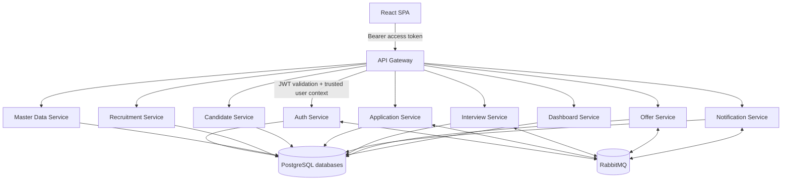
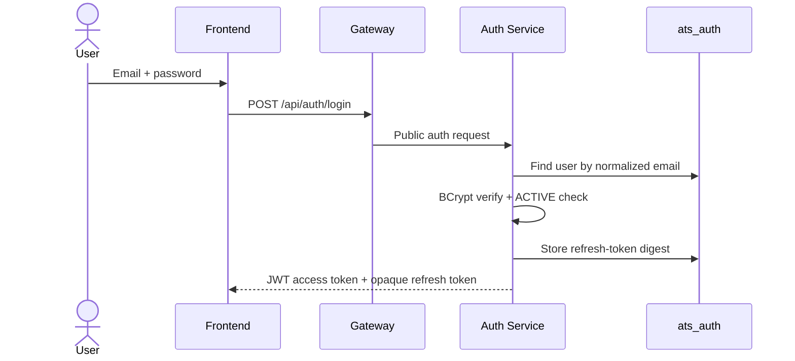
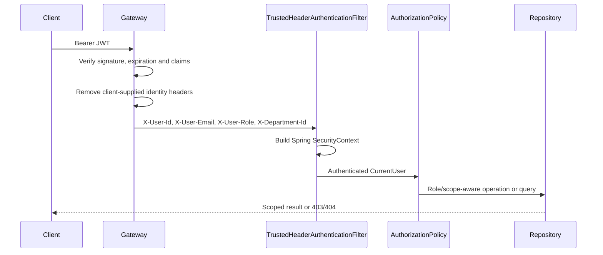
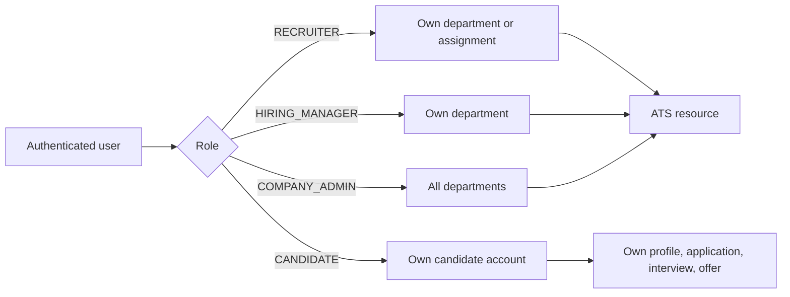

# ATS Current Single-Company Architecture

## 1. Document Status

Status: **CURRENT**  
Updated: **2026-09-03**

Tài liệu này mô tả kiến trúc sau Phase 0-12. Các tài liệu phân tích có nhãn
`TÀI LIỆU LỊCH SỬ - OUTDATED` chỉ dùng để truy vết trạng thái trước refactor.

## 2. Scope

Hệ thống phục vụ một doanh nghiệp duy nhất:

- Không có tenant selector, tenant onboarding hoặc tenant isolation runtime.
- Không có `PLATFORM_ADMIN`.
- `Company` là một hồ sơ cấu hình duy nhất, không phải security boundary.
- Role chính thức: `COMPANY_ADMIN`, `RECRUITER`, `HIRING_MANAGER`, `CANDIDATE`.
- Authorization backend kết hợp role, department, assignment và self-ownership.
- Candidate có portal self-service và bắt buộc có tài khoản đã xác thực để ứng tuyển.

Implementation Status: **IMPLEMENTED**

Evidence:

- `auth-service/src/main/java/iuh/fit/se/auth/enums/RoleName.java`
- `auth-service/src/main/java/iuh/fit/se/auth/entity/Company.java`
- `frontend/src/app/roles.ts`
- `frontend/src/routes/AppRoutes.tsx`

## 3. Component Architecture

Domain services có database riêng nhưng dùng chung một PostgreSQL instance trong
Docker Compose. Không có database-per-tenant hoặc tenant schema.

## 4. Authentication Architecture

JWT chứa `sub`, `email`, `role`, `departmentId` khi có, `iat`, `exp`. Access token
mặc định 15 phút. Refresh token mặc định 7 ngày, rotate khi refresh và revoke khi
logout/reset password. Candidate mới bắt đầu ở `PENDING_VERIFICATION` và chỉ chuyển
sang `ACTIVE` sau email verification.

Implementation Status: **IMPLEMENTED**

Evidence:

- `auth-service/src/main/java/iuh/fit/se/auth/service/LoginService.java`
- `auth-service/src/main/java/iuh/fit/se/auth/security/JwtUtil.java`
- `auth-service/src/main/java/iuh/fit/se/auth/service/RegisterService.java`
- `auth-service/src/main/java/iuh/fit/se/auth/service/PasswordService.java`

## 5. Request Security Context

Client không được chọn department scope bằng body/header. Gateway lấy department từ
JWT. Domain service không chỉ dựa vào frontend route guard; controller/service và
query specification tiếp tục kiểm tra quyền.

Implementation Status: **IMPLEMENTED WITH OPERATIONAL TRUST BOUNDARY**

Evidence:

- `api-gateway/src/main/java/iuh/fit/se/gateway/filter/JwtAuthGlobalFilter.java`
- `*/security/TrustedHeaderAuthenticationFilter.java`
- `*/security/CurrentUser.java`
- `*/security/AuthorizationPolicy.java`

## 6. Authorization Model

Đây là **RBAC + department scope + assignment + ownership**, không phải permission
engine động và không phải multi-tenancy.

Department scope được lưu ở `AppUser.departmentId` và trên resource nghiệp vụ cần
phân vùng như requisition, posting, application, interview và offer. Candidate
ownership liên kết `AppUser.id -> Candidate.userId` rồi được kiểm tra trên các API
`/me` hoặc resource candidate-facing.

Implementation Status: **IMPLEMENTED FOR VALID DEPARTMENT DATA; KNOWN NULL-SCOPE GAP**

Evidence:

- `auth-service/src/main/java/iuh/fit/se/auth/entity/AppUser.java`
- `recruitment-service/src/main/java/iuh/fit/se/recruitment/security/AuthorizationPolicy.java`
- `application-service/src/main/java/iuh/fit/se/application/application/ApplicationSpecifications.java`
- `candidate-service/src/main/java/iuh/fit/se/candidate/candidate/CandidatePortalController.java`

Legacy internal account có `departmentId = null` chưa được backfill. List
specification của requisition, posting và application fail-closed với trường hợp
này: actor non-admin không có scope nào sẽ nhận kết quả rỗng thay vì toàn bộ dữ
liệu. Dữ liệu legacy vẫn cần backfill để những account đó làm việc được.

## 7. Registration Boundaries

- `POST /api/auth/register`: chỉ candidate; backend hardcode role `CANDIDATE`.
- Internal staff: chỉ `COMPANY_ADMIN` gọi `POST /api/auth/admin/users`.
- Candidate registration phát event để candidate-service provision profile theo
  `userId`; SQL seed không tạo candidate account.
- Không có endpoint đăng ký company hoặc endpoint cho client chọn role.

Implementation Status: **IMPLEMENTED**

## 8. Frontend Boundaries

- Public career portal: `/careers` và `/careers/jobs/:jobId`.
- Guest auth: `/login`, `/register`, `/verify-email`, `/forgot-password`,
  `/reset-password`, `/oauth2/callback`.
- Internal workspace: `COMPANY_ADMIN`, `RECRUITER`, `HIRING_MANAGER`.
- Candidate portal: `/my-profile`, `/jobs`, `/my-applications`, `/my-interviews`,
  `/my-offers`.
- Admin-only UI: `/admin/users`, `/masterdata`, `/audit-logs`.

RoleRoute/menu visibility là UX control; backend vẫn là nguồn quyết định quyền.

## 9. Deliberate Limitations

- **NOT IMPLEMENTED:** multi-company SaaS, tenant switching và platform admin.
- **NOT IMPLEMENTED:** permission table/dynamic permission editor.
- **NOT IMPLEMENTED:** cryptographically authenticated service identity. Domain
  services tin trusted headers trong private Docker network.
- **NOT IMPLEMENTED:** browser E2E, Docker E2E và Testcontainers migration suite.
- **PARTIALLY IMPLEMENTED:** production token storage hardening; frontend hiện lưu
  access/refresh token trong `localStorage`.
- **OPERATIONAL REQUIREMENT:** database cũ phải backup và reconcile tenant/department
  data trước khi chạy destructive cleanup migrations.
- **PARTIALLY IMPLEMENTED:** candidate accept/decline offer chuyển stage
  application bất đồng bộ qua RabbitMQ (`offer.accepted`/`offer.declined`). Chưa có
  transactional outbox nên broker lỗi sẽ làm hai service lệch trạng thái.
- **KNOWN DEFECT:** automation còn lại dùng role `SYSTEM` (auto-advance sau đánh giá
  phỏng vấn, notification tra cứu interview) vẫn bị downstream từ chối; các call này
  là best-effort và được nuốt lỗi.
- **KNOWN DEFECT:** admin có thể set candidate chưa verify email sang `ACTIVE` qua
  status API.
- **PARTIALLY IMPLEMENTED:** Google OAuth2 auth-service có code nhưng gateway/Docker
  chưa route đầy đủ callback flow.

## 10. Source Of Truth

1. Runtime code, migrations và tests.
2. Tài liệu này và `README.md`.
3. Các báo cáo `ATS_PHASE_0...12_*.md`.
4. `ATS_AUTHORIZATION_CURRENT_STATE.md` chỉ là lịch sử trước refactor.
