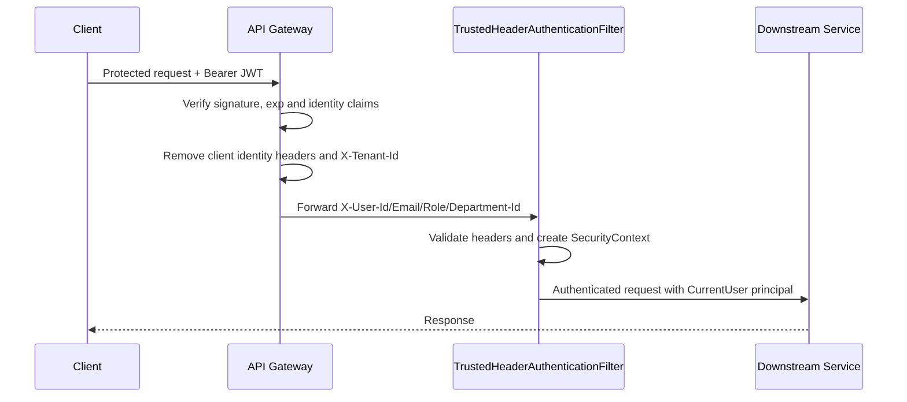

# ATS Phase 2 - Gateway & Security Context Refactor

> Current-state note (2026-09-01): Phase 10 removed the remaining tenant header,
> domain parameters, public tenant-code routes, and event fields. Tenant-specific
> details below are retained as the historical Phase 2 implementation snapshot.

## 1. Execution Status

**Status: COMPLETED for the Phase 2 identity and security-context scope.**

Phase 2 now provides a single-company authentication context from the API gateway to
all downstream services. Tenant is no longer read from JWT, accepted from a client as
identity, or forwarded by the common Feign propagation layer.

Important transition boundary:

- Legacy domain controllers, services, repositories, DTOs and events still contain
  `tenantId`, `tenantCode` and `X-Tenant-Id`.
- The gateway deliberately does not synthesize or hard-code a tenant ID.
- Therefore, protected legacy domain endpoints that still declare a required
  `X-Tenant-Id` cannot complete through the new gateway until Phase 4/10 removes that
  parameter.
- Public job posting remains on its legacy tenant-code lookup until Phase 10.

This is intentional and visible. No fake tenant value was introduced to hide the
remaining migration work.

## 2. Gateway Authentication

Implemented in:

- `api-gateway/src/main/java/iuh/fit/se/gateway/filter/JwtAuthGlobalFilter.java`

For every protected request the gateway now:

1. Requires `Authorization: Bearer <access-token>`.
2. Verifies the HMAC signature using `app.jwt.secret`.
3. Rejects expired tokens through JJWT validation.
4. Requires an `exp` claim.
5. Requires a positive numeric `sub` user ID.
6. Requires non-blank `email` and `role` claims.
7. Accepts only `COMPANY_ADMIN`, `RECRUITER`, `HIRING_MANAGER`, or `CANDIDATE`.
8. Validates optional `departmentId` as a positive number.
9. Removes all client-supplied identity headers and `X-Tenant-Id`.
10. Injects a fresh trusted context from the validated JWT.

Forwarded identity contract:

```http
X-User-Id: <sub>
X-User-Email: <email>
X-User-Role: <role>
X-Department-Id: <departmentId>   # omitted when JWT has no departmentId
```

The gateway never forwards or generates `X-Tenant-Id`.

Implementation Status: **IMPLEMENTED**

Evidence:

- `JwtAuthGlobalFilter.filter`
- `JwtAuthGlobalFilter.parseUserContext`
- `JwtAuthGlobalFilter.removeIdentityHeaders`

## 3. Public Endpoint Baseline

The gateway public rules are now method-aware.

| Method | Path | Current purpose |
| --- | --- | --- |
| POST | `/api/auth/register` | Candidate registration target; endpoint is implemented in Phase 3 |
| POST | `/api/auth/resend-otp` | Existing email verification support |
| POST | `/api/auth/verify-email` | Email verification |
| POST | `/api/auth/login` | Login |
| POST | `/api/auth/refresh-token` | Refresh access token |
| POST | `/api/auth/forgot-password` | Start password reset |
| POST | `/api/auth/reset-password` | Complete password reset |
| POST | `/api/auth/oauth2/exchange` | Existing OAuth2 code exchange |
| GET | `/api/recruitment/public/**` | Public open job postings |
| GET | Swagger/OpenAPI paths | API documentation |

Security changes:

- `/api/auth/register-company` is no longer public and is explicitly denied by
  auth-service security.
- `/api/candidate/public/**` is no longer public at the gateway.
- `/api/application/public/**` is no longer public at the gateway.
- `/api/candidate/candidates/cv-file/**` is no longer public at the gateway.
- Public job posting bypass is `GET` only.
- Client identity headers are stripped even on public requests.

Masterdata has three exact anonymous `GET` allowances for the internal public-job
rendering flow:

- `/api/masterdata/employment-types`
- `/api/masterdata/work-locations`
- `/api/masterdata/departments`

These are not anonymous through the gateway because `/api/masterdata/**` remains a
protected gateway route. They are reachable without user identity only from the
internal Docker network, where recruitment-service enriches public job responses.

Implementation Status: **IMPLEMENTED**

Evidence:

- `JwtAuthGlobalFilter.isPublicRequest`
- `auth-service/.../config/SecurityConfig.java`
- `recruitment-service/.../config/SecurityConfig.java`
- `masterdata-service/.../config/SecurityConfig.java`

## 4. Downstream Security Context

Every backend service now has:

- `security/CurrentUser.java`
- `security/TrustedHeaderAuthenticationFilter.java`
- A `SecurityConfig` that uses the filter and defaults to `authenticated()`.

Services covered:

1. auth-service
2. masterdata-service
3. recruitment-service
4. candidate-service
5. application-service
6. interview-service
7. offer-service
8. notification-service
9. dashboard-service

`CurrentUser` contains exactly:

```text
userId
email
role
departmentId
```

The filter validates a complete trusted header set, creates a
`UsernamePasswordAuthenticationToken`, adds authority `ROLE_<role>`, stores
`CurrentUser` as the principal, and clears the thread-local context after the request.

| Request | Result |
| --- | --- |
| Protected endpoint without identity headers | `401 Unauthorized` |
| Partial/malformed identity headers | `401 Unauthorized` |
| Unsupported role | `401 Unauthorized` |
| Complete valid identity headers | Authenticated `SecurityContext` |
| Public endpoint without identity headers | Allowed by its exact rule |

The static `CurrentUser.required()` helper is ready for controller and authorization
policy adoption in Phase 5. Existing controllers still reading raw headers are not
silently rewritten in Phase 2.

Implementation Status: **IMPLEMENTED**

Evidence:

- `*/src/main/java/**/security/CurrentUser.java`
- `*/src/main/java/**/security/TrustedHeaderAuthenticationFilter.java`
- `*/src/main/java/**/config/SecurityConfig.java`

## 5. Feign Identity Propagation

All existing Feign request interceptors now forward:

```text
X-User-Id
X-User-Email
X-User-Role
X-Department-Id
```

The interceptors no longer copy `X-Tenant-Id` from the inbound request.

Explicit legacy Feign client method parameters named `X-Tenant-Id` remain in domain
code. They are not part of the security context and are deferred to Phase 10 together
with the service/repository tenant parameters.

Implementation Status: **IMPLEMENTED for identity propagation; legacy domain tenant parameters remain deferred**

Evidence:

- `application-service/.../config/FeignClientConfig.java`
- `candidate-service/.../config/FeignClientConfig.java`
- `dashboard-service/.../config/FeignClientConfig.java`
- `interview-service/.../config/FeignClientConfig.java`
- `notification-service/.../config/FeignClientConfig.java`
- `offer-service/.../config/FeignClientConfig.java`
- `recruitment-service/.../config/FeignClientConfig.java`

## 6. Network Boundary

`docker-compose.yml` no longer publishes downstream service ports `8081-8090` to the
host. They use `expose` on `ats-network`. The backend entry point exposed to the host
is API gateway port `8080`.

This materially reduces direct header spoofing in the Docker deployment. Trusted
headers are still not cryptographically signed between services, so these rules remain:

- Do not publish downstream ports in production.
- Do not allow untrusted workloads onto `ats-network`.
- Running a service standalone on a host port is a development mode; a direct caller
  that can reach that port can still forge all trusted headers.

Implementation Status: **IMPLEMENTED for Docker network exposure; cryptographic service identity NOT IMPLEMENTED**

Evidence:

- `docker-compose.yml`
- `docker compose config --quiet` passes

## 7. Current Request Flow



Missing or invalid JWT is rejected at the gateway. Missing or malformed trusted user
context is rejected again at a downstream protected endpoint.

## 8. Verification

Automated tests:

| Module | Result | Coverage |
| --- | --- | --- |
| api-gateway | 6 passed | Context boot; missing token; invalid token; expired token; validated context forwarding; public GET method rule |
| auth-service | 13 passed | Phase 1 login/JWT/user tests rerun without regression |
| recruitment-service | 4 passed | Entry point; direct protected request rejection; valid CurrentUser context; incomplete context rejection |

Build verification:

- auth-service: package passed
- application-service: package passed
- candidate-service: package passed
- dashboard-service: package passed
- interview-service: package passed
- masterdata-service: package passed
- notification-service: package passed
- offer-service: package passed
- recruitment-service: test/compile passed
- api-gateway: test/compile passed
- `docker compose config --quiet`: passed
- `git diff --check`: no whitespace errors; only existing CRLF conversion warnings

## 9. Acceptance Criteria

| Criterion | Status | Evidence |
| --- | --- | --- |
| Protected request without JWT is rejected | PASS | `JwtAuthGlobalFilterTest.rejectsProtectedRequestWithoutToken` |
| Invalid JWT is rejected | PASS | `JwtAuthGlobalFilterTest.rejectsInvalidToken` |
| Expired JWT is rejected | PASS | `JwtAuthGlobalFilterTest.rejectsExpiredToken` |
| Valid JWT forwards complete current-user context | PASS | `JwtAuthGlobalFilterTest.forwardsValidatedUserContextAndRemovesSpoofedTenantHeader` |
| Gateway does not forward tenant identity | PASS | `removeIdentityHeaders`; no tenant injection |
| Protected direct service request without user context is rejected | PASS | `SecurityContextIntegrationTest.rejectsDirectProtectedRequestWithoutTrustedUserHeaders` |
| Broad candidate/application/CV public bypass is removed | PASS | Gateway public rules |
| Downstream default is no longer `permitAll()` | PASS | All nine `SecurityConfig` files |
| Domain code contains no tenant dependency | DEFERRED | Phase 4/10 by plan |

## 10. Remaining Work for Later Phases

### Phase 3

- Implement the public candidate `/api/auth/register` endpoint now reserved by the
  gateway rule.
- Replace legacy registration/verification DTOs that still require tenant code.

### Phase 4 and Phase 10

- Remove required `X-Tenant-Id` parameters from domain controllers.
- Replace tenant repository queries with single-company, department, assignment and
  ownership queries.
- Remove tenant-code public routes.
- Restore complete protected business API operation through the new gateway contract.

### Phase 5 and Phase 6

- Refactor controllers and policy code to use `CurrentUser.required()` rather than raw
  role/user headers.
- Enforce role, department, assignment and ownership authorization.

### Optional Hardening

- Add service-to-service authentication or a signed internal context if the deployment
  must run on a network that cannot guarantee gateway-only ingress.
