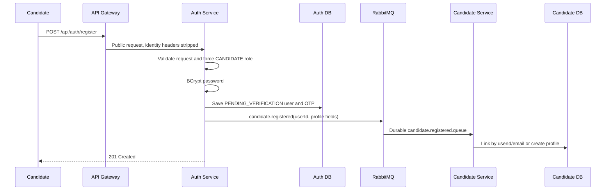
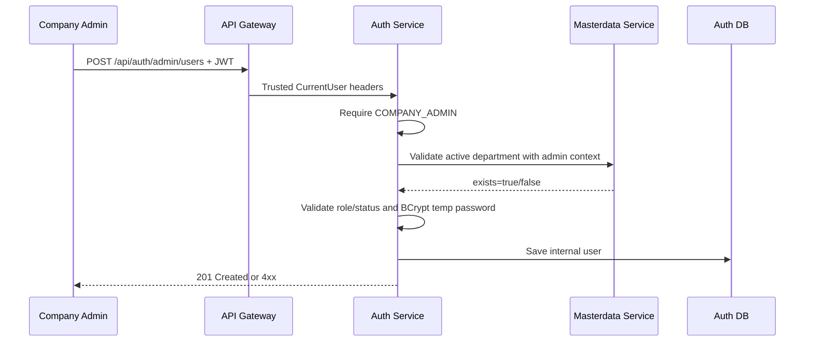

# ATS Phase 3 - Split Registration Flows

## 1. Execution Status

**Status: COMPLETED for the Phase 3 backend scope.**

The registration domain now has two separate entry points:

- Candidate self-registration is public and always creates a `CANDIDATE` account.
- Internal-user creation is protected and can only be initiated by a
  `COMPANY_ADMIN`.

The old company self-registration controller and request DTO have been removed. The
legacy URL `/api/auth/register-company` remains explicitly denied in security config
so it cannot become reachable accidentally.

Important transition boundaries:

- Candidate profile provisioning is asynchronous through RabbitMQ.
- A newly provisioned candidate profile has `tenant_id = null`. Remaining candidate
  controllers and repositories still requiring tenant are Phase 4/10 work.
- Frontend login/register/admin-user screens still contain legacy tenant UI and are
  intentionally assigned to Phase 8.
- Invitation/set-password, OTP attempt throttling, and tenant-free forgot/reset
  password are Phase 9 work.
- No migration was applied to the user's live PostgreSQL databases during this phase.

## 2. Candidate Self-Registration

Endpoint:

```http
POST /api/auth/register
Content-Type: application/json
```

Request contract:

```json
{
  "fullName": "Nguyen Van A",
  "email": "a@example.com",
  "password": "strong-password",
  "confirmPassword": "strong-password",
  "phone": "0900000000"
}
```

Current behavior:

1. Normalizes email to lower case and checks global uniqueness.
2. Requires an eight-character minimum password through Bean Validation.
3. Requires `password` and `confirmPassword` to match.
4. Loads only the seeded `CANDIDATE` role.
5. Hashes the password with the configured BCrypt encoder.
6. Creates `AppUser` with fixed security attributes:

```text
role = CANDIDATE
status = PENDING_VERIFICATION
departmentId = null
emailVerified = false
```

7. Creates a six-digit OTP with `SecureRandom` and a configured expiration.
8. Sends the OTP through the existing `MailService`.
9. Publishes `candidate.registered` with `userId`, name, email, and phone.
10. Returns `201 Created`.

`CandidateRegistrationRequest` has no `role` or `departmentId` property. If a caller
adds either field, Spring's current JSON binding ignores it; neither value can reach
`RegisterService`, and role/department are still assigned by backend code.

Implementation Status: **IMPLEMENTED**

Evidence:

- `auth-service/.../controller/AuthController.registerCandidate`
- `auth-service/.../dto/request/CandidateRegistrationRequest.java`
- `auth-service/.../service/RegisterService.registerCandidate`
- `auth-service/.../config/SecurityConfig.java`
- `api-gateway/.../filter/JwtAuthGlobalFilter.isPublicRequest`

## 3. Email Verification

Registration verification no longer uses a tenant code.

```http
POST /api/auth/verify-email
POST /api/auth/resend-otp
```

Verify request:

```json
{
  "email": "a@example.com",
  "otpCode": "123456"
}
```

Resend request:

```json
{
  "email": "a@example.com"
}
```

Verification activates only an account whose role is `CANDIDATE` and whose current
status is `PENDING_VERIFICATION`. A valid OTP sets:

```text
status = ACTIVE
emailVerified = true
```

The runtime `EmailVerification` entity and repository no longer read or write tenant.
Migration `V2__single_company_email_verification.sql` makes the deprecated physical
`tenant_id` nullable for existing databases and adds an email/id lookup index.

Implementation Status: **IMPLEMENTED for candidate registration verification**

Evidence:

- `RegisterService.verifyEmail`
- `RegisterService.resendOtp`
- `EmailVerification`
- `EmailVerificationRepository.findTopByEmailIgnoreCaseOrderByIdDesc`
- `auth-service/src/main/resources/db/migration/V2__single_company_email_verification.sql`

## 4. Candidate Profile Provisioning

Auth-service publishes:

```text
exchange = ats.events
routing key = candidate.registered
```

Candidate-service declares durable queue `candidate.registered.queue`. Its listener
calls an idempotent provisioning method:

1. Return the existing active profile when the same `userId` was already processed.
2. Otherwise link an existing active profile with the same email.
3. Otherwise create a profile with the event's `userId`, name, email, and phone.

A database migration makes legacy `candidate.tenant_id` nullable and creates a unique
active `user_id` index for existing schemas. The entity also declares `user_id` unique
so a fresh Hibernate-created schema enforces the account/profile one-to-one invariant.

Current transition behavior:

```text
new candidate profile tenantId = null
```

This creates the required User-to-Candidate link without inventing a single-company
tenant ID. Legacy candidate endpoints that still require `X-Tenant-Id` cannot use this
profile until tenant-based repositories are removed in Phase 4/10.

Implementation Status: **IMPLEMENTED for provisioning; legacy candidate CRUD integration remains deferred**

Evidence:

- `CandidateRegistrationPublisher.publish`
- `candidate-service/.../config/RabbitMQConfig.java`
- `CandidateRegistrationListener.handle`
- `CandidateService.provisionRegisteredCandidate`
- `CandidateRepository.findByUserIdAndDeletedAtIsNull`
- `candidate-service/src/main/resources/db/migration/V1__allow_account_candidate_without_tenant.sql`

## 5. Internal User Creation

Endpoint:

```http
POST /api/auth/admin/users
Authorization: Bearer <COMPANY_ADMIN access token>
```

Actual request contract uses the demo-safe temporary-password option allowed by the
refactor plan:

```json
{
  "fullName": "Tran HR",
  "email": "hr@example.com",
  "tempPassword": "temporary-password",
  "role": "RECRUITER",
  "phone": "0911111111",
  "departmentId": 10,
  "status": "ACTIVE"
}
```

Authorization is enforced at three layers:

- URL rule: `hasRole("COMPANY_ADMIN")`.
- Controller method: `@PreAuthorize("hasRole('COMPANY_ADMIN')")`.
- Service defense: rejects a `CurrentUser` whose role is not `COMPANY_ADMIN`.

Business rules:

- Globally unique normalized email.
- Allowed roles are `COMPANY_ADMIN`, `RECRUITER`, and `HIRING_MANAGER`.
- `CANDIDATE` is rejected and `PLATFORM_ADMIN` is absent from `RoleName`.
- Initial status can only be `ACTIVE` or `INACTIVE`.
- Recruiter and hiring manager require a department.
- Company admin may be global with no department.
- Any supplied department ID must be positive and reference an active department.
- Temporary password is BCrypt-hashed before persistence.

The previous `POST /api/auth/users` creation mapping no longer exists. Existing GET
and status-management paths were not moved in this phase because their broader policy
and frontend migration belong to Phase 5/8.

Implementation Status: **IMPLEMENTED using temporary password; invitation flow NOT IMPLEMENTED**

Evidence:

- `AuthController.createInternalUser`
- `auth-service/.../config/SecurityConfig.java`
- `UserService.createUser`
- `UserService.validateInternalRole`
- `CreateUserRequest`

## 6. Department Validation

Auth-service performs a fail-closed service call before creating a department-scoped
user:

```http
GET /api/masterdata/departments/{id}/exists
```

The request forwards the already authenticated admin's trusted identity headers. The
masterdata endpoint requires `COMPANY_ADMIN` both in its URL rule and with
`@PreAuthorize`. It returns true only when the department exists and is active.

If masterdata-service is unreachable or returns an error, auth-service rejects user
creation rather than accepting an unverified department.

Implementation Status: **IMPLEMENTED**

Evidence:

- `DepartmentDirectoryClient.existsActive`
- `DepartmentController.existsActive`
- `DepartmentService.existsActive`
- `masterdata-service/.../config/SecurityConfig.java`
- `docker-compose.yml` (`SERVICES_MASTERDATA_SERVICE_URL`)

## 7. Current Flows

### Candidate Registration



### Internal User Creation



## 8. Verification

Clean automated test runs:

| Module | Result | Coverage |
| --- | --- | --- |
| api-gateway | 7 passed | Existing JWT regression suite plus POST-only public candidate registration |
| auth-service | 20 passed | Candidate fixed attributes, password mismatch, sensitive extra fields, OTP/JWT/login regression, admin endpoint 403/201, internal role/status/department rules |
| candidate-service | 3 passed | New profile provisioning, duplicate-event idempotency, application entry point |
| masterdata-service | 2 passed | Active/inactive/missing department validation, application entry point |
| Total | 32 passed | 0 failures, 0 errors, 0 skipped |

Additional verification:

- auth-service package: passed
- candidate-service package: passed
- masterdata-service package: passed
- `docker compose config --quiet`: passed; only the local Docker config permission warning was printed
- `git diff --check`: no whitespace errors; only CRLF conversion warnings

The migrations were compiled and packaged but were not executed against the user's
live databases.

## 9. Acceptance Criteria

| Criterion | Status | Evidence |
| --- | --- | --- |
| Candidate registration succeeds | PASS | `RegisterServiceTest.candidateRegistrationHardCodesCandidateSecurityAttributes` |
| Registration public bypass is POST-only | PASS | `JwtAuthGlobalFilterTest.onlyPostCandidateRegistrationBypassesAuthentication` |
| Candidate is always `CANDIDATE` | PASS | Hard-coded `RoleName.CANDIDATE` lookup |
| Candidate cannot supply effective role/department | PASS | DTO has no fields; `AuthControllerTest` extra-field case |
| Candidate starts pending and unverified | PASS | `RegisterService.registerCandidate` |
| Candidate profile is linked to `userId` | PASS | Rabbit event and provisioning tests |
| Internal staff has no public self-registration | PASS | Only `/register` candidate route; old company route denied |
| Non-admin cannot create internal users | PASS | `AuthControllerSecurityTest.recruiterCannotCreateInternalUser` |
| Admin can create internal users | PASS | `AuthControllerSecurityTest.companyAdminCanReachInternalUserCreation` |
| Recruiter without department is rejected | PASS | `UserServiceTest.recruiterRequiresDepartment` |
| Missing/inactive department is rejected | PASS | User and department service tests |
| Temporary password is hashed | PASS | `UserServiceTest.createsRecruiterWithValidatedDepartmentAndHashedTemporaryPassword` |

## 10. Deferred Work

### Phase 4 and Phase 10

- Remove physical `tenant_id` from candidate and remaining domain schemas.
- Convert candidate controllers/services/repositories to single-company queries.
- Make the provisioned account-backed profile usable by all candidate workflows.

### Phase 5

- Centralize authorization policy for existing user list/status and domain APIs.
- Replace remaining raw header reads with `CurrentUser` and policy checks.

### Phase 8

- Replace the company-registration frontend with candidate registration.
- Add the admin-only internal-user form.
- Remove tenant code from login/verification UI and auth state.

### Phase 9

- Implement invitation/set-password for internal staff instead of admin-entered
  temporary passwords.
- Remove tenant from forgot/reset password.
- Add OTP attempt limits/rate limits and generic anti-enumeration responses.
- Add reliable outbox/retry handling if candidate profile delivery must be guaranteed
  across RabbitMQ and database failures.
