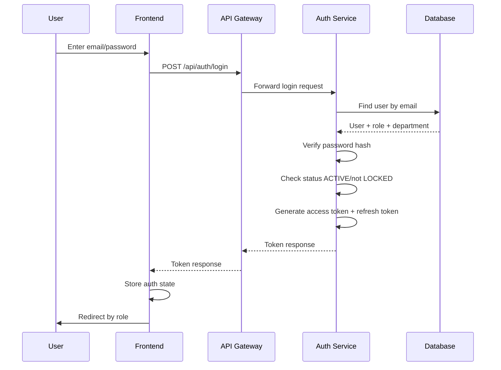
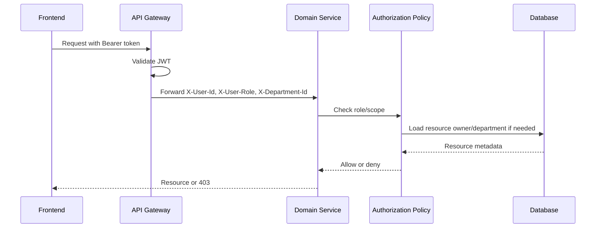

# ATS Single-Company Refactor Plan

## 1. Muc Tieu

Tai lieu nay mo ta ke hoach chinh sua he thong ATS hien tai tu mo hinh nhieu doanh nghiep/multi-tenancy sang mo hinh **mot doanh nghiep duy nhat**.

Pham vi da chot:

- Loai bo han multi-tenancy khoi he thong.
- Khong con `PLATFORM_ADMIN`.
- Role chinh thuc:
  - `COMPANY_ADMIN`
  - `RECRUITER`
  - `HIRING_MANAGER`
  - `CANDIDATE`
- Candidate phai dang ky tai khoan va dang nhap de nop CV, ung tuyen va theo doi tien do.
- Nhan vien noi bo khong duoc tu dang ky. `COMPANY_ADMIN` tao tai khoan noi bo.
- Department phai duoc enforce that su o backend.
- Uu tien bao mat phan quyen va nghiep vu hon UI phu.

Tai lieu nay la ke hoach goc theo phase. Phase 0-12 da duoc trien khai va doi chieu
bang cac bao cao `ATS_PHASE_*.md`; kien truc hien tai duoc tong hop tai
`ATS_CURRENT_ARCHITECTURE.md`.

## 2. Nguyen Tac Thiet Ke Moi

### 2.1. Single Company

He thong chi phuc vu mot doanh nghiep, vi vay:

- Khong can `tenant`.
- Khong can `tenantCode`.
- Khong can `tenantId` trong JWT.
- Khong can API dang ky/cong ty/onboarding tenant.
- Khong can `PLATFORM_ADMIN`.
- Tat ca du lieu nghiep vu thuoc cung mot doanh nghiep.

Thay cho tenant isolation, he thong can tap trung vao:

- Role-based access control.
- Department-based access control.
- Candidate self-access.
- Resource ownership/assignment.

### 2.2. Authentication

Tat ca user dang nhap bang:

```text
email + password
```

Backend phai kiem tra:

- Email co ton tai khong.
- Password co dung khong.
- Account status co hop le khong.
- Account co bi khoa khong.
- Role cua user la gi.
- Neu la nhan vien noi bo, department co hop le khong.

JWT access token chi nen chua:

```text
userId
email
role
departmentId
```

`departmentId` can co trong token de downstream service co the enforce department scope nhanh hon. Tuy nhien service van nen query/validate lai khi thao tac nhay cam.

### 2.3. Registration

Tach thanh 2 luong:

```text
Internal Staff: COMPANY_ADMIN tao tai khoan
Candidate: tu dang ky
```

Khong co `/register` chung cho moi role.

Candidate self-register:

- Candidate nhap full name, email, password, confirm password, phone.
- Backend tu gan `role = CANDIDATE`.
- Backend khong cho client truyen role.
- Account ban dau nen la `PENDING_VERIFICATION`.
- Sau khi verify email/OTP moi thanh `ACTIVE`.

Internal staff:

- `COMPANY_ADMIN` tao user qua User Management.
- Role chi duoc chon trong `COMPANY_ADMIN`, `RECRUITER`, `HIRING_MANAGER`.
- Internal staff bat buoc co `departmentId`, tru truong hop quyet dinh cho `COMPANY_ADMIN` la global admin.
- Co the tao account voi status `ACTIVE` hoac `PENDING_INVITATION`.

### 2.4. Authorization

Backend la noi enforce authorization chinh.

Frontend chi duoc xem la UI protection:

- An/hien menu theo role.
- Dieu huong dashboard theo role.
- Khong duoc xem frontend guard la bao mat that su.

Tat ca API quan trong phai enforce o backend:

- Role.
- Department.
- Candidate self.
- Owner/assignee.

## 3. Target Role Model

| Role | Scope | Muc dich |
| --- | --- | --- |
| `COMPANY_ADMIN` | Global trong mot doanh nghiep | Quan tri user, department, master data, xem toan bo du lieu |
| `RECRUITER` | Department hoac assigned resource | Tao/sua requisition/job/candidate/application trong pham vi duoc phan cong |
| `HIRING_MANAGER` | Department cua minh | Duyet requisition, xem ung vien/application/interview cua department minh |
| `CANDIDATE` | Self | Quan ly ho so ca nhan, nop CV, ung tuyen, theo doi tien do cua minh |

Ghi chu:

- Khong them role `INTERVIEWER` trong phase nay vi user da chot danh sach 4 role.
- Neu can nguoi phong van, dung `HIRING_MANAGER` duoc gan vao interview/evaluation.

## 4. Target User Model

Model user nen chuyen ve dang single-company:

```text
AppUser
 ├── id
 ├── email
 ├── passwordHash
 ├── fullName
 ├── phone
 ├── role
 ├── departmentId
 ├── status
 ├── emailVerified
 ├── createdAt
 └── updatedAt
```

Status de xuat:

```text
PENDING_VERIFICATION
ACTIVE
LOCKED
INACTIVE
```

Quy tac:

- `CANDIDATE`: `departmentId = null`.
- `RECRUITER`: bat buoc co `departmentId`.
- `HIRING_MANAGER`: bat buoc co `departmentId`.
- `COMPANY_ADMIN`: co the `departmentId = null` neu la admin toan cong ty.

## 5. Target Auth Endpoints

| Endpoint | Purpose | Public/Auth | Ghi chu |
| --- | --- | --- | --- |
| `POST /api/auth/login` | Dang nhap tat ca user | Public | Request chi gom `email`, `password` |
| `POST /api/auth/register` | Candidate tu dang ky | Public | Backend tu gan role `CANDIDATE` |
| `POST /api/auth/verify-email` | Xac thuc email/OTP | Public | Activate candidate |
| `POST /api/auth/forgot-password` | Gui OTP/reset link | Public | Khong tiet lo email co ton tai hay khong |
| `POST /api/auth/reset-password` | Dat mat khau moi | Public/tokenized | Dung OTP/reset token |
| `POST /api/auth/refresh-token` | Cap access token moi | Public/tokenized | Nen rotate refresh token |
| `POST /api/auth/logout` | Dang xuat | Authenticated | Revoke refresh token |
| `GET /api/auth/me` | Current user | Authenticated | Tra ve user profile + role + department |
| `POST /api/auth/admin/users` | Tao internal user | `COMPANY_ADMIN` | Khong tao candidate qua endpoint nay |
| `GET /api/auth/admin/users` | Quan ly user | `COMPANY_ADMIN` | Loc theo role/status/department |
| `PATCH /api/auth/admin/users/{id}/status` | Khoa/mo khoa user | `COMPANY_ADMIN` | Khong cho user tu nang role |

## 6. Target Authorization Matrix

| Resource | `COMPANY_ADMIN` | `RECRUITER` | `HIRING_MANAGER` | `CANDIDATE` |
| --- | --- | --- | --- | --- |
| Department | CRUD all | View own department | View own department | No access |
| User | CRUD internal users | View self | View self | View/update self |
| Job Requisition | All | Create/view/update own department | View/approve own department | No access |
| Job Posting | All | Manage own department/assigned | View own department | View public/open |
| Candidate Profile | All | View candidates in assigned jobs/department | View candidates in own department pipeline | View/update self |
| Resume/CV | All | View candidate CV in authorized applications | View CV in own department interviews/applications | Upload/view own CV |
| Application | All | Manage applications in own department/assigned jobs | View/update stage/evaluation in own department | Create/view own applications |
| Interview | All | Schedule/manage own department/assigned | View/confirm/evaluate assigned or own department | View/confirm own interviews |
| Evaluation | All | View authorized evaluations | Create/update own assigned evaluations | No access |
| Offer | All | Create/manage for authorized applications | Approve/view own department if assigned | View/respond own offers |
| Notification | All/system | Own notifications | Own notifications | Own notifications |

## 7. Phase Plan

## Phase 0 - Scope Freeze & Design Baseline

Status: COMPLETED. Baseline and exact change inventory: ATS_PHASE_0_SCOPE_FREEZE_BASELINE.md.

Muc tieu:

- Dong bang scope single-company.
- Tao tai lieu target architecture de tranh sua lan man.
- Xac dinh ro phan nao bi xoa, phan nao duoc thay the.

Viec can lam:

- Tao/chot tai lieu nay lam plan chinh.
- Doi chieu voi `ATS_AUTHORIZATION_CURRENT_STATE.md`.
- Lap danh sach tat ca noi dang dung:
  - `tenantId`
  - `tenantCode`
  - `Tenant`
  - `PLATFORM_ADMIN`
  - `X-Tenant-Id`
  - route frontend `/c/:tenantCode`
- Xac dinh thu tu migration de khong lam hong build giua chung.

Acceptance criteria:

- Co danh sach file can sua.
- Khong con yeu cau multi-company trong target design.
- Tat ca role target chi con 4 role da chot.

Risk:

- Xoa tenant qua som co the lam hong nhieu service. Nen thay doi theo tung lop: auth/gateway truoc, domain services sau, frontend sau.

## Phase 1 - Auth Domain Refactor

Status: COMPLETED. Implementation report: ATS_PHASE_1_AUTH_DOMAIN_REFACTOR.md.

Muc tieu:

- Chuyen auth-service tu tenant-based sang single-company.
- Sua user model de co department va status dung nghiep vu.

File/khu vuc can kiem tra/sua:

- `auth-service/src/main/java/.../AppUser.java`
- `auth-service/src/main/java/.../Role.java`
- `auth-service/src/main/java/.../RoleName.java`
- `auth-service/src/main/java/.../UserStatus.java`
- `auth-service/src/main/java/.../LoginRequest.java`
- `auth-service/src/main/java/.../LoginService.java`
- `auth-service/src/main/java/.../JwtUtil.java`
- `auth-service/src/main/java/.../AuthController.java`
- database init/migration lien quan auth.

Viec can lam:

- Xoa `tenantId` khoi `AppUser`.
- Them `departmentId` vao `AppUser`.
- Bo role `PLATFORM_ADMIN`.
- Giu role:
  - `COMPANY_ADMIN`
  - `RECRUITER`
  - `HIRING_MANAGER`
  - `CANDIDATE`
- Sua login request tu:

```text
tenantCode + email + password
```

thanh:

```text
email + password
```

- Sua lookup user theo email duy nhat.
- Dam bao email unique trong toan he thong.
- Sua JWT claim:

```text
sub = userId
email
role
departmentId
iat
exp
```

- Khong tao claim `tenantId`.
- Dong bo enum status backend/frontend.

Acceptance criteria:

- Login khong can `tenantCode`.
- JWT khong chua `tenantId`.
- User noi bo co department.
- Candidate khong co department.
- `PLATFORM_ADMIN` khong con trong code runtime.

Test can co:

- Login thanh cong voi account `ACTIVE`.
- Login fail khi sai password.
- Login fail khi account `INACTIVE`.
- Login fail khi account `LOCKED`.
- Login fail khi email khong ton tai.
- JWT claim dung va khong co `tenantId`.

## Phase 2 - Gateway & Security Context Refactor

Status: COMPLETED. Implementation report: ATS_PHASE_2_GATEWAY_SECURITY_CONTEXT_REFACTOR.md.

Scope note: Phase 2 removes tenant from JWT identity propagation and the downstream
SecurityContext. Legacy domain controller/service/repository tenant parameters remain
explicitly deferred to Phase 4/10 and are not replaced by a hard-coded tenant ID.

Muc tieu:

- Bo `X-Tenant-Id`.
- Tao security context thong nhat cho downstream services.
- Giam nguy co spoof header khi goi truc tiep service.

File/khu vuc can kiem tra/sua:

- `api-gateway/.../JwtAuthGlobalFilter.java`
- security config cua tung service.
- common/current-user helper neu co.
- cac `AccessGuard`.

Viec can lam:

- Gateway validate JWT.
- Gateway inject headers:

```http
X-User-Id
X-User-Email
X-User-Role
X-Department-Id
```

- Xoa inject `X-Tenant-Id`.
- Downstream services doc current user tu headers.
- Public path chi giu nhung endpoint thuc su public:
  - login
  - candidate register
  - verify email
  - forgot/reset password
  - refresh token
  - public job postings
- Cac endpoint nhay cam khong duoc public.

Can nhac bao mat:

- Neu downstream service con expose port ra ngoai Docker/network, header co the bi spoof.
- Nen gioi han truy cap downstream chi qua gateway trong moi truong production.
- Service-level filter nen reject request noi bo neu thieu `X-User-Id` cho endpoint protected.

Acceptance criteria:

- Request protected khong co JWT bi reject.
- Request protected co JWT het han bi reject.
- Downstream khong con tin `X-Tenant-Id`.
- Khong con public wildcard qua rong.

Test can co:

- Gateway reject missing token.
- Gateway reject invalid token.
- Gateway forward valid user context.
- Direct protected service request thieu user header bi reject neu service-level security duoc bat.

## Phase 3 - Split Registration Flows

**Execution status: COMPLETED (2026-08-28).**

Implementation report: `ATS_PHASE_3_SPLIT_REGISTRATION_FLOWS.md`

Scope note: candidate registration, tenant-free registration OTP verification,
admin-only internal user creation, active-department validation, and asynchronous
candidate-profile provisioning are implemented. The profile is provisioned with a
deprecated nullable `tenant_id` during the transition; removal of tenant-based
candidate APIs remains Phase 4/10. Frontend registration and admin-user-management UI
remain Phase 8, while invitation/set-password and password-reset hardening remain
Phase 9.

Muc tieu:

- Candidate duoc tu dang ky.
- Internal staff chi duoc tao boi `COMPANY_ADMIN`.

### 3.1. Candidate Registration

Endpoint target:

```http
POST /api/auth/register
```

Request:

```json
{
  "fullName": "Nguyen Van A",
  "email": "a@example.com",
  "password": "secret",
  "confirmPassword": "secret",
  "phone": "0900000000"
}
```

Backend behavior:

- Validate email unique.
- Validate password == confirmPassword.
- Hash password bang BCrypt hoac Argon2.
- Tao user:

```text
role = CANDIDATE
status = PENDING_VERIFICATION
departmentId = null
emailVerified = false
```

- Tao/gan candidate profile voi `userId`.
- Gui OTP/email verification neu email service co san.

Khong duoc:

- Cho candidate truyen role.
- Cho candidate truyen department.
- Auto active account neu da quyet dinh bat buoc verify email.

### 3.2. Internal User Creation

Endpoint target:

```http
POST /api/auth/admin/users
```

Role required:

```text
COMPANY_ADMIN
```

Request:

```json
{
  "fullName": "Tran HR",
  "email": "hr@example.com",
  "role": "RECRUITER",
  "phone": "0911111111",
  "departmentId": 10,
  "status": "ACTIVE"
}
```

Backend behavior:

- Chi `COMPANY_ADMIN` duoc goi.
- Khong cho tao `CANDIDATE` qua endpoint internal staff, tru khi co use-case ro rang.
- Khong cho tao `PLATFORM_ADMIN`.
- `RECRUITER` va `HIRING_MANAGER` bat buoc co department.
- Password nen tao qua invitation/set-password flow.
- Neu lam don gian cho demo, co the cho admin set temporary password, nhung phai hash.

Acceptance criteria:

- Candidate dang ky luon la `CANDIDATE`.
- Candidate khong the tu nang role.
- Internal staff khong co public self-register.
- Admin tao user noi bo co department hop le.

Test can co:

- Candidate register thanh cong.
- Candidate register request co field role bi ignore hoac reject.
- Non-admin goi create internal user bi reject.
- Admin tao recruiter khong co department bi reject.

## Phase 4 - Database & Entity Cleanup

**Execution status: COMPLETED (2026-08-28) for the code and versioned-migration baseline.**

Implementation report: `ATS_PHASE_4_DATABASE_ENTITY_CLEANUP.md`

Scope note: all JPA entities and repositories are tenant-free, the tenant lifecycle
model is removed, single-company resource relationships are preserved/indexed, and
Flyway is enabled across persistence services. Legacy physical `tenant_id` columns
and the old `tenant` table are retained as nullable/deprecated recovery data; no live
database migration was executed. Controller/service/Feign/DTO/event tenant contracts
remain explicitly assigned to Phase 10, and `ddl-auto:update` remains during the
transition to versioned schema ownership.

Muc tieu:

- Loai bo concept tenant khoi schema/entity.
- Them quan he department/user/resource can thiet.

Viec can lam:

- Xoa/bat dau deprecate cac bang:
  - `tenant`
  - `tenant_settings`
  - role/platform admin mapping neu chi phuc vu multi-tenancy.
- Xoa cot `tenant_id` khoi cac bang domain sau khi code khong con dung.
- Them/bao dam cot:
  - `app_user.department_id`
  - `candidate.user_id`
  - `job_requisition.department_id`
  - `job_posting.requisition_id`
  - `application.candidate_id`
  - `application.job_posting_id`
  - `interview.application_id`
  - `interview.interviewer_id` hoac assignee tuong duong
  - `offer.application_id`
- Them foreign key neu database migration dang duoc dung.

Khuyen nghi:

- Chuyen dan tu `ddl-auto:update` sang migration co version neu can bao ve demo/production.
- Neu thoi gian han che, co the giu mot so cot tenant khong dung trong DB tam thoi, nhung code runtime khong duoc dua vao chung. Danh dau ro la deprecated.

Acceptance criteria:

- Entity runtime khong yeu cau `tenantId`.
- Department relation duoc dung trong authorization.
- Candidate lien ket duoc voi user account.

Test can co:

- Schema boot thanh cong.
- Tao user noi bo voi department hop le.
- Tao candidate account kem candidate profile.
- Repository query khong con yeu cau tenant parameter.

## Phase 5 - Backend Authorization Policy

**Execution status: COMPLETED (2026-08-28) for the backend policy baseline.**

Implementation report: `ATS_PHASE_5_BACKEND_AUTHORIZATION_POLICY.md`

Scope note: role, self, department, owner, and assignment checks are now enforced at
backend boundaries. Full candidate-directory department visibility remains Phase 6;
trusted service identity for background workflow commands is not implemented and is
recorded explicitly in the Phase 5 report.

Muc tieu:

- Dinh nghia authorization policy tap trung, ro rang, test duoc.
- Khong de moi service tu check tuy tien bang string roi lech nhau.

Thiet ke de xuat:

```text
CurrentUser
 ├── userId
 ├── email
 ├── role
 └── departmentId

AuthorizationService / AccessGuard
 ├── requireRole(...)
 ├── requireAnyRole(...)
 ├── requireAdmin()
 ├── requireSameDepartment(resourceDepartmentId)
 ├── requireSelf(targetUserId)
 ├── canAccessCandidate(candidateId)
 ├── canAccessApplication(applicationId)
 └── canManageJob(jobId)
```

Quy tac nen enforce:

- `COMPANY_ADMIN`: full access trong mot doanh nghiep.
- `RECRUITER`: access resource thuoc department cua minh hoac resource duoc assign.
- `HIRING_MANAGER`: access resource thuoc department cua minh; interview/evaluation duoc assign.
- `CANDIDATE`: chi access du lieu cua chinh minh.

Acceptance criteria:

- Moi controller protected deu lay `CurrentUser`.
- Moi action nhay cam deu check role + scope.
- Khong con endpoint chi dua vao frontend guard.

Test can co:

- Vertical escalation: candidate goi API admin bi reject.
- Horizontal escalation: candidate A doc application candidate B bi reject.
- Cross-department: HM department A doc job/application department B bi reject.
- Admin doc tat ca duoc allow.

## Phase 6 - Department Authorization

**Execution status: COMPLETED (2026-08-28) for the department authorization baseline.**

Implementation report: `ATS_PHASE_6_DEPARTMENT_AUTHORIZATION.md`

Scope note: department is now enforced from internal user context through requisition,
posting, application, candidate visibility, interview/evaluation/slot, and offer flows.
Legacy rows created before the new authorization snapshots must be reconciled before
production migration; non-admin access to missing department snapshots fails closed.

Muc tieu:

- Department khong chi la master data.
- Department phai anh huong den viec user xem/sua resource.

Resource can co department source:

- User noi bo: `departmentId`.
- Job Requisition: `departmentId`.
- Job Posting: lay department tu requisition.
- Application: lay department tu job posting/requisition.
- Interview: lay department tu application/job.
- Evaluation: lay department tu interview/application/job.
- Offer: lay department tu application/job.

Quy tac:

| Action | Rule |
| --- | --- |
| Recruiter list jobs | Chi department cua minh hoac job assigned |
| Recruiter manage candidates/applications | Chi job/application trong department cua minh hoac assigned |
| Hiring Manager list requisitions | Chi department cua minh |
| Hiring Manager approve requisition | Chi department cua minh |
| Hiring Manager view candidate pipeline | Chi application thuoc department cua minh |
| Candidate view data | Chi self, khong theo department |
| Company Admin | All departments |

File/khu vuc can uu tien:

- recruitment-service requisition/posting services.
- candidate-service candidate/resume APIs.
- application-service application APIs.
- interview-service interview/evaluation/slot APIs.
- offer-service offer/salary proposal APIs.

Acceptance criteria:

- User khac department khong xem/sua duoc resource department khac.
- Candidate khong the truyen id cua candidate khac de xem/sua.
- DepartmentId tu request body khong duoc tin tuyet doi; phai validate voi role/current user.

Test can co:

- Recruiter department A bi reject khi update job department B.
- Hiring manager department A bi reject khi approve requisition department B.
- Candidate A bi reject khi xem application candidate B.
- Company admin xem ca department A/B thanh cong.

## Phase 7 - Candidate Portal Security & Workflow

Status: **COMPLETED (2026-08-31) for the candidate ownership and portal workflow baseline.**

Implementation report: `ATS_PHASE_7_CANDIDATE_PORTAL_SECURITY_WORKFLOW.md`

Muc tieu:

- Candidate la user that su, co login, co portal rieng.
- Candidate chi thao tac voi du lieu cua minh.

Viec can lam:

- Candidate register tao `AppUser` + `CandidateProfile`.
- Candidate upload CV gan voi candidate cua chinh user hien tai.
- Candidate apply job:
  - Chi apply bang candidate profile cua minh.
  - Khong cho client truyen `candidateId` tuy y hoac phai ignore `candidateId` client gui.
  - Backend lay candidateId tu `currentUser.userId`.
- Candidate list applications:
  - Chi tra ve applications cua minh.
- Candidate view application detail:
  - Check ownership.
- Candidate view interview/offer:
  - Check ownership qua application/candidate.

Endpoint target:

```http
GET /api/candidate/me
PATCH /api/candidate/me
POST /api/candidate/me/resume
POST /api/applications
GET /api/applications/my
GET /api/applications/my/{id}
GET /api/interviews/my
GET /api/offers/my
```

Acceptance criteria:

- Candidate khong can biet candidateId cua minh khi apply.
- Candidate khong doc duoc candidate/application/interview/offer cua nguoi khac.
- CV file endpoint khong public tuy tien neu file chua authorize.

Test can co:

- Candidate A upload CV thanh cong.
- Candidate A apply job thanh cong.
- Candidate A get application B bi reject.
- Anonymous khong upload CV duoc.

## Phase 8 - Frontend Refactor

Status: **COMPLETED (2026-08-31).**

Implementation report: `ATS_PHASE_8_FRONTEND_REFACTOR.md`

Muc tieu:

- Frontend phan anh dung single-company auth.
- Khong con tenant UI.
- Route/menu theo 4 role target.

Khu vuc can sua:

- Auth slice/context.
- Login page.
- Register page.
- Axios interceptor.
- Protected route/Role route.
- Sidebar/menu.
- Admin user management.
- Candidate portal.

Viec can lam:

- Login form bo `tenantCode`.
- JWT decode khong con doc `tenantId`.
- Luu auth state:

```text
accessToken
refreshToken
userId
email
role
departmentId
```

- `/register` chi la candidate register.
- Admin dashboard co User Management de tao internal users.
- Menu theo role:
  - `COMPANY_ADMIN`: admin, users, departments, recruitment, reports.
  - `RECRUITER`: requisitions/postings/candidates/applications/interviews.
  - `HIRING_MANAGER`: requisitions cần duyệt, department pipeline, interviews/evaluations.
  - `CANDIDATE`: profile, jobs, my applications, interviews, offers.
- An button/action theo role de UX tot hon, nhung backend van la enforcement chinh.

Acceptance criteria:

- Khong con form tenant/company code.
- Candidate register khong co dropdown role.
- Candidate dashboard chi hien du lieu cua candidate.
- Internal user creation chi nam trong admin UI.

Test can co:

- Login redirect theo role.
- Candidate register flow.
- Non-admin khong thay User Management.
- Frontend khong gui `X-Tenant-Id`.

## Phase 9 - Refresh Token, Logout, Email Verification, Forgot Password

Status: **COMPLETED (2026-08-31).**

Implementation report: `ATS_PHASE_9_AUTH_LIFECYCLE_SECURITY.md`

Muc tieu:

- Hoan thien security flow can co cho ATS.

Refresh token:

- Luu refresh token server-side.
- Rotate refresh token moi lan refresh neu co the.
- Revoke token khi logout.
- Expire refresh token ro rang.

Logout:

- Frontend goi backend `/logout`.
- Backend revoke refresh token/session.
- Frontend clear local storage/state.

Email verification:

- Candidate sau register co status `PENDING_VERIFICATION`.
- Verify thanh cong moi `ACTIVE`.
- OTP/reset token phai co expiration.

Forgot password:

- Khong gui password cu.
- Khong response ro "email khong ton tai" de tranh account enumeration.
- Hash password moi.

Acceptance criteria:

- Logout lam refresh token khong dung lai duoc.
- Candidate chua verify khong login duoc hoac login bi chan theo policy.
- Reset password thanh cong voi token hop le.

Test can co:

- Refresh token rotation/revocation.
- Logout revoke token.
- Forgot password generic response.
- Verify email active account.

## Phase 10 - Remove Multi-Tenancy From Domain Services

Status: **COMPLETED (2026-09-01).**

Implementation report: `ATS_PHASE_10_REMOVE_MULTI_TENANCY_DOMAIN_SERVICES.md`

Muc tieu:

- Don sach tenant logic khoi cac service nghiep vu sau khi auth/gateway da on dinh.

Cong viec:

- Xoa parameter `tenantId` khoi controller/service/repository.
- Thay query `findByTenantId...` bang query theo role/department/owner.
- Xoa DTO field `tenantId` neu khong con dung.
- Xoa filter/specification tenant.
- Xoa public route dang co tenant code.

Can lam theo thu tu:

1. masterdata-service.
2. recruitment-service.
3. candidate-service.
4. application-service.
5. interview-service.
6. offer-service.
7. notification-service.
8. audit-log/dashboard neu co.

Acceptance criteria:

- Build backend pass.
- Khong con request/response yeu cau tenant.
- Khong con `X-Tenant-Id`.
- `rg "tenantId|tenantCode|X-Tenant-Id|PLATFORM_ADMIN"` chi con ket qua trong migration deprecated/docs/test cu da danh dau.

Test can co:

- Service boot thanh cong.
- CRUD resource theo role/department/self pass.
- Khong co regression voi candidate flow.

## Phase 11 - Test Strategy

Status: **COMPLETED (2026-09-01).**

Implementation report: `ATS_PHASE_11_TEST_STRATEGY.md`

Muc tieu:

- Dam bao authorization khong chi dung tren UI.
- Bat cac loi IDOR/BOLA/cross-department.

Loai test can co:

- Unit test cho `AuthorizationService`/`AccessGuard`.
- Integration test cho controller nhay cam.
- API test qua gateway.
- Frontend route/menu tests neu dang dung test framework.

Test cases bat buoc:

### Authentication

- Login success.
- Login wrong password.
- Login inactive account.
- Login locked account.
- Candidate pending verification khong duoc login neu policy yeu cau active.
- JWT expired bi reject.

### Role Authorization

- Candidate goi API admin bi reject.
- Recruiter goi API admin user management bi reject.
- Hiring manager tao internal user bi reject.
- Company admin tao internal user thanh cong.

### Department Authorization

- Recruiter department A khong sua job department B.
- Hiring manager department A khong duyet requisition department B.
- Hiring manager chi xem pipeline department minh.
- Company admin xem duoc tat ca department.

### Candidate Self-Scope

- Candidate A khong xem profile candidate B.
- Candidate A khong xem application candidate B.
- Candidate A khong xem interview/offer candidate B.
- Candidate A khong apply bang candidateId cua B.

### Token/Session

- Refresh token het han bi reject.
- Refresh token bi logout/revoke khong dung lai duoc.
- Access token moi sau refresh dung claims.

## Phase 12 - Cleanup & Documentation

Muc tieu:

- Don code cu va cap nhat tai lieu de nop/demo.

Viec can lam:

- Cap nhat README.
- Cap nhat test accounts.
- Cap nhat API docs/Postman collection neu co.
- Xoa UI/menu/route tenant.
- Xoa docs cu noi ve multi-company hoac danh dau la outdated.
- Tao diagram current target architecture.
- Ghi ro gioi han he thong:
  - single-company
  - no platform admin
  - department authorization supported
  - candidate self-service supported

Acceptance criteria:

- Nguoi doc moi khong con hieu nham he thong la SaaS multi-tenant.
- Demo flow khop voi scope giao vien yeu cau.

## 8. Thu Tu Uu Tien De Implement

Neu thoi gian han che, lam theo thu tu sau:

1. Sua auth model/login/JWT bo tenant.
2. Bo `PLATFORM_ADMIN`, dong bo role/status.
3. Candidate self-register voi role hardcoded `CANDIDATE`.
4. Admin create internal user.
5. Them `departmentId` cho internal users.
6. Enforce department cho requisition/job/application/interview/offer.
7. Enforce candidate self-scope.
8. Sua gateway/downstream protected endpoints.
9. Sua frontend login/register/menu/dashboard.
10. Refresh/logout/forgot-password/email verification.
11. Don tenant code cu.
12. Viet test authorization.

## 9. Viec Khong Nen Lam

- Khong chi an field tenant tren UI trong khi backend van phu thuoc tenant.
- Khong giu `/register` chung cho moi role.
- Khong cho candidate truyen role khi dang ky.
- Khong tin `departmentId` tu request body neu no quyet dinh quyen truy cap.
- Khong de downstream service `permitAll` cho endpoint protected.
- Khong xem frontend route guard la authorization that su.
- Khong xoa tenant database truoc khi da sua xong query/service phu thuoc vao tenant.

## 10. Definition Of Done

Refactor duoc xem la hoan thanh khi:

- Login chi dung email/password.
- JWT khong con `tenantId`.
- Code runtime khong con `PLATFORM_ADMIN`.
- Candidate tu dang ky va login duoc.
- Candidate chi xem/sua duoc du lieu cua minh.
- Internal staff chi duoc tao boi `COMPANY_ADMIN`.
- `RECRUITER` va `HIRING_MANAGER` bi gioi han theo department/assignment.
- `COMPANY_ADMIN` quan ly toan bo du lieu trong mot doanh nghiep.
- Backend enforce role + department + ownership.
- Frontend khong con tenant/company code.
- API protected khong bi truy cap chi bang cach sua request tu frontend.
- Co test cho cac case authorization quan trong.

## 11. Target Architecture

```mermaid
flowchart TD
    Client[Frontend Client]
    Login[Login: email + password]
    Register[Candidate Register]
    AdminCreate[Admin Creates Internal User]
    Auth[Auth Service]
    JWT[JWT: userId + email + role + departmentId]
    Gateway[API Gateway]
    Services[Domain Services]
    Policy[Authorization Policy]
    Dept[Department Scope]
    Self[Candidate Self Scope]
    Resource[ATS Resources]

    Client --> Login
    Client --> Register
    Client --> AdminCreate

    Login --> Auth
    Register --> Auth
    AdminCreate --> Auth

    Auth --> JWT
    JWT --> Gateway
    Gateway --> Services
    Services --> Policy
    Policy --> Dept
    Policy --> Self
    Dept --> Resource
    Self --> Resource
```



## 12. Target Login Flow



## 13. Target API Authorization Flow



## 14. Summary Cho Giao Vien

Huong chinh sua moi khong con xay ATS theo SaaS multi-tenant. He thong duoc thu gon thanh ATS cho mot doanh nghiep, nhung phan quyen phai chat hon:

- `COMPANY_ADMIN` quan ly toan cong ty.
- `RECRUITER` lam nghiep vu tuyen dung trong department/assignment.
- `HIRING_MANAGER` duyet va danh gia trong department cua minh.
- `CANDIDATE` tu dang ky, nop CV, ung tuyen va theo doi tien do cua chinh minh.

Trong scope moi, phan can lam tot nhat la backend authorization:

```text
Role
 + Department
 + Candidate self ownership
 + Resource assignment
```

Day la trong tam thay the cho multi-tenancy.
