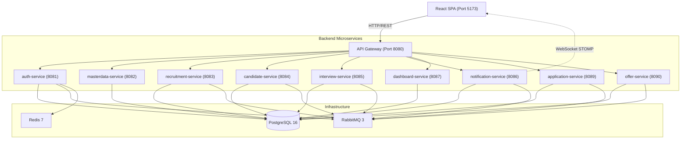
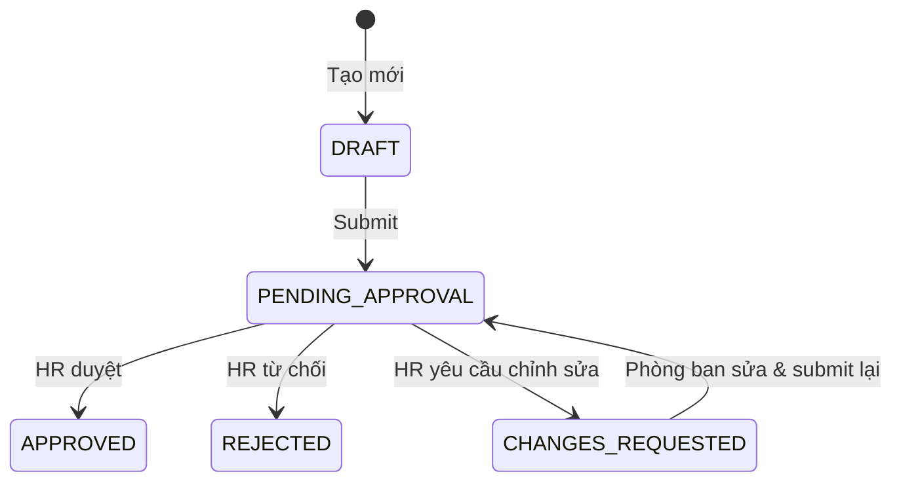
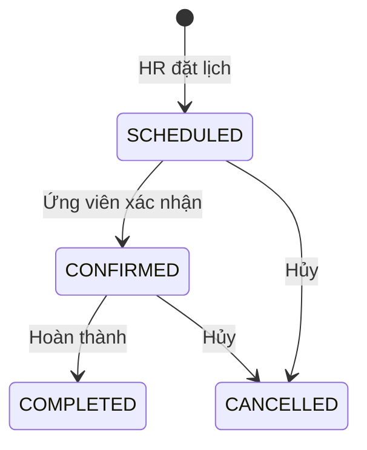
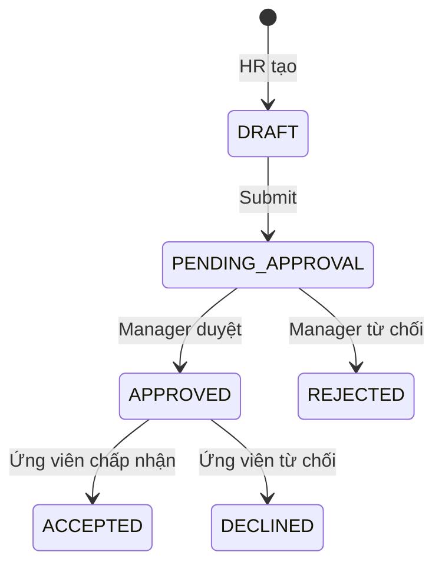
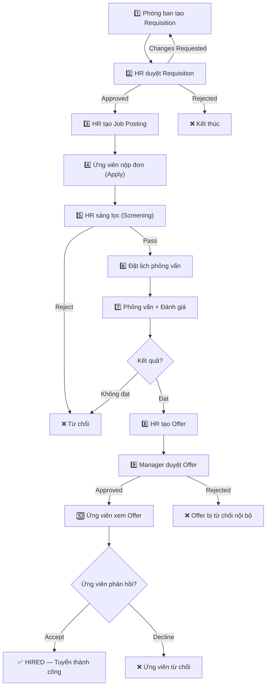

# 📋 Phân Tích Toàn Diện Dự Án ATS (Applicant Tracking System)

> **Phạm vi:** Phân tích chi tiết từ Backend → Frontend → Giao diện → So sánh với hệ thống ATS thực tế → Đề xuất cải thiện.
> **Ghi chú:** Các phần về AI (AI trích xuất CV, AI chấm điểm) sẽ được triển khai sau — chưa nằm trong phạm vi đánh giá này.

---

## Mục Lục

1. [Tổng Quan Kiến Trúc](#1-tổng-quan-kiến-trúc)
2. [Chi Tiết Backend — Từng Microservice](#2-chi-tiết-backend--từng-microservice)
3. [Chi Tiết Frontend](#3-chi-tiết-frontend)
4. [Luồng Nghiệp Vụ End-to-End](#4-luồng-nghiệp-vụ-end-to-end)
5. [So Sánh Với ATS Thực Tế](#5-so-sánh-với-ats-thực-tế)
6. [Đề Xuất Cải Thiện Chi Tiết](#6-đề-xuất-cải-thiện-chi-tiết)

---

## 1. Tổng Quan Kiến Trúc

### 1.1 Kiến Trúc Tổng Thể

Hệ thống được xây dựng theo kiến trúc **Microservices** với **10 service** (9 backend + 1 frontend SPA), giao tiếp qua **API Gateway** duy nhất.



### 1.2 Tech Stack

| Tầng | Công Nghệ | Chi Tiết |
|:---|:---|:---|
| **Backend** | Java 21 + Spring Boot 3.x | Spring Data JPA, Spring Cloud Gateway, Spring Security |
| **Database** | PostgreSQL 16 | Mỗi service 1 database riêng biệt (8 databases tổng) |
| **Message Broker** | RabbitMQ 3 (Management) | Xử lý sự kiện bất đồng bộ giữa các service, delayed message |
| **Cache** | Redis 7 | Session, token cache |
| **Frontend** | React 19 + TypeScript + Vite 8 | Ant Design 6, Recharts, @stomp/stompjs |
| **State Management** | Redux Toolkit (RTK Query) | Axios interceptors cho JWT |
| **Form & Validation** | React Hook Form + Zod | Schema-based validation |
| **Realtime** | WebSocket (STOMP + SockJS) | Push notification realtime |
| **Container** | Docker Compose | Tất cả infrastructure + services |
| **I18n** | Custom I18n Provider | Hỗ trợ Tiếng Việt + English |

### 1.3 Multi-tenancy

Hệ thống sử dụng mô hình **Multi-tenancy** ở mức logic (shared database, tenant-isolated data):

- Mỗi công ty đăng ký = 1 **Tenant** (có `tenantId` duy nhất)
- API Gateway trích xuất `tenantId` từ JWT token và inject vào header: `X-Tenant-Id`, `X-User-Id`, `X-User-Role`
- Tất cả entity trong mọi service đều có trường `tenant_id` → mọi query đều lọc theo tenant
- Dữ liệu giữa các công ty hoàn toàn cách ly

### 1.4 Hệ Thống Phân Quyền (RBAC)

| Role | Mã | Quyền Hạn Chính |
|:---|:---|:---|
| **Platform Admin** | `PLATFORM_ADMIN` | Quản trị nền tảng, xem audit log |
| **Company Admin** | `COMPANY_ADMIN` | Quản trị toàn bộ công ty: master data, user, dashboard, cài đặt |
| **HR/Recruiter** | `RECRUITER` | Duyệt requisition, đăng tin, sàng lọc CV, quản lý phỏng vấn, offer |
| **Hiring Manager** | `HIRING_MANAGER` | Tạo requisition, tham gia phỏng vấn/chấm điểm, duyệt offer |
| **Candidate** | `CANDIDATE` | Xem việc làm, nộp CV, xem đơn, xác nhận lịch PV, accept/decline offer |

---

## 2. Chi Tiết Backend — Từng Microservice

### 2.1 API Gateway (`api-gateway` — Port 8080)

**Vai trò:** Single entry point cho toàn bộ hệ thống.

**Chức năng đã triển khai:**
- ✅ Routing — Chuyển tiếp request đến đúng service dựa trên path prefix (`/api/auth/**`, `/api/masterdata/**`, v.v.)
- ✅ JWT Authentication — `JwtAuthGlobalFilter` validate token ở mọi request (trừ public endpoints)
- ✅ Header Injection — Tự động đính kèm `X-User-Id`, `X-Tenant-Id`, `X-User-Role` vào request chuyển tiếp
- ✅ CORS Configuration — Cho phép frontend localhost:5173 và localhost:3000
- ✅ Whitelist endpoints — Các endpoint public (đăng ký, đăng nhập, verify email) không cần JWT

**Routing Table:**

| Path Prefix | Service | Port |
|:---|:---|:---:|
| `/api/auth/**` | auth-service | 8081 |
| `/api/masterdata/**` | masterdata-service | 8082 |
| `/api/recruitment/**` | recruitment-service | 8083 |
| `/api/candidate/**` | candidate-service | 8084 |
| `/api/interview/**` | interview-service | 8085 |
| `/api/notification/**` | notification-service | 8086 |
| `/api/dashboard/**` | dashboard-service | 8087 |
| `/api/application/**` | application-service | 8089 |
| `/api/offer/**` | offer-service | 8090 |

---

### 2.2 Auth Service (`auth-service` — Port 8081, DB: `ats_auth`)

**Vai trò:** Quản lý xác thực, phân quyền, và tài khoản người dùng.

**Entities:**

| Entity | Trường chính | Mô tả |
|:---|:---|:---|
| `Tenant` | id, code, status | Đại diện 1 công ty (multi-tenancy) |
| `Company` | id, tenantId, name, address, phone | Thông tin doanh nghiệp |
| `AppUser` | id, tenantId, email, passwordHash, fullName, roleId, status | Tài khoản người dùng |
| `Role` | id, name | 5 roles: PLATFORM_ADMIN, COMPANY_ADMIN, RECRUITER, HIRING_MANAGER, CANDIDATE |
| `Permission` | id, name | Quyền chi tiết (mở rộng) |
| `RolePermission` | roleId, permissionId | Mapping role-permission |
| `EmailVerification` | id, email, otpCode, expiresAt | Mã OTP xác thực email |
| `RefreshToken` | id, userId, token, expiresAt | Refresh token để renew JWT |
| `PasswordResetToken` | id, userId, token, expiresAt | Token reset mật khẩu |

**API Endpoints:**

| Method | Endpoint | Chức năng |
|:---|:---|:---|
| `POST` | `/api/auth/register-company` | Đăng ký công ty mới + tạo admin user |
| `POST` | `/api/auth/verify-email` | Xác thực OTP email |
| `POST` | `/api/auth/resend-otp` | Gửi lại mã OTP |
| `POST` | `/api/auth/login` | Đăng nhập, trả JWT access + refresh token |
| `POST` | `/api/auth/refresh-token` | Gia hạn access token bằng refresh token |
| `POST` | `/api/auth/forgot-password` | Gửi link reset password qua email |
| `POST` | `/api/auth/reset-password` | Reset mật khẩu bằng token |
| `PUT` | `/api/auth/change-password` | Đổi mật khẩu (đã login) |
| `GET` | `/api/auth/me` | Lấy thông tin profile user hiện tại |
| `PUT` | `/api/auth/me` | Cập nhật profile |
| `GET` | `/api/auth/users` | Liệt kê user trong công ty (admin/HR) |
| `POST` | `/api/auth/users` | Tạo user mới trong công ty |
| `PUT` | `/api/auth/users/{id}/status` | Kích hoạt/vô hiệu hóa user |
| `GET` | `/api/auth/company` | Lấy thông tin công ty |
| `PUT` | `/api/auth/company` | Cập nhật thông tin công ty |
| `GET` | `/api/auth/public/companies/{tenantCode}` | (Public) Lấy thông tin công ty theo tenant code |

**Luồng xử lý nổi bật:**
1. **Đăng ký công ty:** Tạo Tenant → Tạo Company → Tạo Admin User (status=UNVERIFIED) → Sinh OTP → Gửi email qua RabbitMQ
2. **Verify Email:** Kiểm tra OTP + expiry → Chuyển user status sang ACTIVE → Chuyển tenant status sang ACTIVE → Publish event `TenantActivatedEvent` qua RabbitMQ (để masterdata-service seed data mặc định)
3. **Login:** Validate credentials → Sinh JWT Access Token (chứa userId, tenantId, role, tenantCode) + Refresh Token → Trả về client

---

### 2.3 MasterData Service (`masterdata-service` — Port 8082, DB: `ats_masterdata`)

**Vai trò:** Quản lý tất cả danh mục dữ liệu dùng chung cho từng công ty.

**Danh mục (Catalogs) — Mỗi danh mục là 1 module CRUD riêng:**

| Danh mục | Entity | Mô tả | Trường chính |
|:---|:---|:---|:---|
| **Department** | `Department` | Phòng ban | name, code, tenantId |
| **Job Title** | `JobTitle` | Vị trí công việc | name, tenantId |
| **Job Level** | `JobLevel` | Cấp bậc | name, tenantId |
| **Skill** | `Skill` | Kỹ năng | name, tenantId |
| **Employment Type** | `EmploymentType` | Loại hình tuyển dụng (Full-time, Part-time...) | name, tenantId |
| **Contract Type** | `ContractType` | Loại hợp đồng (1 năm, 2 năm, thử việc...) | name, tenantId |
| **Work Location** | `WorkLocation` | Địa điểm làm việc | name, address, tenantId |
| **Education Level** | `EducationLevel` | Trình độ học vấn | name, tenantId |
| **Experience Level** | `ExperienceLevel` | Yêu cầu kinh nghiệm | name, tenantId |
| **Recruitment Source** | `RecruitmentSource` | Nguồn tuyển dụng (Website, LinkedIn...) | name, tenantId |
| **Recruitment Status** | `RecruitmentStatus` | Trạng thái tuyển dụng | name, color, tenantId |
| **Rejection Reason** | `RejectionReason` | Lý do từ chối ứng viên | name, tenantId |
| **Email Template** | `EmailTemplate` | Mẫu email thông báo | name, subject, body, tenantId |
| **Interview Criteria** | `InterviewCriteria` | Tiêu chí đánh giá phỏng vấn | name, maxScore, tenantId |

**Module đặc biệt — Recruitment Pipeline:**

| Entity | Mô tả |
|:---|:---|
| `RecruitmentPipeline` | Quy trình tuyển dụng (name, isDefault, active, tenantId) |
| `PipelineStage` | Vòng/giai đoạn trong pipeline (name, stageType, stageOrder) |

**StageType enum:** `SCREENING`, `INTERVIEW`, `ASSESSMENT`, `OFFER`, `HIRED`, `REJECTED` (mỗi stage có type xác định nghiệp vụ)

**Tính năng đặc biệt:**
- ✅ **Auto-seeding dữ liệu mặc định:** Khi nhận event `TenantActivatedEvent` từ auth-service, tự động tạo bộ danh mục mặc định cho công ty mới (departments, skills, pipeline chuẩn, v.v.) qua `DefaultDataSeeder` + `TenantActivatedListener`
- ✅ Mỗi công ty có thể tùy chỉnh lại toàn bộ danh mục riêng

---

### 2.4 Recruitment Service (`recruitment-service` — Port 8083, DB: `ats_recruitment`)

**Vai trò:** Quản lý phiếu yêu cầu tuyển dụng (Job Requisition) và tin tuyển dụng (Job Posting).

#### 2.4.1 Job Requisition (Phiếu yêu cầu tuyển dụng)

**Entity `JobRequisition`:**

| Trường | Kiểu | Mô tả |
|:---|:---|:---|
| `title` | String | Tiêu đề vị trí cần tuyển |
| `departmentId` | Long | Phòng ban yêu cầu |
| `jobTitleId` | Long | Vị trí công việc |
| `jobLevelId` | Long | Cấp bậc |
| `quantity` | Integer | Số lượng cần tuyển |
| `budget` | BigDecimal | Ngân sách tuyển dụng |
| `expectedSalaryMin/Max` | BigDecimal | Mức lương phòng ban đề xuất |
| `approvedSalaryMin/Max` | BigDecimal | Mức lương HR chốt duyệt |
| `expectedStartDate` | LocalDate | Ngày dự kiến nhận việc |
| `description` | Text | Mô tả yêu cầu chi tiết |
| `requesterId` | Long | Người tạo yêu cầu (Hiring Manager) |
| `approverId` | Long | Người duyệt (HR/Recruiter) |
| `status` | Enum | Trạng thái phiếu |
| `rejectReason` | String | Lý do từ chối (nếu bị reject) |
| `hrNote` | Text | Ghi chú của HR khi duyệt/yêu cầu chỉnh sửa |

**Status Flow:**



**API Endpoints:**

| Method | Endpoint | Chức năng | Quyền |
|:---|:---|:---|:---|
| `POST` | `/api/recruitment/requisitions` | Tạo phiếu yêu cầu | HIRING_MANAGER |
| `GET` | `/api/recruitment/requisitions` | Liệt kê phiếu (filter theo role) | HR + HIRING_MANAGER |
| `GET` | `/api/recruitment/requisitions/{id}` | Chi tiết phiếu | HR + HIRING_MANAGER |
| `PUT` | `/api/recruitment/requisitions/{id}` | Cập nhật phiếu (chỉ khi DRAFT/CHANGES_REQUESTED) | HIRING_MANAGER |
| `PATCH` | `/api/recruitment/requisitions/{id}/submit` | Submit để duyệt | HIRING_MANAGER |
| `PATCH` | `/api/recruitment/requisitions/{id}/approve` | Duyệt phiếu (có thể điều chỉnh lương) | HR |
| `PATCH` | `/api/recruitment/requisitions/{id}/reject` | Từ chối phiếu | HR |
| `PATCH` | `/api/recruitment/requisitions/{id}/request-changes` | Yêu cầu chỉnh sửa | HR |

#### 2.4.2 Job Posting (Tin tuyển dụng)

**Entity `JobPosting`:**

| Trường | Kiểu | Mô tả |
|:---|:---|:---|
| `requisitionId` | FK → JobRequisition | Liên kết phiếu yêu cầu |
| `title` | String | Tiêu đề tin tuyển dụng |
| `employmentTypeId` | Long | Loại hình (Full-time, Part-time...) |
| `workLocationId` | Long | Địa điểm làm việc |
| `pipelineId` | Long | Quy trình tuyển dụng áp dụng |
| `description` | Text | Mô tả công việc |
| `requirements` | Text | Yêu cầu ứng viên |
| `benefits` | Text | Quyền lợi |
| `salaryMin/Max` | BigDecimal | Khoảng lương hiển thị |
| `status` | Enum | `OPEN`, `PAUSED`, `CLOSED` |
| `pipelineLocked` | boolean | Pipeline bị khóa khi đã có ứng viên |
| `publishedAt` / `closedAt` | LocalDateTime | Thời điểm đăng/đóng tin |

**API Endpoints:**

| Method | Endpoint | Chức năng |
|:---|:---|:---|
| `POST` | `/api/recruitment/postings` | Tạo tin tuyển dụng (từ requisition APPROVED) |
| `GET` | `/api/recruitment/postings` | Liệt kê tin tuyển dụng |
| `PUT` | `/api/recruitment/postings/{id}` | Cập nhật tin |
| `PATCH` | `/api/recruitment/postings/{id}/status` | Đổi trạng thái (OPEN/PAUSED/CLOSED) |
| `GET` | `/api/recruitment/public/postings` | (Public) Trang tuyển dụng công khai |
| `GET` | `/api/recruitment/public/postings/{id}` | (Public) Chi tiết tin tuyển dụng |

---

### 2.5 Candidate Service (`candidate-service` — Port 8084, DB: `ats_candidate`)

**Vai trò:** Quản lý hồ sơ ứng viên, kỹ năng, và upload CV.

**Entity `Candidate`:**

| Trường | Kiểu | Mô tả |
|:---|:---|:---|
| `userId` | Long | Liên kết tài khoản user (nullable — ứng viên có thể chưa có tài khoản) |
| `fullName` | String | Họ tên |
| `email` | String | Email |
| `phone` | String | Số điện thoại |
| `dateOfBirth` | LocalDate | Ngày sinh |
| `gender` | String | Giới tính |
| `address` | String | Địa chỉ |
| `currentPosition` | String | Vị trí hiện tại |
| `educationLevelId` | Long | Trình độ học vấn |
| `cvFileUrl` | String | URL file CV (lưu trên S3/MinIO) |
| `skills` | List\<CandidateSkill\> | Danh sách kỹ năng (OneToMany) |

**Entity `CandidateSkill`:** candidateId + skillId (mapping kỹ năng)

**Tính năng đặc biệt:**
- ✅ **Upload CV lên S3/MinIO:** Sử dụng `S3Config` + `S3Service` để upload file CV dạng PDF
- ✅ **Tự động tạo candidate khi apply:** Ứng viên nộp đơn lần đầu → hệ thống tự tạo bản ghi Candidate
- ✅ **Public API cho ứng viên:** `PublicCandidateController` cho phép tạo hồ sơ không cần auth (khi apply công khai)

---

### 2.6 Application Service (`application-service` — Port 8089, DB: `ats_application`)

**Vai trò:** Quản lý đơn ứng tuyển — trung tâm của quy trình sàng lọc.

**Entity `Application`:**

| Trường | Kiểu | Mô tả |
|:---|:---|:---|
| `candidateId` | Long | Ứng viên |
| `candidateNameSnapshot` | String | Snapshot tên ứng viên (denormalized) |
| `candidateEmailSnapshot` | String | Snapshot email |
| `jobPostingId` | Long | Tin tuyển dụng ứng tuyển |
| `recruitmentSourceId` | Long | Nguồn tuyển dụng |
| `assignedRecruiterId` | Long | HR phụ trách |
| `resumeUrl` | String | URL file CV |
| `currentStageId` | Long | Giai đoạn hiện tại trong pipeline |
| `currentStageName` | String | Tên giai đoạn (denormalized) |
| `currentStageOrder` | Integer | Thứ tự giai đoạn (denormalized) |
| `currentStageType` | String | Loại giai đoạn (denormalized) |
| `rejectionReasonId` | Long | Lý do từ chối (nếu bị reject) |
| `note` | Text | Ghi chú |

**Entity `ApplicationHistory`:** Lưu lịch sử thay đổi giai đoạn (fromStage → toStage, actorUserId, timestamp, note)

**API Endpoints:**

| Method | Endpoint | Chức năng |
|:---|:---|:---|
| `POST` | `/api/application/applications` | Tạo đơn ứng tuyển (HR tạo thủ công) |
| `POST` | `/api/application/public/apply` | Ứng viên tự nộp đơn (public) |
| `GET` | `/api/application/applications` | Liệt kê đơn (filter theo posting, stage...) |
| `GET` | `/api/application/applications/{id}` | Chi tiết đơn |
| `PATCH` | `/api/application/applications/{id}/advance` | Chuyển giai đoạn tiếp theo |
| `PATCH` | `/api/application/applications/{id}/reject` | Từ chối đơn |
| `GET` | `/api/application/applications/{id}/history` | Lịch sử thay đổi giai đoạn |
| `GET` | `/api/application/my` | Ứng viên xem đơn của mình |

**Sự kiện phát ra (qua RabbitMQ):**
- `ApplicationCreatedEvent` — Khi có đơn mới → Notify HR
- `ApplicationStatusChangedEvent` — Khi đổi giai đoạn → Notify cả ứng viên và recruiter

---

### 2.7 Interview Service (`interview-service` — Port 8085, DB: `ats_interview`)

**Vai trò:** Quản lý lịch phỏng vấn, phân công hội đồng, và đánh giá.

#### Entity `Interview`:

| Trường | Kiểu | Mô tả |
|:---|:---|:---|
| `applicationId` | Long | Đơn ứng tuyển |
| `jobPostingId` | Long | Tin tuyển dụng |
| `candidateId` | Long | Ứng viên |
| `candidateNameSnapshot` | String | Tên ứng viên |
| `scheduledAt` | LocalDateTime | Thời gian dự kiến |
| `durationMinutes` | Integer | Thời lượng (phút) |
| `format` | Enum | `ONLINE` / `OFFLINE` |
| `location` | String | Địa điểm (offline) |
| `meetingLink` | String | Link họp (online) |
| `status` | Enum | `SCHEDULED` → `CONFIRMED` → `COMPLETED` / `CANCELLED` |
| `candidateConfirmedAt` | LocalDateTime | Thời điểm ứng viên xác nhận |
| `interviewers` | List\<InterviewInterviewer\> | Hội đồng phỏng vấn |

#### Entity `InterviewInterviewer`:
- `interviewId`, `interviewerId` — Mapping người phỏng vấn
- Cho phép nhiều người cùng phỏng vấn 1 buổi (panel interview)

#### Entity `InterviewEvaluation`:
- `interviewId`, `interviewerId` — Ai đánh giá buổi nào
- `overallRecommendation` — Enum: `STRONG_HIRE`, `HIRE`, `NO_HIRE`, `STRONG_NO_HIRE`
- `generalComment` — Nhận xét tổng quan
- `salaryProposed` — Mức lương đề xuất
- `salaryNote` — Ghi chú về lương

#### Entity `InterviewEvaluationScore`:
- `evaluationId`, `criteriaId`, `score` — Điểm theo từng tiêu chí phỏng vấn
- Liên kết với `InterviewCriteria` trong masterdata-service

**Status Flow:**



**Sự kiện phát ra:**
- `InterviewScheduledEvent` → Notify interviewer + candidate + lên lịch reminder
- `InterviewConfirmedEvent` → Notify interviewer

---

### 2.8 Offer Service (`offer-service` — Port 8090, DB: `ats_offer`)

**Vai trò:** Quản lý thư mời nhận việc (Offer Letter).

**Entity `Offer`:**

| Trường | Kiểu | Mô tả |
|:---|:---|:---|
| `applicationId` | Long | Đơn ứng tuyển |
| `candidateId` | Long | Ứng viên |
| `candidateNameSnapshot` | String | Tên ứng viên |
| `salaryOffered` | BigDecimal | Mức lương đề nghị |
| `contractTypeId` | Long | Loại hợp đồng |
| `startDate` | LocalDate | Ngày bắt đầu |
| `probationMonths` | Integer | Số tháng thử việc |
| `responseDeadline` | LocalDateTime | Hạn phản hồi |
| `benefits` | Text | Quyền lợi |
| `allowance` | BigDecimal | Phụ cấp |
| `note` | Text | Ghi chú |
| `requesterId` | Long | Người tạo offer (HR) |
| `approverId` | Long | Người duyệt (Hiring Manager) |
| `status` | Enum | Trạng thái offer |
| `rejectReason` | String | Lý do từ chối (nội bộ) |
| `declineReasonId` | Long | Lý do ứng viên từ chối |
| `declineNote` | String | Ghi chú từ chối |

**Status Flow:**



**Sự kiện phát ra:**
- `OfferApprovedEvent` → Notify requester + candidate (offer sẵn sàng)
- `OfferAcceptedEvent` → Notify requester (ứng viên đã nhận)
- `OfferDeclinedEvent` → Notify requester (ứng viên từ chối)

---

### 2.9 Notification Service (`notification-service` — Port 8086, DB: `ats_notification`)

**Vai trò:** Hub thông báo trung tâm — nhận event từ tất cả service qua RabbitMQ, tạo notification + push realtime.

**Entity `Notification`:**

| Trường | Mô tả |
|:---|:---|
| `recipientUserId` | User nhận thông báo |
| `type` | Enum — loại thông báo |
| `title` | Tiêu đề |
| `message` | Nội dung chi tiết |
| `resourceType` | Loại tài nguyên liên quan (REQUISITION, APPLICATION, INTERVIEW, OFFER) |
| `resourceId` | ID tài nguyên liên quan |
| `read` | Đã đọc chưa |

**NotificationType enum:**
- `REQUISITION_PENDING_APPROVAL` — Yêu cầu cần duyệt
- `APPLICATION_CREATED` — Đơn ứng tuyển mới
- `APPLICATION_STAGE_CHANGED` — Đổi giai đoạn
- `APPLICATION_REJECTED` — Bị từ chối
- `INTERVIEW_SCHEDULED` — Lịch phỏng vấn mới
- `INTERVIEW_CONFIRMED` — Ứng viên xác nhận
- `INTERVIEW_REMINDER` — Nhắc trước phỏng vấn (24h)
- `EVALUATION_INCOMPLETE_REMINDER` — Nhắc interviewer chưa nộp đánh giá
- `OFFER_PENDING_CONFIRMATION` — Offer đã duyệt
- `OFFER_READY_FOR_CANDIDATE` — Offer sẵn sàng cho ứng viên
- `OFFER_ACCEPTED` — Ứng viên đã nhận
- `OFFER_DECLINED` — Ứng viên từ chối

**Tính năng nổi bật:**
- ✅ **WebSocket STOMP** — Push notification realtime qua `/user/queue/notifications`
- ✅ **Delayed Messages (RabbitMQ)** — Lên lịch nhắc phỏng vấn trước 24h + kiểm tra evaluation sau 24h
- ✅ **Email Notification** — Gửi email qua `EmailNotificationService`
- ✅ **RealtimePushService** — Push qua WebSocket ngay khi tạo notification

**Entity `AuditLog`:**
- Ghi nhận mọi hành động quan trọng: `actorUserId`, `action`, `resourceType`, `resourceId`, `metadata`
- Nhận event từ tất cả service qua `AuditLogListener`

---

### 2.10 Dashboard Service (`dashboard-service` — Port 8087, DB: `ats_dashboard`)

**Vai trò:** Tổng hợp dữ liệu thống kê từ nhiều service.

**DTO `DashboardSummaryResponse`:**

| Trường | Kiểu | Mô tả |
|:---|:---|:---|
| `openPostingsCount` | long | Số tin đang mở |
| `activeRequisitionsCount` | long | Số yêu cầu đang hoạt động |
| `totalCandidates` | long | Tổng ứng viên |
| `totalApplications` | long | Tổng đơn ứng tuyển |
| `hiredCount` | long | Số đã tuyển |
| `rejectedCount` | long | Số bị từ chối |
| `successRatePercent` | double | Tỷ lệ tuyển thành công (%) |
| `applicationsByStage` | Map\<String, Long\> | Phân bổ ứng viên theo giai đoạn |
| `funnel` | FunnelMetrics | Phễu tuyển dụng (req → posting → apply → interview → offer → hired) |

**Giao tiếp cross-service:** Sử dụng **OpenFeign** client gọi sang:
- `RecruitmentServiceClient` — Lấy data requisition + posting
- `CandidateServiceClient` — Lấy data candidate
- `ApplicationServiceClient` — Lấy data application

---

## 3. Chi Tiết Frontend

### 3.1 Kiến Trúc Frontend

```text
frontend/src/
├── app/                   # Redux store, hooks, theme, roles config
├── assets/                # Static assets
├── components/            # Shared components (ProtectedRoute, GuestRoute, RoleRoute, AiScoreBadge)
│   └── ui/                # UI primitives
├── features/              # Feature-based modules (mỗi feature có: pages, components, API, types, schemas)
│   ├── auth/              # Đăng nhập, đăng ký, quên mật khẩu, quản lý user
│   ├── masterdata/        # Quản lý danh mục
│   ├── recruitment/       # Quản lý tuyển dụng (requisition + posting)
│   ├── candidate/         # Quản lý ứng viên, đơn ứng tuyển, Kanban board
│   ├── interview/         # Quản lý phỏng vấn, đánh giá, xếp lịch 3 bên
│   ├── offer/             # Quản lý offer
│   ├── notification/      # Thông báo realtime + WebSocket
│   ├── dashboard/         # Trang tổng quan
│   ├── auditlog/          # Nhật ký hoạt động
│   └── public/            # Career portal công khai
├── i18n/                  # Đa ngôn ngữ (Tiếng Việt + English)
├── layouts/               # AppLayout (nội bộ) + PublicLayout (career portal)
├── routes/                # React Router config (AppRoutes.tsx)
├── services/              # Axios client (interceptors, token refresh)
└── main.tsx               # Entry point
```

### 3.2 Routing & Phân Quyền Frontend

| Path | Component | Quyền Truy Cập | Mô Tả |
|:---|:---|:---|:---|
| `/c/:tenantCode` | `CompanyJobsPage` | **Public** | Trang tuyển dụng công khai |
| `/c/:tenantCode/jobs/:jobId` | `JobDetailApplyPage` | **Public** | Chi tiết & nộp đơn công khai |
| `/login` | `LoginPage` | Guest only | Đăng nhập |
| `/register` | `RegisterPage` | Guest only | Đăng ký công ty |
| `/verify-email` | `VerifyEmailPage` | Guest only | Xác thực email OTP |
| `/forgot-password` | `ForgotPasswordPage` | Guest only | Quên mật khẩu |
| `/reset-password` | `ResetPasswordPage` | Guest only | Đặt lại mật khẩu |
| `/dashboard` | `DashboardPage` | All logged-in | Trang tổng quan |
| `/notifications` | `NotificationsPage` | All logged-in | Danh sách thông báo |
| `/masterdata` | `MasterDataPage` | HR roles | Quản lý danh mục |
| `/candidates` | `CandidatesPage` | HR roles | Quản lý ứng viên |
| `/recruitment` | `RecruitmentPage` | HR + Department | Quản lý tuyển dụng |
| `/applications` | `ApplicationsPage` | HR + Department | Quản lý đơn ứng tuyển |
| `/scheduling` | `InterviewSchedulingPage` | HR + Department + Candidate | Xếp lịch phỏng vấn 3 bên |
| `/interviews` | `InterviewsPage` | HR + Department | Quản lý phỏng vấn |
| `/offers` | `OffersPage` | HR + Department | Quản lý offer |
| `/jobs` | `JobsPage` | Candidate only | Xem việc làm |
| `/my-applications` | `MyApplicationsPage` | Candidate only | Đơn của tôi |
| `/offers/candidate/:id` | `OfferCandidateViewPage` | Candidate only | Xem & phản hồi offer |
| `/audit-logs` | `AuditLogPage` | COMPANY_ADMIN, PLATFORM_ADMIN | Nhật ký hoạt động |
| `/settings` | `AuthManagementPage` | All logged-in | Cài đặt tài khoản, quản lý user |

### 3.3 Chi Tiết Từng Module Frontend

#### 3.3.1 Auth Module
- **LoginPage** — Form đăng nhập với Zod validation, lưu JWT vào Redux store
- **RegisterPage** — Form đăng ký doanh nghiệp (tên công ty, email admin, mật khẩu)
- **VerifyEmailPage** — Nhập mã OTP 6 chữ số
- **ForgotPasswordPage** — Nhập email, gửi link reset
- **ResetPasswordPage** — Nhập mật khẩu mới qua token
- **AuthManagementPage** — Quản lý profile, đổi mật khẩu, CRUD user trong công ty (admin)

#### 3.3.2 MasterData Module
- **MasterDataPage** — Tab-based UI quản lý tất cả danh mục
- **CatalogPanel** — Component generic CRUD cho từng danh mục (tái sử dụng cho 14 catalogs)
- **PipelinePanel** — Quản lý recruitment pipeline: tạo/sửa pipeline + drag-and-drop stages

#### 3.3.3 Recruitment Module
- **RecruitmentPage** — 2 tabs: Requisition + Job Posting
- **RequisitionListPanel** — Danh sách phiếu yêu cầu (bảng + filter)
- **RequisitionFormModal** — Form tạo/sửa requisition
- **RequisitionDetailDrawer** — Drawer xem chi tiết + nút duyệt/từ chối (HR)
- **PostingListPanel** — Danh sách tin tuyển dụng
- **PostingFormModal** — Form tạo/sửa posting (chọn pipeline, employment type, work location...)

#### 3.3.4 Candidate & Application Module
- **CandidatesPage** — Bảng danh sách ứng viên + tìm kiếm + CRUD
- **CandidateFormModal** — Form thêm/sửa ứng viên (kỹ năng, học vấn, upload CV)
- **CvUploadModal** — Upload file CV (PDF)
- **ApplicationsPage** — Quản lý đơn ứng tuyển
- **ApplicationKanbanBoard** — **Kanban board** hiển thị đơn theo stage (kéo thả giữa các cột)
- **ApplicationDetailDrawer** — Chi tiết đơn ứng tuyển + lịch sử + nút advance/reject
- **ApplicationCreateModal** — Tạo đơn ứng tuyển thủ công
- **RejectApplicationModal** — Form từ chối ứng viên (chọn lý do + ghi chú)
- **JobsPage** — Danh sách việc làm cho Candidate
- **MyApplicationsPage** — Candidate xem đơn đã nộp

#### 3.3.5 Interview Module
- **InterviewsPage** — Danh sách phỏng vấn + filter
- **InterviewCreateModal** — Form tạo lịch phỏng vấn (chọn ứng viên, thời gian, format, interviewer)
- **InterviewDetailDrawer** — Chi tiết buổi phỏng vấn
- **InterviewCalendar** — Calendar view lịch phỏng vấn
- **InterviewSchedulingPage** — **Hệ thống xếp lịch 3 bên** (HR đề xuất → Phòng ban xác nhận → Ứng viên xác nhận → Hệ thống chốt)
- **SlotConfirmationPanel** — UI cho Candidate/Department xác nhận khung giờ
- **EvaluationSubmitModal** — Form chấm điểm theo tiêu chí + recommendation
- **EvaluationSummaryModal** — Xem tổng hợp đánh giá từ tất cả interviewer
- **MyEvaluationsList** — Interviewer xem danh sách buổi cần đánh giá

#### 3.3.6 Offer Module
- **OffersPage** — Danh sách offer + tabs theo status
- **OffersList** — Bảng danh sách offer
- **OfferCreateModal** — Form tạo offer (lương, hợp đồng, ngày bắt đầu, thử việc, phụ cấp...)
- **OfferDetailDrawer** — Chi tiết offer + nút duyệt/từ chối
- **OfferCandidateViewPage** — Trang cho Candidate xem offer + Accept/Decline
- **OfferDeclineModal** — Form từ chối offer (chọn lý do + ghi chú)
- **OfferRejectModal** — Form từ chối nội bộ (manager)

#### 3.3.7 Notification Module
- **NotificationBell** — Chuông thông báo trên header (hiển thị badge số chưa đọc)
- **NotificationsPage** — Danh sách đầy đủ thông báo
- **websocketClient.ts** — STOMP WebSocket client kết nối notification-service realtime
- **notificationRoutes.ts** — Mapping resourceType → URL điều hướng khi click thông báo

#### 3.3.8 Dashboard Module
- **DashboardPage** — Trang tổng quan với:
  - Welcome banner (lời chào theo thời gian)
  - 4 stat cards: Tin đang mở, Yêu cầu tuyển dụng, Tổng ứng viên, Tỷ lệ thành công
  - 3 sub-stat cards: Tổng hồ sơ, Đã tuyển, Đã từ chối
  - BarChart — Ứng viên theo giai đoạn
  - PieChart — Phân bổ ứng viên
  - AreaChart — Xu hướng ứng tuyển
  - Quick Action grid — Shortcut đến các chức năng chính
  - (Phễu tuyển dụng — đã build, đang comment out)

#### 3.3.9 Public (Career Portal)
- **PublicLayout** — Layout riêng cho trang tuyển dụng công khai (header, footer branded)
- **CompanyJobsPage** — Danh sách việc làm công khai theo tenant code (`/c/TECHCORP`)
- **JobDetailApplyPage** — Chi tiết tin + form nộp đơn (nhập thông tin + upload CV)
- **ApplySuccessPage** — Trang thành công sau khi nộp đơn

#### 3.3.10 AuditLog Module
- **AuditLogPage** — Bảng nhật ký hoạt động (filter theo action, thời gian, user)

### 3.4 Tính Năng Frontend Nổi Bật

| Tính năng | Chi tiết |
|:---|:---|
| **Kanban Board** | Quản lý đơn ứng tuyển dạng drag-and-drop giữa các cột pipeline |
| **WebSocket Realtime** | STOMP over SockJS, auto-reconnect, push notification ngay lập tức |
| **I18n** | Hỗ trợ Tiếng Việt + English, chuyển ngôn ngữ 1 click trên header |
| **Role-based Menu** | Sidebar tự động ẩn/hiện menu theo role user đăng nhập |
| **Token Auto-refresh** | Axios interceptor tự động refresh JWT khi hết hạn |
| **Zod Validation** | Schema-based form validation với error messages rõ ràng |
| **Ant Design 6** | UI library enterprise-grade, consistent design language |
| **Recharts** | Charts tương tác (Bar, Pie, Area) trên dashboard |
| **Career Portal** | Trang tuyển dụng public, mỗi công ty có URL riêng (`/c/{tenantCode}`) |
| **3-party Scheduling** | Hệ thống xếp lịch phỏng vấn 3 bên: HR → Department → Candidate |

---

## 4. Luồng Nghiệp Vụ End-to-End

### 4.1 Quy Trình Tuyển Dụng Hoàn Chỉnh



### 4.2 Luồng Thông Báo Tự Động

| Sự kiện | Người nhận | Kênh |
|:---|:---|:---|
| Requisition submitted | HR/Approver | In-app + WebSocket |
| Application created | Assigned Recruiter (hoặc tất cả Recruiter) | In-app + WebSocket |
| Application stage changed | Candidate + Recruiter | In-app + WebSocket |
| Application rejected | Candidate | In-app + WebSocket |
| Interview scheduled | Interviewers + Candidate | In-app + WebSocket |
| Interview confirmed | Interviewers | In-app + WebSocket |
| Interview reminder (T-24h) | Interviewers + Candidate | In-app (Delayed Message) |
| Evaluation incomplete (T+24h) | Interviewer chưa nộp + Recruiter | In-app (Delayed Message) |
| Offer approved | Requester + Candidate | In-app + WebSocket |
| Offer accepted | Requester | In-app + WebSocket |
| Offer declined | Requester | In-app + WebSocket |

---

## 5. So Sánh Với ATS Thực Tế

### 5.1 Bảng So Sánh Tính Năng

So sánh với các hệ thống ATS hàng đầu: **Greenhouse**, **Lever**, **BambooHR**, **Workday Recruiting**, **Breezy HR**.

| Tính năng | Dự án ATS hiện tại | ATS Thực Tế | Đánh giá |
|:---|:---:|:---:|:---|
| **Multi-tenancy** | ✅ | ✅ | Tốt — có tenant isolation ở mức logic |
| **Đăng ký & OTP Email** | ✅ | ✅ | Đạt chuẩn |
| **RBAC (5 roles)** | ✅ | ✅ | Cơ bản — ATS thực tế có custom role + permission |
| **JWT + Refresh Token** | ✅ | ✅ | Đạt chuẩn |
| **Master Data quản lý** | ✅ (14 catalogs) | ✅ | Rất tốt — đầy đủ và có auto-seed |
| **Recruitment Pipeline tùy chỉnh** | ✅ | ✅ | Tốt — có pipeline + stages + stage type |
| **Job Requisition + Approval** | ✅ | ✅ | Tốt — có workflow approval 2 cấp |
| **Job Posting** | ✅ | ✅ | Cơ bản — thiếu multi-channel posting |
| **Career Portal (công khai)** | ✅ | ✅ | Cơ bản — có URL riêng theo tenant |
| **Apply Online** | ✅ | ✅ | Đạt — upload CV + auto-create candidate |
| **Application Pipeline Tracking** | ✅ | ✅ | Tốt — Kanban board + stage history |
| **Kanban Board** | ✅ | ✅ | Tốt — tương tự Greenhouse/Lever |
| **Interview Scheduling** | ✅ | ✅ | **Xuất sắc** — hệ thống 3 bên (HR/Dept/Candidate) |
| **Panel Interview** | ✅ | ✅ | Tốt — nhiều interviewer per buổi |
| **Evaluation & Scorecard** | ✅ | ✅ | Tốt — criteria-based scoring + recommendation |
| **Offer Management** | ✅ | ✅ | Tốt — approval workflow + candidate response |
| **Realtime Notification** | ✅ | ✅ | Tốt — WebSocket STOMP |
| **Delayed Reminders** | ✅ | ✅ | Tốt — RabbitMQ delayed message |
| **Audit Log** | ✅ | ✅ | Tốt — ghi nhận mọi hành động |
| **Dashboard & Analytics** | ✅ | ✅ | Cơ bản — có charts nhưng thiếu filter/drill-down |
| **I18n** | ✅ (VI/EN) | ✅ | Đạt — 2 ngôn ngữ |
| **Responsive Design** | ⚠️ | ✅ | Ant Design responsive nhưng chưa mobile-optimized |
| — | — | — | — |
| **AI Resume Parsing** | ❌ (Sẽ làm) | ✅ | Cần thiết — trích xuất tự động từ CV |
| **AI Candidate Scoring** | ❌ (Sẽ làm) | ✅ | Cần thiết — matching CV vs JD |
| **Email Integration (Gmail/Outlook)** | ❌ | ✅ | Thiếu — ATS thực tế sync email 2 chiều |
| **Calendar Integration (Google/Outlook)** | ❌ | ✅ | Thiếu — tự động đồng bộ lịch PV |
| **Job Board Integration** | ❌ | ✅ | Thiếu — đăng tin lên LinkedIn, Indeed, v.v. |
| **Candidate Sourcing** | ❌ | ✅ | Thiếu — Chrome extension, LinkedIn import |
| **Bulk Actions** | ❌ | ✅ | Thiếu — xử lý hàng loạt (reject, advance, assign...) |
| **Custom Fields** | ❌ | ✅ | Thiếu — thêm trường tùy chỉnh cho từng entity |
| **Report & Export** | ❌ | ✅ | Thiếu — export PDF/Excel, báo cáo nâng cao |
| **Referral Program** | ❌ | ✅ | Thiếu — quản lý giới thiệu nhân viên |
| **Onboarding Module** | ❌ | ✅ | Thiếu — quy trình sau khi tuyển |
| **GDPR/Data Privacy** | ❌ | ✅ | Thiếu — quản lý consent, data retention |
| **SSO (Google/Azure AD)** | ❌ | ✅ | Thiếu — đăng nhập bằng SSO |
| **API Documentation (Swagger)** | ❌ | ✅ | Thiếu — không có docs cho API |
| **Unit/Integration Tests** | ❌ | ✅ | Thiếu — không có test coverage |
| **Search & Filtering nâng cao** | ⚠️ | ✅ | Cơ bản — chưa có full-text search, saved filters |
| **Talent Pool** | ❌ | ✅ | Thiếu — hồ sơ ứng viên tiềm năng |
| **Collaboration Tools** | ❌ | ✅ | Thiếu — comment, @mention, activity feed |
| **Workflow Automation** | ❌ | ✅ | Thiếu — trigger rules tự động |

### 5.2 Nhận Xét Tổng Quan

> [!NOTE]
> **Điểm mạnh:** Dự án đã xây dựng được **backbone** hoàn chỉnh của một ATS enterprise — từ đăng ký công ty, quản lý master data, quy trình tuyển dụng end-to-end (Requisition → Posting → Application → Interview → Offer), đến thông báo realtime và audit log. Kiến trúc microservices rõ ràng, phân tách trách nhiệm tốt.

> [!IMPORTANT]
> **Điểm cần cải thiện:** Khoảng cách lớn nhất so với ATS thực tế nằm ở 3 mảng: **(1)** Tích hợp bên ngoài (email, calendar, job boards), **(2)** Automation & intelligence (AI, workflow rules), và **(3)** Enterprise features (SSO, GDPR, custom fields, advanced reporting).

---

## 6. Đề Xuất Cải Thiện Chi Tiết

Các đề xuất được sắp xếp theo **mức độ ưu tiên** và **khả thi** cho phạm vi KLTN.

### 6.1 Ưu Tiên Cao — Nên Làm Ngay (Tăng tính thực tế rõ rệt)

#### 6.1.1 Tìm Kiếm & Lọc Nâng Cao

**Hiện tại:** Các trang list chỉ có filter cơ bản.

**Đề xuất:**
- Thêm **full-text search** cho ứng viên (tên, email, kỹ năng, vị trí)
- Thêm **multi-filter** cho danh sách application: theo posting, stage, recruiter, ngày nộp, nguồn tuyển dụng
- Thêm **saved filters** — lưu bộ lọc hay dùng
- Thêm **pagination metadata** trả về totalItems, totalPages cho tất cả API list

**Tại sao:** Đây là tính năng cốt lõi mà HR dùng hàng ngày. Khi có 500+ ứng viên, filter kém = unusable.

#### 6.1.2 Bulk Actions (Xử Lý Hàng Loạt)

**Hiện tại:** Mọi thao tác đều 1-by-1.

**Đề xuất:**
- Cho phép chọn nhiều application → Reject hàng loạt / Advance hàng loạt
- Cho phép chọn nhiều ứng viên → Assign recruiter hàng loạt
- Gửi email hàng loạt cho nhóm ứng viên

**Tại sao:** HR xử lý hàng chục đơn/ngày. Không có bulk action = mất rất nhiều thời gian.

#### 6.1.3 Export Dữ Liệu (PDF/Excel)

**Hiện tại:** Không có tính năng export.

**Đề xuất:**
- Export danh sách ứng viên → Excel
- Export danh sách application → Excel (với filter hiện tại)
- Export chi tiết Offer → PDF (letter format, có thể in/gửi)
- Export báo cáo tuyển dụng theo tháng → PDF

**Tại sao:** Đây là yêu cầu bắt buộc trong thực tế — HR cần gửi báo cáo cho management.

#### 6.1.4 Cải Thiện Career Portal

**Hiện tại:** Career portal đơn giản, chỉ có list jobs + form apply.

**Đề xuất:**
- Thêm **banner/hero image** cho trang company (upload từ company settings)
- Thêm **mô tả công ty** (About Us, văn hóa, phúc lợi chung) hiển thị trên career portal
- Thêm **filter việc làm** theo phòng ban, loại hình, địa điểm
- Thêm **SEO metadata** cho từng job posting (Open Graph, structured data)
- Cho phép candidate **tạo tài khoản** trực tiếp trên career portal (để track đơn)

**Tại sao:** Career portal là "bộ mặt" của công ty. ATS thực tế (Greenhouse, Lever) đều có branded career page rất đẹp.

#### 6.1.5 API Documentation (Swagger/OpenAPI)

**Hiện tại:** Không có API docs.

**Đề xuất:**
- Thêm Springdoc OpenAPI (Swagger UI) cho mỗi service
- Tự động generate docs từ controller + DTO annotations

**Tại sao:** Đây là best practice bắt buộc cho microservices. Giúp dev, testing, và trình bày trong KLTN.

---

### 6.2 Ưu Tiên Trung Bình — Nên Làm Nếu Có Thời Gian

#### 6.2.1 Collaboration Features

**Đề xuất:**
- Thêm **comment system** trên Application — HR/Manager có thể comment, @mention nhau
- Thêm **Activity Feed** trên chi tiết application — hiển thị timeline các sự kiện (ai làm gì, khi nào)
- Thêm **internal notes** cho từng ứng viên (riêng tư, chỉ team thấy)

**Tại sao:** ATS là tool team — collaboration là yếu tố khiến team chọn ATS thay vì spreadsheet.

#### 6.2.2 Email Template Variables & Preview

**Hiện tại:** Có entity EmailTemplate nhưng chưa có template rendering.

**Đề xuất:**
- Hỗ trợ biến (variables) trong email template: `{{candidateName}}`, `{{jobTitle}}`, `{{interviewDate}}`, v.v.
- Thêm **preview** email trước khi gửi
- Cho phép HR chỉnh sửa nội dung email trước mỗi lần gửi (dùng template làm base)

**Tại sao:** ATS thực tế đều có template engine mạnh — giúp giao tiếp chuyên nghiệp và nhất quán.

#### 6.2.3 Talent Pool (Hồ Sơ Ứng Viên Tiềm Năng)

**Đề xuất:**
- Cho phép HR **lưu ứng viên bị từ chối** vào Talent Pool (có tag, ghi chú)
- Khi có vị trí mới, HR có thể **tìm kiếm trong Talent Pool** và tạo application mới
- Thêm **source tracking** — ứng viên đến từ đâu (website, referral, LinkedIn...)

**Tại sao:** 70% ứng viên bị reject ở vị trí A có thể phù hợp vị trí B. Talent Pool tiết kiệm chi phí sourcing.

#### 6.2.4 Calendar View & Integration

**Đề xuất:**
- Cải thiện **Calendar View** cho phỏng vấn (tích hợp Ant Design Calendar hoặc FullCalendar)
- Hiển thị tất cả interview trên calendar theo tuần/tháng
- Thêm nút "Add to Google Calendar" khi xem chi tiết phỏng vấn
- Tạo file `.ics` cho mỗi buổi phỏng vấn (download/email)

**Tại sao:** Interviewers cần thấy lịch PV trong context của lịch làm việc tổng thể.

#### 6.2.5 Advanced Dashboard & Analytics

**Đề xuất:**
- Thêm **filter theo thời gian** (7 ngày, 30 ngày, 90 ngày, custom range) cho dashboard
- Thêm **Time-to-Hire** metric — thời gian trung bình từ apply đến hired
- Thêm **Source Effectiveness** — nguồn nào mang lại nhiều candidate chất lượng nhất
- Thêm **Pipeline Conversion Rate** — tỷ lệ chuyển đổi giữa các stage
- Thêm **Recruiter Performance** — mỗi recruiter xử lý bao nhiêu đơn, tỷ lệ thành công
- Bật lại **Recruitment Funnel** chart (hiện đang comment out)

**Tại sao:** Data-driven decision là xu hướng bắt buộc trong HR tech. Dashboard chỉ hiển thị số tĩnh = chưa đủ giá trị.

---

### 6.3 Ưu Tiên Thấp — Nice-to-Have (Nâng Cấp Enterprise)

#### 6.3.1 Custom Fields
- Cho phép mỗi công ty thêm trường tùy chỉnh cho Candidate, Application (ví dụ: "Mã giới thiệu", "Ngày available"...)

#### 6.3.2 Workflow Automation
- Tạo rules tự động: "Nếu ứng viên ở stage Screening > 7 ngày → auto-notify recruiter"
- Tự động advance stage khi tất cả interviewer đã submit evaluation với rating >= HIRE

#### 6.3.3 SSO Integration
- Đăng nhập bằng Google, Microsoft Azure AD cho user nội bộ công ty

#### 6.3.4 Mobile-Responsive
- Tối ưu giao diện cho tablet/mobile (Interviewer có thể chấm điểm trên điện thoại)

#### 6.3.5 GDPR & Data Retention
- Quản lý consent ứng viên (đồng ý lưu trữ dữ liệu)
- Auto-delete hồ sơ sau N tháng (configurable)

#### 6.3.6 Referral Program
- Nhân viên giới thiệu ứng viên → tracking referral → thưởng khi hire thành công

#### 6.3.7 Onboarding Module
- Sau khi Offer Accepted → bắt đầu quy trình Onboarding (checklist tài liệu, lịch orientation...)

---

### 6.4 Tổng Hợp Roadmap Đề Xuất

```mermaid
gantt
    title Roadmap Cải Thiện ATS
    dateFormat X
    axisFormat %s

    section Ưu Tiên Cao
    Tìm kiếm & Lọc nâng cao      :a1, 0, 3
    Bulk Actions                   :a2, 0, 2
    Export PDF/Excel               :a3, 1, 3
    Cải thiện Career Portal        :a4, 2, 4
    Swagger API Docs               :a5, 0, 1

    section Ưu Tiên Trung Bình
    Collaboration (comment/notes)  :b1, 3, 5
    Email Template Variables       :b2, 3, 5
    Talent Pool                    :b3, 4, 6
    Calendar View & .ics           :b4, 4, 6
    Advanced Dashboard             :b5, 5, 7

    section AI (Triển Khai Sau)
    AI Resume Parsing              :c1, 6, 9
    AI Candidate Scoring           :c2, 7, 10
```



---

> [!TIP]
> **Kết luận:** Dự án ATS đã hoàn thành **~65-70% tính năng** so với một ATS thương mại cơ bản (mid-market). Phần lõi (quy trình tuyển dụng end-to-end, multi-tenancy, realtime notification, 3-party scheduling) được triển khai **rất tốt** và vượt trội so với nhiều ATS nhỏ. Khoảng cách chính nằm ở tích hợp bên ngoài, automation, và các tính năng enterprise — đây là vùng có thể cải thiện dần để nâng cấp hệ thống.
