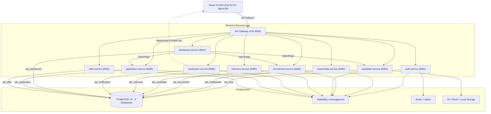
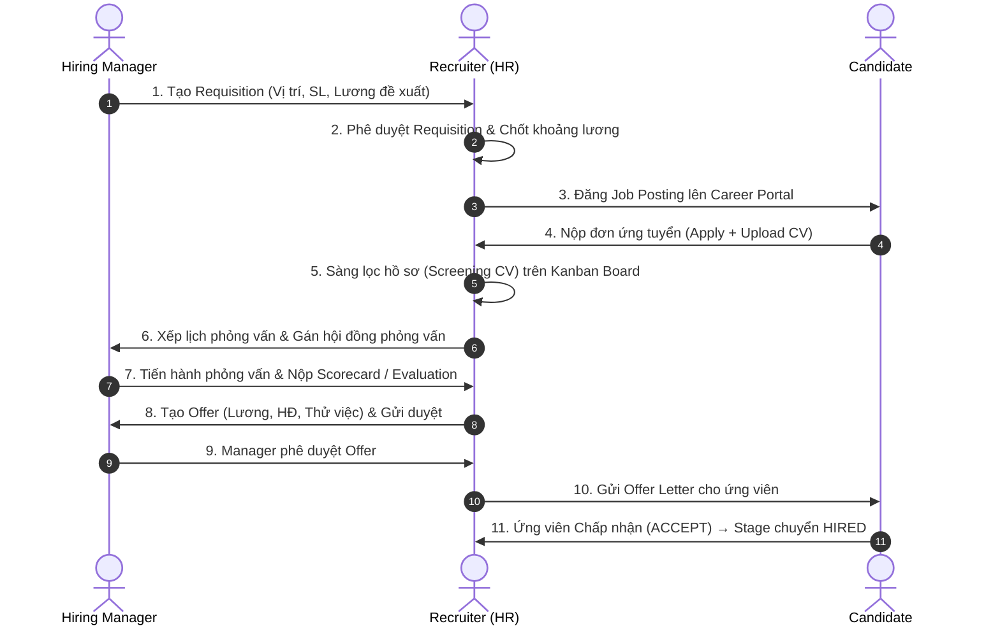

# 📋 Phân Tích Toàn Diện & Đánh Giá Thực Tế Dự Án ATS (Applicant Tracking System)

> **Phạm vi tài liệu:** Phân tích kiến trúc, đối soát chi tiết Code thực tế vs Thiết kế (Backend → Frontend → CSDL → API), kiểm toán toàn bộ lỗi kỹ thuật & khoảng trống nghiệp vụ so với ATS thương mại (Greenhouse, Lever, BambooHR).  
> **Phiên bản:** 2.0 (Đã kiểm toán trực tiếp từng dòng code & cấu hình trong toàn bộ workspace).

---

## Mục Lục

1. [Tổng Quan Kiến Trúc & Tech Stack Thực Tế](#1-tổng-quan-kiến-trúc--tech-stack-thực-tế)
2. [Chi Tiết Backend — 9 Microservices + 1 API Gateway](#2-chi-tiết-backend--9-microservices--1-api-gateway)
3. [Chi Tiết Frontend — Cấu Trúc & Luồng Dữ Liệu Thực Tế](#3-chi-tiết-frontend--cấu-trúc--luồng-dữ-liệu-thực-tế)
4. [Luồng Nghiệp Vụ End-to-End](#4-luồng-nghiệp-vụ-end-to-end)
5. [So Sánh Nghiệp Vụ Với ATS Thương Mại](#5-so-sánh-nghiệp-vụ-với-ats-thương-mại)
6. [Bảng Kiểm Toán Toàn Bộ Lỗi Sai & Bất Cập Kỹ Thuật Trong Project](#6-bảng-kiểm-toán-toàn-bộ-lỗi-sai--bất-cập-kỹ-thuật-trong-project)
7. [Đề Xuất Cải Thiện & Roadmap Tối Ưu Hóa](#7-đề-xuất-cải-thiện--roadmap-tối-ưu-hóa)

---

## 1. Tổng Quan Kiến Trúc & Tech Stack Thực Tế

### 1.1 Sơ Đồ Kiến Trúc Hệ Thống

Hệ thống được thiết kế theo mô hình **Microservices** phân tán bao gồm **10 dịch vụ Java (Spring Boot 3)** và **1 ứng dụng Frontend SPA (React 19)**:



### 1.2 Tech Stack Thực Tế (Đối soát với Code)

| Tầng | Công Nghệ / Thư Viện | Đánh Giá & Ghi Chú Hiện Trạng |
|:---|:---|:---|
| **Backend Core** | Java 21, Spring Boot 3.3.4, Spring Data JPA | Khung chuẩn, cấu hình Hibernate `ddl-auto: update`. |
| **API Gateway** | Spring Cloud Gateway (Reactive), JJWT 0.12.6 | Xác thực JWT tập trung, inject header `X-User-Id`, `X-Tenant-Id`, `X-User-Role`. |
| **Databases** | PostgreSQL 16 (9 CSDL độc lập) | 9 DB: `ats_auth`, `ats_masterdata`, `ats_recruitment`, `ats_candidate`, `ats_interview`, `ats_notification`, `ats_dashboard`, `ats_application`, `ats_offer`. |
| **Message Broker** | RabbitMQ 3 Management | Xử lý sự kiện bất đồng bộ (`ApplicationCreatedEvent`, `OfferApprovedEvent`...) và Delayed Queue (nhắc lịch 24h). |
| **Cache** | Redis 7 Alpine | Đã cấu hình kết nối trong compose, dùng hỗ trợ session/token. |
| **Frontend** | React 19.2, TypeScript 6.0, Vite 8.1 | Giao diện Ant Design 6.5, Recharts 3.10, `@hello-pangea/dnd`. |
| **State Management** | Redux Toolkit (Chỉ quản lý `authSlice`) + Axios Client | **Lưu ý:** Không sử dụng RTK Query như tài liệu cũ mô tả; các feature gọi API trực tiếp qua `axiosClient` trong các file `xxxApi.ts`. |
| **Form & Validation** | React Hook Form 7.82 + Zod 4.4 | Quản lý form và validate schema chặt chẽ. |
| **Realtime** | WebSocket STOMP (`@stomp/stompjs` + SockJS) | Notification realtime nối trực tiếp cổng 8086 của `notification-service`. |
| **File Storage** | AWS S3 SDK (Java v2) + Fallback Local Disk | Lưu trữ file CV ứng viên (PDF). |
| **I18n** | Custom I18n Context Provider | Hỗ trợ 2 ngôn ngữ: Tiếng Việt (VI) & English (EN). |

### 1.3 Cơ Chế Multi-Tenancy & RBAC

- **Multi-Tenancy:** Áp dụng mô hình Logical Multi-tenancy (Shared Database per Service, Row-level Isolation). Mọi request qua API Gateway đều được trích xuất `tenantId` từ JWT Token và gắn vào HTTP Header `X-Tenant-Id`. Toàn bộ các Repository/Query ở tầng Backend phải lọc theo `tenantId`.
- **RBAC (Role-Based Access Control):** 5 vai trò người dùng được định nghĩa:
  1. `PLATFORM_ADMIN`: Quản trị viên hệ thống nền tảng.
  2. `COMPANY_ADMIN`: Quản trị viên doanh nghiệp (toàn quyền cấu hình công ty, master data, users, dashboard).
  3. `RECRUITER`: Nhân viên tuyển dụng / HR (duyệt requisition, đăng job, sàng lọc hồ sơ, xếp lịch phỏng vấn, tạo offer).
  4. `HIRING_MANAGER`: Trưởng phòng / Người yêu cầu tuyển dụng (tạo requisition, phỏng vấn, chấm điểm đánh giá, duyệt offer).
  5. `CANDIDATE`: Ứng viên (xem tin tuyển dụng, nộp hồ sơ, xác nhận lịch hẹn, phản hồi offer).

---

## 2. Chi Tiết Backend — 9 Microservices + 1 API Gateway

### 2.1 API Gateway (`api-gateway` — Port 8080)
- **Chức năng:** Điểm truy cập duy nhất (Single Entry Point), định tuyến toàn bộ request theo tiền tố URL (`/api/auth/**`, `/api/recruitment/**`...).
- **Bảo mật:** `JwtAuthGlobalFilter` giải mã JWT token, kiểm tra chữ ký HMAC-SHA256, trích xuất Claims và gắn 3 header nội bộ: `X-User-Id`, `X-Tenant-Id`, `X-User-Role`.
- **Whitelist công khai:** Bỏ qua kiểm tra JWT đối với các endpoint đăng ký, xác thực OTP, đăng nhập, quên mật khẩu, xem file CV công khai, và toàn bộ Career Portal (`/api/*/public/**`).

### 2.2 Auth Service (`auth-service` — Port 8081, DB: `ats_auth`)
- **Entities chính:** `Tenant`, `Company`, `AppUser`, `Role`, `Permission`, `RolePermission`, `EmailVerification`, `RefreshToken`, `PasswordResetToken`.
- **API thực tế đã có:**
  - `POST /api/auth/register-company`: Đăng ký công ty + admin user (status = `PENDING`).
  - `POST /api/auth/verify-email`: Xác thực OTP 6 số, kích hoạt Tenant & User sang `ACTIVE`, bắn event `TenantActivatedEvent` để seed master data.
  - `POST /api/auth/login`: Đăng nhập, trả về Access Token (15p) & Refresh Token (7 ngày).
  - `POST /api/auth/refresh-token`: Gia hạn Access Token.
  - `POST /api/auth/logout`: Thu hồi Refresh Token.
  - `POST /api/auth/forgot-password` & `/reset-password`: Quy trình khôi phục mật khẩu qua email OTP.
  - `POST /api/auth/change-password`: Đổi mật khẩu cho user đã đăng nhập.
  - `GET /api/auth/users`: Lấy danh sách user trong công ty (lọc theo role).
  - `POST /api/auth/users`: Tạo tài khoản nội bộ mới (chỉ `COMPANY_ADMIN`).
  - `GET /api/auth/me` & `PUT /api/auth/profile`: Xem & cập nhật thông tin cá nhân.
  - `GET /api/auth/company` & `PUT /api/auth/company`: Xem & cập nhật thông tin doanh nghiệp.
  - `GET /api/auth/public/companies/{tenantCode}`: Lấy thông tin công ty phục vụ Career Portal.

### 2.3 MasterData Service (`masterdata-service` — Port 8082, DB: `ats_masterdata`)
- **Entities chính:** Quản lý 14 danh mục độc lập: `Department`, `JobTitle`, `JobLevel`, `Skill`, `EmploymentType`, `ContractType`, `WorkLocation`, `EducationLevel`, `ExperienceLevel`, `RecruitmentSource`, `RecruitmentStatus`, `RejectionReason`, `EmailTemplate`, `InterviewCriteria`, và `RecruitmentPipeline` + `PipelineStage`.
- **Enum `StageType` thực tế:** `APPLIED`, `CV_SCREENING`, `HR_SCREENING`, `TECHNICAL_INTERVIEW`, `HR_INTERVIEW`, `FINAL_INTERVIEW`, `OFFER`, `HIRED`, `REJECTED`, `CUSTOM`.
- **Cơ chế Auto-Seed:** `TenantActivatedListener` lắng nghe `TenantActivatedEvent` từ RabbitMQ và tự động khởi tạo bộ dữ liệu mẫu (phòng ban, kỹ năng, pipeline mặc định 9 bước, tiêu chí phỏng vấn...) qua `DefaultDataSeeder`.

### 2.4 Recruitment Service (`recruitment-service` — Port 8083, DB: `ats_recruitment`)
- **Entities chính:** `JobRequisition` (bảng `job_requisition`), `JobPosting` (bảng `job_posting`).
- **Quy trình Requisition:** `DRAFT` → `PENDING_APPROVAL` → `APPROVED` / `REJECTED` / `CHANGES_REQUESTED`.
- **Quy trình Job Posting:** Tạo từ Requisition đã duyệt → Trạng thái `OPEN`, `PAUSED`, `CLOSED`. Có cơ chế khóa cấu hình pipeline (`pipelineLocked = true`) khi đã có hồ sơ nộp vào.
- **Public API:** `GET /api/recruitment/public/postings` & `GET /api/recruitment/public/postings/{id}` cho ứng viên xem việc làm ngoài Career Portal.

### 2.5 Candidate Service (`candidate-service` — Port 8084, DB: `ats_candidate`)
- **Entities chính:** `Candidate` (bảng `candidate`), `CandidateSkill` (bảng `candidate_skill`).
- **Tính năng nổi bật:** Upload file CV lên AWS S3 / MinIO với cơ chế tự động fallback lưu ổ đĩa cục bộ (`uploads/`) nếu không có cấu hình S3. Cung cấp API tải file CV `/api/candidate/candidates/cv-file/{fileName}` công khai.

### 2.6 Application Service (`application-service` — Port 8089, DB: `ats_application`)
- **Entities chính:** `Application` (bảng `application`), `ApplicationHistory` (bảng `application_history`).
- **Chức năng:** Trọng tâm quản lý hồ sơ ứng tuyển: chuyển giai đoạn (`/advance`), từ chối (`/reject`), lưu snapshot thông tin ứng viên tại thời điểm nộp đơn, ghi nhận nhật ký chuyển vòng (`ApplicationHistory`).
- **Sự kiện RabbitMQ:** Phát ra `ApplicationCreatedEvent` và `ApplicationStatusChangedEvent`.

### 2.7 Interview Service (`interview-service` — Port 8085, DB: `ats_interview`)
- **Entities chính:** `Interview` (bảng `interview`), `InterviewInterviewer` (bảng `interview_interviewer`), `InterviewEvaluation` (bảng `interview_evaluation`), `InterviewEvaluationScore` (bảng `interview_evaluation_score`).
- **Quy trình Phỏng vấn:** HR đặt lịch → Trạng thái `SCHEDULED` → Ứng viên xác nhận (`CONFIRMED`) → Hoàn thành (`COMPLETED`) hoặc Hủy (`CANCELLED`).
- **Chấm điểm & Đánh giá:** Hỗ trợ hội đồng nhiều người (Panel Interview). Mỗi người chấm điểm theo từng tiêu chí (`InterviewCriteria`) và đưa ra khuyến nghị (`STRONG_HIRE`, `HIRE`, `NO_HIRE`, `STRONG_NO_HIRE`).

### 2.8 Offer Service (`offer-service` — Port 8090, DB: `ats_offer`)
- **Entity chính:** `Offer` (bảng `offer`).
- **Quy trình Offer:** HR tạo `DRAFT` → Submit `PENDING_APPROVAL` → Hiring Manager duyệt `APPROVED` → Ứng viên nhận và phản hồi `ACCEPTED` hoặc `DECLINED`.
- **Sự kiện:** `OfferApprovedEvent`, `OfferAcceptedEvent`, `OfferDeclinedEvent`.

### 2.9 Notification Service (`notification-service` — Port 8086, DB: `ats_notification`)
- **Entities chính:** `Notification` (bảng `notification`), `AuditLog` (bảng `audit_log`).
- **Kênh thông báo:**
  1. WebSocket STOMP realtime qua `/user/queue/notifications`.
  2. In-app notification lưu DB.
  3. Email Notification qua `JavaMailSender` (gửi bất đồng bộ).
  4. Delayed Queue (RabbitMQ `x-delayed-message`): Lên lịch gửi nhắc hẹn trước 24h và kiểm tra nhắc đánh giá sau 24h.

### 2.10 Dashboard Service (`dashboard-service` — Port 8087, DB: `ats_dashboard`)
- **Chức năng:** Tổng hợp số liệu thống kê qua OpenFeign: gọi `recruitment-service` (đếm postings, requisitions), `candidate-service` (đếm ứng viên), `application-service` (đếm đơn theo stage, tính tỉ lệ thành công, xây dựng phễu tuyển dụng `FunnelMetrics`).

---

## 3. Chi Tiết Frontend — Cấu Trúc & Luồng Dữ Liệu Thực Tế

### 3.1 Cấu Trúc Mã Nguồn Frontend

```text
frontend/src/
├── app/                   # Redux store (authSlice), roles.ts, theme.ts, statusLabels.ts
├── components/            # Reusable: ProtectedRoute, GuestRoute, RoleRoute, StatCard
├── features/              # Feature modules (mỗi module có: pages/, components/, xxxApi.ts, types.ts, schemas/)
│   ├── auth/              # Đăng nhập, đăng ký công ty, OTP, reset pass, quản lý user & profile
│   ├── masterdata/        # Quản lý 14 danh mục (CatalogPanel) + Pipeline Builder (PipelinePanel)
│   ├── recruitment/       # Quản lý Requisitions & Job Postings (Modal, Drawer, Tables)
│   ├── candidate/         # Quản lý Candidate, Applications, Kanban Board (@hello-pangea/dnd)
│   ├── interview/         # Quản lý Phỏng vấn, Calendar, Chấm điểm Evaluation
│   ├── offer/             # Quản lý Offer, Modal duyệt/từ chối, View phản hồi cho Candidate
│   ├── notification/      # Chuông thông báo, NotificationsPage, websocketClient.ts
│   ├── dashboard/         # DashboardPage với stat cards, BarChart, PieChart, AreaChart
│   ├── auditlog/          # AuditLogPage theo dõi nhật ký hoạt động
│   └── public/            # Career portal (/c/:tenantCode, chi tiết job & apply form)
├── i18n/                  # I18nProvider, dictionaries.ts (VI/EN)
├── layouts/               # AppLayout (menu sidebar, header avatar) & PublicLayout (career header/footer)
├── routes/                # AppRoutes.tsx
└── services/              # axiosClient.ts (tự động gắn Bearer Token & xử lý auto refresh token)
```

### 3.2 Cơ Chế Gọi API & State Management Thực Tế

- **Không dùng RTK Query:** Trái với mô tả ở các tài liệu sơ khai, Frontend không triển khai `createApi` của RTK Query.
- **Pattern thực tế:**
  1. Mỗi feature sở hữu file `xxxApi.ts` đóng gói các hàm Axios gọi endpoint tương ứng (vd: `candidateApi.ts`, `recruitmentApi.ts`).
  2. Các Page/Component sử dụng `useState` và `useEffect` để tải dữ liệu, quản lý trạng thái `loading`, và render qua Ant Design `Table`, `Card`, `Modal`, `Drawer`.
  3. Redux Store chỉ lưu trữ duy nhất `authSlice` (token, thông tin user hiện tại, trạng thái login).

---

## 4. Luồng Nghiệp Vụ End-to-End



---

## 5. So Sánh Nghiệp Vụ Với ATS Thương Mại

| Phân Hệ / Tính Năng | ATS Hiện Tại | Greenhouse / Lever | Đánh Giá & Khoảng Trống |
|:---|:---:|:---:|:---|
| **Multi-tenancy & Phân quyền** | ✅ Đạt chuẩn | ✅ | Cách ly tenant tốt; RBAC 5 role cơ bản. |
| **Quản lý Master Data & Pipeline** | ✅ Rất tốt | ✅ | Cấu hình linh hoạt 14 danh mục + kéo thả Pipeline stages. |
| **Quy trình Requisition & Posting** | ✅ Hoàn chỉnh | ✅ | Luồng duyệt 2 cấp chặt chẽ, đăng tuyển đa dạng. |
| **Tiếp nhận CV & Career Portal** | ✅ Cơ bản | ✅ | Có portal riêng `/c/{tenantCode}`; thiếu tùy biến banner/About Us. |
| **Theo dõi ứng viên (Kanban Board)** | ✅ Tốt | ✅ | Kéo thả chuyển cột mượt mà, lưu lịch sử chuyển stage. |
| **Phỏng vấn & Phiếu chấm điểm** | ✅ Tốt | ✅ | Hội đồng nhiều người, tiêu chí linh hoạt, recommendation 4 mức. |
| **Quản lý Offer & Phản hồi online** | ✅ Hoàn chỉnh | ✅ | Duyệt nội bộ + link candidate xem/chấp nhận online. |
| **Realtime Notification** | ✅ Tốt | ✅ | WebSocket STOMP push tức thời + nhắc lịch delayed queue. |
| — | — | — | — |
| **Phân trang Backend (Pagination)** | ❌ **Chưa có** | ✅ | Toàn bộ BE trả `List<T>`, FE lọc in-memory (không scale được). |
| **Tìm kiếm & Lọc nâng cao** | ⚠️ **Cơ bản** | ✅ | Search client-side, thiếu full-text search, thiếu saved filters. |
| **Thao tác hàng loạt (Bulk Actions)** | ❌ **Chưa có** | ✅ | Chưa thể reject/advance/assign 50 đơn cùng lúc. |
| **Xuất báo cáo (Export Excel/PDF)** | ❌ **Chưa có** | ✅ | Chưa xuất được file Excel ứng viên hay in thư Offer PDF. |
| **Tích hợp Email Template Variables** | ⚠️ **Chưa nối** | ✅ | Có bảng EmailTemplate nhưng notification gửi text cứng. |
| **Xếp lịch 3 bên (`/scheduling`)** | ⚠️ **Lỗi BE** | ✅ | Frontend đã dựng UI nhưng Backend chưa viết API (gọi bị 404). |
| **Tài liệu API (Swagger/OpenAPI)** | ❌ **Chưa có** | ✅ | Chưa tích hợp springdoc-openapi trên bất kỳ service nào. |
| **Tích hợp Lịch (Google Calendar/.ics)**| ❌ **Chưa có** | ✅ | Chưa sinh file `.ics` đính kèm email phỏng vấn. |
| **SSO / OAuth2 (Google/Microsoft)** | ❌ **Chưa có** | ✅ | Chỉ có đăng nhập email/mật khẩu truyền thống. |
| **Talent Pool & Gắn Tag ứng viên** | ❌ **Chưa có** | ✅ | Ứng viên bị reject không được lưu vào hồ sơ tiềm năng. |
| **Activity Feed & Trao đổi nội bộ** | ❌ **Chưa có** | ✅ | Chưa có mục comment/@mention giữa HR và Hiring Manager. |

---

## 6. Bảng Kiểm Toán Toàn Bộ Lỗi Sai & Bất Cập Kỹ Thuật Trong Project

Dưới đây là danh sách toàn bộ các lỗi phát hiện qua kiểm tra trực tiếp mã nguồn:

### 6.1 Lỗi Build & Biên Dịch (Severity: Critical — Gây sập Build Frontend)

| STT | Vị trí File | Chi tiết lỗi | Nguyên nhân & Hậu quả |
|:---:|:---|:---|:---|
| 1 | `frontend/.../ApplicationDetailDrawer.tsx` (Dòng 92) | Truyền prop `applicationId={application.id}` vào `OfferCreateModal` | `OfferCreateModal` định nghĩa prop tên `defaultApplicationId`. Sai tên prop dẫn tới lỗi `TS2322`, lệnh `npm run build` bị gãy hoàn toàn. |
| 2 | `frontend/.../ApplicationsPage.tsx` (Dòng 22) | Khai báo `setJobPostingId` nhưng không sử dụng | Cấu hình `noUnusedLocals: true` trong TypeScript khiến lệnh build fail (`TS6133`). |
| 3 | `frontend/.../DashboardPage.tsx` (Dòng 31, 39, 202, 262) | Khai báo `FilterOutlined`, `Text`, `FUNNEL_COLORS`, `funnelMax` không dùng | Gây lỗi `TS6133` khi build production. |
| 4 | `frontend/.../JobDetailApplyPage.tsx` (Dòng 302) | Hàm `handleApplyAgain` không được gọi | Gây lỗi `TS6133` khi build production. |

### 6.2 Lỗi Môi Trường & Script Khởi Động (Severity: High — Không chạy được trên máy khác)

| STT | Vị trí File | Chi tiết lỗi | Nguyên nhân & Hậu quả |
|:---:|:---|:---|:---|
| 5 | `start-all.bat` (Dòng 21) | Hardcode đường dẫn tuyệt đối: `d:\KLTN\ATS\frontend` | Khi clone sang ổ đĩa khác (như `e:\ATS`), script không tìm thấy thư mục và không bật được Frontend. |
| 6 | `start-backend.bat` (10 dòng) | Hardcode `cd /d d:\KLTN\ATS\<service>` cho cả 10 service | Không thể khởi động backend từ file `.bat` trên bất kỳ máy nào khác. Phải đổi sang dùng `%~dp0<service>`. |
| 7 | `start-all.ps1` (Dòng 20, 37, 43) | Hardcode đường dẫn `d:\KLTN\ATS\...` và text ghi sai "8 Microservices" | Script PowerShell không thể chạy portable; mô tả sai lệch số lượng service. |
| 8 | `README.md` (Dòng 8) | Chứa markdown link cứng `file:///d:/KLTN/ATS/TEST_ACCOUNTS.md` | Link bị vỡ khi xem trên GitHub hoặc workspace khác. |

### 6.3 Lỗi Bất Đồng Bộ CSDL & Seed Data (Severity: High — Dữ liệu Seed bị mồ côi)

| STT | Vị trí File | Chi tiết lỗi | Nguyên nhân & Hậu quả |
|:---:|:---|:---|:---|
| 9 | `docker/.../init-databases.sql` vs `masterdata-service` | SQL tạo & seed vào bảng `catalog_items`, `pipelines`, `pipeline_stages` | `masterdata-service` Entity dùng các bảng riêng: `department`, `skill`, `recruitment_pipeline`, `pipeline_stage`... Toàn bộ dữ liệu seed trong SQL không bao giờ được service đọc. |
| 10 | `docker/.../init-databases.sql` vs Các Entity khác | Lệch chuẩn số ít/số nhiều: SQL tạo `job_requisitions`, `job_postings`, `candidates`, `applications`, `offers` | Hibernate Entity đặt `@Table` số ít (`job_requisition`, `candidate`, `application`, `offer`). Hibernate tạo bảng mới riêng, bảng trong init script trở thành bảng rác. |
| 11 | `docker/.../init-databases.sql` (Dòng 128) | Insert `stage_type` là `'SCREENING'`, `'INTERVIEW'` | Java Enum `StageType` không có 2 giá trị này (chỉ có `CV_SCREENING`, `TECHNICAL_INTERVIEW`...). Nếu parse trực tiếp sẽ văng Exception `IllegalArgumentException`. |

### 6.4 Lỗi Thiếu Endpoint Backend & Ghost Feature (Severity: High — Gọi API bị 404)

| STT | Vị trí File | Chi tiết lỗi | Nguyên nhân & Hậu quả |
|:---:|:---|:---|:---|
| 12 | `interview-service` vs `InterviewSchedulingPage.tsx` | Thiếu toàn bộ API `/interview/slots/**` và `/interview/salary-proposals/**` | Frontend đã dựng trang Xếp lịch 3 bên hoàn chỉnh và `schedulingApi.ts`, nhưng backend chưa từng code entity/controller cho slots. Người dùng nhấn nút trên trang `/scheduling` 100% nhận lỗi HTTP 404. |
| 13 | `auth-service` / `AuthController.java` | Thiếu endpoint `@PostMapping("/resend-otp")` | `RegisterService` đã có hàm `resendOtp()`, Gateway đã whitelist, Frontend đã có hàm gọi, nhưng Controller quên khai báo endpoint → Người dùng bấm "Gửi lại OTP" bị 404. |
| 14 | `auth-service` / `AuthController.java` | Thiếu endpoint cập nhật trạng thái User (`updateUserStatus`) | Frontend `authApi.ts` gọi `PATCH /api/auth/users/${userId}/status` để khóa/mở tài khoản nhưng backend chưa viết hàm này. |
| 15 | `masterdata-service` vs `notification-service` | `EmailTemplate` không được kết nối vào luồng gửi mail | `EmailNotificationService` gửi mail bằng chuỗi string cứng, không đọc mẫu template từ `masterdata-service` và không render biến. |

---

## 7. Đề Xuất Cải Thiện & Roadmap Tối Ưu Hóa

Để đưa hệ thống đạt chuẩn hoàn thiện cho đồ án tốt nghiệp và tiệm cận ATS thương mại thực tế, lộ trình nâng cấp được chia làm 4 nhóm ưu tiên:

### 7.1 Ưu Tiên P0: Sửa Lỗi Kỹ Thuật Nền Tảng (Làm Ngay)
1. **Fix triệt để lỗi TypeScript:** Sửa prop `defaultApplicationId` trong `ApplicationDetailDrawer.tsx` và dọn sạch các biến unused để `npm run build` thành công.
2. **Chuẩn hóa script khởi động:** Thay toàn bộ đường dẫn hardcode `d:\KLTN\ATS\` bằng biến môi trường tương đối (`%~dp0` trong Batch, `$PSScriptRoot` trong PowerShell).
3. **Bổ sung các Endpoint còn thiếu:** Thêm `@PostMapping("/resend-otp")` và `@PatchMapping("/users/{id}/status")` vào `AuthController.java`.
4. **Xử lý tính năng Xếp lịch 3 bên:** Hoặc bổ sung Backend Entities/APIs cho Slots trong `interview-service`, hoặc quy hoạch lại luồng xếp lịch trực tiếp qua `InterviewCreateModal`.

### 7.2 Ưu Tiên P1: Nâng Cấp Core Tuyển Dụng & Trải Nghiệm HR
1. **Phân trang & Tìm kiếm Server-Side (Pagination):** Chuyển tất cả repository sang `Pageable`, Frontend Table kết nối `pagination` controlled để xử lý mượt mà khi dữ liệu lớn.
2. **Thao tác hàng loạt (Bulk Actions):** Thêm tính năng chọn nhiều hồ sơ để Reject / Advance / Gán Recruiter đồng thời.
3. **Xuất dữ liệu (Export Excel/PDF):** Tích hợp Apache POI xuất danh sách ứng viên Excel và thư mời nhận việc Offer dạng PDF.
4. **Tích hợp Email Template Variables & Preview:** Kết nối `notification-service` với `masterdata-service` để thay thế biến `{{candidateName}}`, `{{jobTitle}}` và xem trước email.
5. **Tích hợp Swagger/OpenAPI:** Thêm `springdoc-openapi` cho 9 microservices để tự động sinh tài liệu API và test giao diện Swagger UI.

### 7.3 Ưu Tiên P2: Tính Năng Cộng Tác & Doanh Nghiệp
1. **Talent Pool & Sourcing Tag:** Đánh dấu lưu trữ ứng viên tiềm năng sau khi reject để tái sử dụng cho các đợt tuyển dụng sau.
2. **Ghi chú & Trao đổi nội bộ (Collaboration):** Activity feed và comment @mention giữa HR và Hiring Manager trên từng hồ sơ ứng tuyển.
3. **Lịch phỏng vấn (.ics / Google Calendar):** Sinh file `.ics` đính kèm email thông báo lịch phỏng vấn để tự động đồng bộ vào Outlook/Google Calendar.
4. **Dashboard Nâng Cao:** Bổ sung bộ lọc theo khoảng ngày, tính toán chỉ số Time-to-Hire, hiệu quả nguồn tuyển dụng (Source Effectiveness), và mở lại biểu đồ Funnel.
5. **Tối ưu hóa Mobile Responsive:** Tinh chỉnh giao diện chấm điểm phỏng vấn và nộp đơn trên thiết bị di động.

---

> [!TIP]
> **Tổng kết:** Dự án sở hữu kiến trúc Microservices phân tách miền nghiệp vụ rất tốt, luồng dữ liệu logic chặt chẽ. Sau khi hoàn thành việc vá các lỗi biên dịch, chuẩn hóa kịch bản chạy và bổ sung các tính năng cốt lõi (Phân trang, Bulk Action, Export, Email Template), hệ thống sẽ hoàn toàn đạt độ hoàn thiện cao, sẵn sàng phục vụ báo cáo KLTN và vận hành thực tế.
